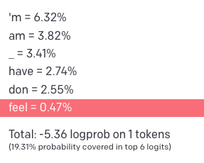

# Introduction

Our world is increasingly influenced by the rapid progress of digital evolution, which has far-reaching implications in a variety of domains, including academia. A notable development in this arena is the incorporation of artificial intelligence (AI) and machine learning (ML) technologies into academic research methodologies. This integration opens up exciting prospects for significant breakthroughs, pushing the boundaries of traditional research methods.

This study delves into the exploration of one such technology, the Generative Pretrained Transformer 4 (GPT-4), a cutting-edge Large Language Model (LLM) developed by the American AI research laboratory OpenAI. GPT-4, the latest iteration in the GPT series, possesses advanced capabilities that have the potential to revolutionise the field of text generation and analysis. In particular, our research aims to examine the capacity of GPT-4 in augmenting traditional qualitative research methodologies, with the backdrop being the IT department in Vejle Municipality in Denmark.

Vejle's IT department has in place a well-structured IT investment process, but there have been challenges with employees' adherence, leading to inefficiencies and discrepancies. This study is designed to dig deep into the reasons behind such behaviour and propose strategies to enhance compliance.

A significant innovation of our research lies in utilising GPT-4 to create affinity diagrams based on a corpus of interview data. This leverages GPT-4's capacity to process and analyse vast amounts of text and build an understanding of the interconnected themes present within the data. Recent studies, such as @weiChainThoughtPrompting2022, indicate that LLMs perform optimally on reasoning tasks when prompted with a chain of thought. The novelty of our study lies in the application of this chain of thought prompting to a more substantial analytical task, such as the analysis of interview data and the generation of a structured affinity diagram.

Our exploration, therefore, fulfils a dual purpose. Firstly, it sheds light on the socio-technical system within Vejle municipality and the specific dynamics that impact the IT investment process. Secondly, it uncovers the potential of AI and GPT-4 as pioneering tools in academic research, providing an original perspective on qualitative studies.

## Research Questions

Our research is guided by two intertwined questions:

1.  How does GPT-4's capacity to generate affinity diagrams from interview data compare to that of a human researcher, and what insights can this provide for qualitative research methodologies?
2.  What are the key factors contributing to the non-compliance of employees with the IT investment process in Vejle municipality, and how can these factors be addressed to improve adherence?

These research questions aim to deliver a comprehensive assessment of GPT-4 as an innovative tool for qualitative research and simultaneously offer deeper insights into the dynamics of the IT investment process in Vejle municipality.

## Relevance of Research

This research carries weight from both practical and academic standpoints. Practically, the findings of this study aim to enhance the efficiency and compliance of the IT investment process in Vejle Municipality. Academically, the study explores the potential of GPT-4 as an innovative tool in qualitative research, which can contribute significantly to the discourse on AI integration in academic research practices.

The combination of these aspects means the research holds immediate practical implications and has the potential to influence the trajectory of academic research methodologies, opening up new doors of enquiry regarding the role LLMs could play in qualitative research going forward.

## Overview of Structure

This thesis is composed of two parts, each addressing a specific research question. The first part focuses on the IT Investment Process in Vejle Municipality, while the second part evaluates the utility of GPT-4 in qualitative research, focusing on prompting the model to output affinity diagrams from interview data.

The first section starts with an introduction to the case background, followed by a literature review providing the theoretical context. The research methodology includes semi-structured interviews and field notes for data collection, with affinity diagrams used for data analysis. The results, discussion, and recommendations form the subsequent segments of this part of the study.

The second section focuses on GPT-4, providing a technical background for those unfamiliar with the model. This is followed by a literature review on GPT-4's implications in qualitative research. The methodology involves data collection through user-model interfaces, with criteria for assessing output quality forming the basis of data analysis.
# Case Study: Vejle Municipality's IT Investment Process

## Case Background
Residing within the administrative building of Vejle Municipality, the IT department has historically grappled with effective communication, particularly with external stakeholders and individuals in decentralised roles. Recognising the need to bridge this gap, the department strategically incorporated four IT architects into its ranks over recent years, each bringing a distinct blend of skills and expertise.

These IT architects, integral to the municipality's IT ecosystem, strive to reconcile municipal employees' expectations with the capabilities and resources of the IT department. They deftly navigate technical and non-technical perspectives within the municipality, balancing the need for clear communication with the complex understanding required of their role. A blend of "hard" and "soft" skills allows them to empathise with the diverse needs of users throughout the municipality while staying conversant with current and emergent technologies.

Among these architects are Jonas and Mathilde, who together form a harmonious blend of technical and human-focused insights. Jonas excels in the intricate nuances of IT architecture, while Mathilde advocates for a more empathetic, human-centred approach to IT. Their collaborative efforts ensure the fluid integration of new technologies and foster a sense of shared understanding and ownership in IT investment decisions across the organisation.

Jonas and Mathilde's invaluable guidance and profound knowledge have significantly shaped the course of the present study, their generosity in sharing their insights reflects in the multiple references within the forthcoming text.

In response to the challenges in procuring new technologies, Vejle Municipality has implemented an IT investment process, facilitated through an online webform accessible via the intranet. The webform serves a dual purpose: keeping the IT department apprised of supported technologies, and connecting appropriate IT personnel with the investment project for smooth implementation and potential impact evaluation.

The webform's user interface presents a clear directive to all employees of the municipality:

> "If you need to address a new IT task, update or enhance an existing system, have an idea for an IT system, or purchase a new IT system, the City Council requires you to utilise the IT investment process. By following this process, we collectively ensure that the system or function can be utilised while meeting our IT requirements. Additionally, when you follow the investment process, you will receive guidance to other departments if there are specific areas that require attention, such as information security."

A list of examples provided to clarify the instances in which the IT investment process should be invoked includes scenarios like exploring existing solutions, making changes to current systems, seeking IT support for a process, purchasing new equipment requiring network access, or implementing a new IT solution.

To engage this process, employees are required to complete an electronic form on the designated intranet page. Following form submission, an IT department architect typically contacts the submitter within 48 hours, initiating a dialogue involving the employee, the supplier, and an IT department representative, ultimately leading to feedback that includes an overall IT assessment of the system. If required, additional references to other departments within Vejle Municipality, such as Competition Suspension, are provided.

However, despite these comprehensive instructions and the broad applicability of the webform, its use among employees remains limited. A significant effort has been made to simplify the webform, making it more accessible by removing intricate questions that non-IT personnel found challenging. The primary goal was to increase the form's usage and prevent staff from directly contacting IT architects or other members of the IT department, thereby streamlining the IT investment process. However, these efforts have not translated into the expected increase in webform usage.

In light of these observations, this study aims to delve into the reasons behind employees' inconsistent adherence to the IT investment process and propose strategies to improve compliance. The ensuing report will thoroughly investigate the complexities of this

## Literature Review
This literature review will delve into three key areas pertinent to this study: IT Investment Governance, Ethnomethodology, and Affinity Diagrams. The analysis of these topics aims to build a theoretical underpinning for understanding the complexities of IT investment in the public sector and how ethnomethodological research and affinity diagrams can help derive valuable insights into this intricate process. Let's begin by unpacking the first concept, Information Technology Investment Governance.

### IT Investment Governance

IT governance is a vital component for both private and public sector organisations, playing a central role in aligning IT investments with institutional goals and maximising associated benefits \[@Weill2004\]. Encompassing decision-making, planning, and controlling IT investments, it sits at the heart of effective governance.

One influential concept for understanding IT governance is the resource-based theory, proposed by @Wernerfelt1984. The resource-based view (RBV) suggests that organisations can secure a sustainable advantage by optimally employing their resources and capabilities, those possessing valuable, rare, imperfectly imitable, and non-substitutable (VRIN) attributes \[@Wernerfelt1984; @Barney1991\]. RBV underlines the strategic necessity of resource allocation for maximum value.

When we consider RBV in public sector contexts, such as Vejle municipality, the idea of a "competitive advantage" is recontextualised. Unlike private firms, public institutions aim to deliver the best possible public value rather than outperform market competitors. Here, the efficient allocation and utilisation of resources equate to high-quality service delivery. In the realm of IT investment, strategic decisions should maximise public benefit through increased efficiency and effectiveness.

Building upon the RBV, @Bharadwaj2000 positions IT resources as a distinct strategic category. Organisations, he argues, possessing superior IT capabilities, can enhance their operational efficiency and service quality \[@Bharadwaj2000\]. This perspective fits seamlessly within the RBV, reinforcing the critical need for effective governance of IT resources and investments.

@ALI20151 developed a novel construct, known as IT investment governance (ITIG), also premised on the RBV. ITIG gauges an organisation's competence in effectively governing its IT investments, thereby enabling the efficient allocation and utilisation of IT resources. The construct comprises four elements: IT investment value governance, IT investment value monitoring, IT investment appraisals, and IT investment project management.

The relevance and efficacy of the ITIG construct were demonstrated by Ali et al. (2015), highlighting a significant positive correlation with organisational performance. This critical finding implies organisations with robust IT investment governance are poised to extract greater value from their IT investments and align these more closely with their strategic goals. Consequently, effective IT investment governance enables organisations to amplify operational efficiency and public value, thus reinforcing the core principles of the RBV.

While Ali et al. (2015) made notable strides, certain gaps still persist, particularly in understanding the behavioural elements influencing effective IT investment governance, such as employee compliance with IT governance processes. Nonetheless, the RBV and ITIG construct offer a robust theoretical foundation to scrutinise and enhance IT investment governance within the public sector, paving the way for future research and improvements.

### Ethnomethodology

The field of social science research has seen a significant surge in the application of Ethnomethodology (EM) as a theoretical approach. EM explores how individuals establish and uphold social order through their everyday interactions, focusing on practical methods and techniques they utilise to comprehend their social realm. As observed by @crabtreeDoingDesignEthnography2012, EM research primarily centres on how communities or social settings employ quotidian practices and knowledge to formulate the regulations governing their social existence (p. 316).

EM's wide-ranging application spans diverse fields such as sociology, anthropology, communication studies, with more recent integration into human-computer interaction and interaction design studies. It is instrumental in examining how individuals engage with technology in daily life and how technological advancements impact and shape social practices.

@crabtreeDoingDesignEthnography2012 assert the value of EM in deciphering technology utilisation across various settings. They suggest that the methodology's focus on minutiae of day-to-day practices can aid researchers in recognising practical challenges encountered by individuals while using technology, and how design can alleviate these issues. Moreover, they posit that EM's emphasis on the social context of technological use can provide insights into how technology integrates into broader social structures and influences social relations.

#### Interviewing: A Word of Caution

Interviews, according to @crabtreeDoingDesignEthnography2012, should be approached with prudence. They propose conducting interviews within the authentic flow of work as circumstances allow. Highlighting the discrepancy between what people claim to do and their actual actions, they note that while not being intentionally misleading, interviewees tend to gloss over their work. To overcome this, researchers are advised to focus on the precise actions and methods of work, avoiding an interview format driven by a set of pre-formulated questions detached from the actual work process.

#### The Importance of Field Notes

The creation of field notes is a crucial component of fieldwork, state @crabtreeDoingDesignEthnography2012. Field notes allow researchers to document their observations, capturing what they witness, hear, and are informed of. This not only provides a record of the research but also assists researchers in tracking and organising their thoughts. The active process of note-taking encourages the researcher's attention to the work as it occurs, thereby fostering a better understanding of the task at hand.

The researchers' notebook, @crabtreeDoingDesignEthnography2012 suggest, should not be a mere collection of disjointed remarks. Instead, it should serve as a structure for the researcher's thoughts, crafting a coherent narrative of the setting's work. Diagrams of the work ecology are recommended to frame inquiries and represent the work environment to others. Detailing the environment, the inhabitants, their roles or responsibilities, and the artefacts employed for work can lead to a more comprehensive understanding of the setting's work and the methods employed by members to organise it.

#### Formal Organisation of Work and Its Flow

Understanding how the work is 'formally organised' across a division of labour and individually, is crucial, according to @crabtreeDoingDesignEthnography2012. This comprises the plans, procedures, processes, and routines invoked by the members to account for their work organisation. Researchers should also concentrate on the work's flow, noting how it moves across individuals, activities, and culminates in an endpoint.

#### Discrete Sequences of Interactional Work, Cooperation, and Collaboration

@crabtreeDoingDesignEthnography2012 encourage researchers to enrich their depiction of work's flow by concentrating on discrete sequences of interactional work entailed in completing specific activities. The focus should be on what is done, who does it, and the process of work completion. Attention should also be given to the cooperation and collaboration between individuals during discrete sequences of interactional work. This would involve observing and documenting who interacts with whom, their discussion points, joint activities, task transactions and handovers, and subsequent responses.

### Affinity diagrams
Affinity diagrams, also known as the KJ method or affinity charting, were first developed by Japanese anthropologist Jiro Kawakita [as cited in @scupinKJMethodTechnique1997]. Affinity diagrams are used to synthesise and categorise large amounts of qualitative data, such as observations, interviews, and field notes, into meaningful and easily understandable themes and patterns [@haningtonUniversalMethodsDesign2019].

The affinity diagramming process typically starts with the raw data being transformed into discrete statements or observations. These statements are then grouped based on their similarities and relationships [@haningtonUniversalMethodsDesign2019]. The groups are subsequently labelled with descriptive headings, which capture the essence of their content. This iterative process allows for the identification of patterns, themes, and relationships among the collected data, thus providing insights and guidance for further analysis and design @holtzblattAffinityDiagram2016.

In the context of ethnographic UX studies, affinity diagrams serve as a valuable tool for making sense of the complex and often messy data that emerges from immersive fieldwork @holtzblattAffinityDiagram2016. By organising and categorising data in a structured manner, researchers can identify user needs, behaviours, and pain points, which can inform design decisions and enhance the overall user experience @haningtonUniversalMethodsDesign2019.

Furthermore, affinity diagrams facilitate collaboration and interdisciplinary communication among research team members @holtzblattAffinityDiagram2016. By engaging in the process of grouping and labeling data, researchers from different backgrounds and expertise can contribute to a shared understanding of the user experience, leading to more innovative and effective solutions.

## Methodology

### Data Collection: Interviews & Field Notes

In this study, the process of data collection was established upon two critical components: semi-structured interviews and field notes documentation.

**Semi-Structured Interviews:** This data collection methodology was a primary channel to gain insight into the users' experiences and perspectives. As suggested by @crabtreeDoingDesignEthnography2012, the interview setting was informal to encourage genuine and in-depth discussion. The interviews were designed to be "decontextualised" due to the nature of the study, where the subject matter (new IT investments) was not part of the daily routine for most employees.

A selection of twelve employees across all six administrative divisions of Vejle's municipality was interviewed based on a list provided by an internal contact at the municipality. To maintain confidentiality, each interviewee was assigned a pseudonym and an identification number.

The interviews were conducted face-to-face, barring one instance where a video call was arranged to accommodate the participant's circumstances. Handwritten notes were taken during the conversations to ensure a relaxed atmosphere, and the questions were based loosely on an interview guide (Appendix X), allowing flexibility for natural discourse.

Following each interview, the brief notes were used to create detailed transcriptions, which were then developed into coherent prose summaries. It is important to note that the interviews were conducted in Danish, and the translation into English occurred at the summary phase. The complete interview summaries and notes are available for reference in Appendix X.

**Field Notes:** As a complementary method, field notes played an essential role in the data collection process. Drawing from the significance emphasized by @crabtreeDoingDesignEthnography2012, field notes were used to document observations, thoughts, and insights about the research setting.

A physical notebook was consistently maintained for documenting fieldwork observations, particularly during interviews, to avoid the intrusion of digital devices. Additionally, a cloud-synced notes application served as a supplemental tool for situations where typing was preferable to handwriting.

The process of taking field notes enabled a comprehensive understanding of Vejle's work environment, shedding light on specific dynamics such as task handovers and transactions between individuals. Additionally, the field notes acted as a reflective tool, aiding in evolving an understanding of the work setting over time.

In sum, the combination of semi-structured interviews and field notes documentation provided a comprehensive and valuable resource. The detailed accounts served as a solid foundation for the analysis and interpretation of the data, effectively informing the subsequent phases of this research study.

### Data Analysis: Affinity Diagrams
**_Now write a methodology section for how I used the collection of these summaries to make an affinity diagram: I went through the interview summaries one at a time, writing down data segments on virtual sticky notes in a computer program, gaving each of the interviewees their own color of sticky notes until I ran out of colours, having to make the rest grey, etc, etc normal affinity diagram process, drawing linking lines between the groups and whatnot

https://chat.openai.com/c/082b64f4-2e8d-4c8f-85b9-c4a6520007b5_**
## Presentation of Interview Data

## Discussion

### Recommendations for Vejle Municipality

Interviews conducted and ethnographic observations highlight opportunities to improve the IT investment process at Vejle Municipality. Though initially perceived as primarily an awareness issue, other key concerns also require addressing. Recommendations will be based on interview data and, occasionally, my own ethnographic observations.

#### Enhance communication and visibility of the IT investment process

To better communicate the IT investment process, it should be positioned as a support service rather than a bureaucratic obstacle. Adding an option to indicate preferred contact persons in the IT department could help alleviate concerns about the process's impersonal nature. Moreover, prioritising improved communication and collaboration between central IT and decentralised areas, and between IT and the rest of the organisation, is essential. IT architects have made progress in this area, but continued efforts are crucial for effectively integrating the IT investment process into Vejle Municipality's daily operations.

##### Establish clearer guidelines on reporting responsibilities

IT architects play a vital role in communicating the process through personal interactions and other means. As Anne, an interviewee, highlighted, sharing the process with the right people without bothering irrelevant employees is essential. While the intranet contains ample information on when investments must be reported, it lacks clarity on who is specifically responsible for reporting investments to IT. This ambiguity can lead to situations where no one takes responsibility for contacting IT.

Clearer guidelines for reporting responsibilities could help remedy this problem and make it easier for architects to find and communicate with the appropriate individuals within the municipality.

##### Address implementation time and workload concerns
As reported in the interview with Anne from the Salary department, instances have occurred where employees approach IT and other stakeholders with unrealistic expectations regarding the timeframe for solution implementation. Such situations can lead to disappointment and/or impose an excessively heavy workload to meet the desired schedule. It is therefore crucial to focus on the time requirements of projects. If feasible, guidelines should be established to provide employees with a realistic estimate of the time it will take to implement their IT investments.

Alternatively, or in addition, the IT investment process form could incorporate an option for indicating a preferred implementation date for the new IT investment. This provision would allow the IT architect to manage expectations right from the first meeting, helping to realign any unrealistic timelines. Consequently, the IT architect would be less likely to be taken aback by an impractical timeframe presented during the meeting. This strategy could also mitigate the element of surprise and reduce the likelihood of a burdensome workload being imposed at short notice.

##### Set an example

When employees contact IT architects for assistance, they should receive help with their IT investment. Simultaneously, IT architects should create a record of the new IT investment in the appropriate database, demonstrating mutual respect for the process. After logging the investment, IT architects could inform the employee and politely request that they use the IT investment process for future investments, ensuring to explain the process's purpose.

##### Simplifying the introductory text

IT should consider the presentation of the IT investment process on the intranet page further. The extensive technical text on the page should be relegated to less prominent areas, as first impressions are crucial in persuading employees to engage with the process. Instead, a more concise, simplified version should be presented, emphasising the rationale for the process's existence and the advantages of utilising it, ideally employing more engaging communication methods.

For instance, a video that explains the process, its purpose, and its benefits could be showcased on the intranet page, making it a valuable resource to which IT architects can direct employees for further information.

By making employees aware of the rationale behind the IT investment process and its potential benefits, they are more likely to be receptive to changing their behaviour. Simultaneously, understanding the logic underpinning the IT investment process provides a more intuitive way of explaining and grasping its relevance. This approach could help address the image problem and confusion arising from the current guidelines, as mentioned in the previous section.

##### Consider revising guidelines for when investments should be reported

For IT-savvy employees outside of the IT department, such as Mikkel and Freja, the guidelines regarding when IT investments need to be reported can appear overly broad, seemingly intended for employees whose daily work and competencies do not focus on IT. Consequently, these IT-savvy employees may feel that they are exempt from using the IT investment process or perceive that employees with their competencies have not been taken into account when formulating the guidelines.

Although the current guidelines serve as a comprehensive catch-all, which can be suitable when the complexity of a situation makes it difficult to establish precise rules, the IT department should be cognisant of the image problem and the confusion generated by prominently displaying these guidelines on the intranet page for the IT investment process. This prominence can overwhelm readers or appear condescending.

#### Humanise the IT investment process

Interview data and ethnographic observations indicate that the IT investment process suffers from an image problem. To counteract this perception, steps should be taken to make the process more approachable. In the following sections, I will cover possible ways of achieving this.

##### Renaming the process

Many interviewees unfamiliar with the IT investment process commented on its name. The lengthy Danish term, consisting of twenty-three letters, appeared bureaucratic and unappealing. A name like "Indkøbsguiden" (Danish for "The Purchase Guide") was suggested as an alternative, appealing more to the grassroots level of the organisation.

##### Cater to the needs of diverse employee groups

The IT investment process should accommodate the requirements of various employee groups who may be hesitant to use the process. Allowing employees to choose a preferred architect when completing the form could provide peace of mind to those dealing with sensitive IT investments, such as daycare workers with unique needs.

##### Clarify the purpose and advantages of using the IT investment process

Interviewees viewed the IT investment process as bureaucratic and struggled to understand its benefits compared to directly contacting the IT department. The IT department should use the intranet site to clearly explain the purpose of the IT investment process, emphasising the "why" rather than relying on coercive language about city council mandates.

#### Attempt to unify reporting with other parts of the organisation

One significant issue raised in the interviews was the non-uniformity of reporting processes across the organisation. Other departments have their own reporting requirements for various cases of investments, such as new welfare technology investments and new systems integrating with the municipality's payroll system. This complexity creates a challenging environment for employees to navigate when investing in new systems.

Although this complexity currently hinders the adoption of the IT investment process, there is potential to transform it into a strength by initiating dialogue to unify reporting requirements across the organisation. A unified reporting system could simplify communication about the importance of reporting new investments and improve overall compliance.

This unified system would serve as a one-stop shop for all new investment reporting. A streamlined set of questions would automatically identify which departments should be informed of the new investment based on the responses provided, allowing IT and other departments to collaborate rather than compete for employees' attention.

Implementing such an approach presents challenges, including fostering cooperation between separate working groups. However, given the shared difficulties arising from poorly executed investment reporting (as exemplified by Anne's interview), there should be common ground for collaboration.

A potential solution is a standardised form asking relevant questions about the investment, such as access requirements to payroll systems and municipal networks. Based on the responses, the form would determine which responsible parties within the organisation need to be informed of the specific investment in question.

#### Ease restrictions where possible

While information and cyber security are crucial, it is also essential to strike a balance. Decentralised employees may perceive strict restrictions on user privileges as excessive burdens, potentially affecting their job satisfaction and sense of agency. It is essential to consider that decentralised IT specialists, although not part of the central IT department organisationally, are still IT experts and likely possess the necessary knowledge and skills to manage their tasks responsibly.

By easing restrictions where possible, a more balanced approach can be achieved, ensuring that decentralised employees, particularly IT specialists, feel trusted and empowered within the organisation.

### Opportunities for Future Research

# GPT-4's Utility in Qualitative Research

## Technical Background
The following sections provide a technical background designed to enhance the understanding of LLMs, specifically focusing on their architecture, training process, and operational mechanisms, delving into the principles of inferential text completion, tokenisation, token-based pricing, and the importance of prompt engineering in eliciting emergent abilities from LLMs. 

While this background aims to build a strong foundation for understanding the chapter that follows, it is worth nothing that the complexity and depth of the subject at hand does not allow for an exhaustive coverage in this brief overview. Further reading and resources are cited throughout to provide a more detailed exploration of these topics. It is encouraged to delve into these sources for a deeper and more nuanced understanding of the intricacies of LLMs.

### Model Architecture

LLMs are generally based on a Transformer architecture, first introduced in @vaswani2017attention. Transformers are characterised by their self-attention mechanism, which allows the model to weigh different parts of the input sequence in relation to each other. This mechanism enables the model to capture long-range dependencies and context more effectively than traditional recurrent neural networks or convolutional neural networks [@vaswani2017attention].

### Training Process

The training of LLMs involves two primary steps: pre-training and fine-tuning. During the pre-training phase, the model learns a general understanding of language by predicting missing words or tokens in a sequence (also known as masked language modeling). This is achieved by feeding the model a vast amount of text data from diverse sources, such as books, articles, and websites [see, for example, @devlin-etal-2019-bert]

After pre-training, the model typically undergoes some sort of fine-tuning phase, during which it is further trained on a smaller, task-specific dataset. This enables the model to acquire specialised knowledge and skills related to the target task, such as question-answering, translation, or summarisation [@devlin-etal-2019-bert].

### Inferential text completion
Inferential text completion serves as the fundamental task carried out by LLMs in the context of current research. This task entails generating coherent, contextually relevant, and human-like text by continuing a provided prompt based on learned linguistic patterns and contextual information. Owing to their ability to perform this task, LLMs are well-suited for various applications such as content generation, summarisation, and conversation.

Understanding the basics of inferential text completion requires delving into the underlying principles that govern the process. LLMs are trained on vast amounts of text data, enabling them to recognise and predict complex patterns in human language. These models employ a probabilistic approach, calculating the likelihood of different tokens appearing in sequence based on their acquired knowledge.

Figure X offers an example of inferential text completion using an older model, such as text-davinci-003. In this figure, the model is prompted with the letter "I," and its inference process is displayed. Individual tokens are separated and color-coded according to their likelihood of being the next text in the sequence. For instance, the token "feel" had a 0.47% probability of appearing next (Figure X). The hyperparameter, temperature, plays a vital role in controlling the model's randomness. As the temperature approaches 0, the model's output becomes increasingly deterministic, while higher temperature values (up to a maximum of 1) yield more varied results, often selecting less likely inferences.

However, in certain cases, despite having a good prompt, the model may produce lower quality or irrelevant output due to the influence of the temperature parameter or other stochastic factors. This phenomenon, referred to as "output degradation" or "response deviation," occurs when random chance from the temperature parameter leads the model in a direction of generating low-quality output [@Holtzman2020The]. A well-known type of response deviation is "hallucination," where the models yield information that is either irrelevant to the context or non-factual.

As suggested in @Holtzman2020The, the quality and relevance of the generated text can be improved by fine-tuning hyperparameters such as temperature and top-k. These parameters influence the model's token selection. A lower temperature value results in more deterministic output, while a higher value promotes exploration and creativity. Similarly, the top-k parameter limits the model to consider only the k most probable tokens for each position in the text, striking a balance between diversity and coherence.

In the current research, temperature values between 0.5 and 0.7 are typically used, as they are generally considered to strike an optimal balance between diversity and coherence.

### Tokenisation

Tokenisation is a crucial aspect of LLMs, as it serves as a pre-processing step that converts raw text into a format that can be processed by the model. In this process, the text is broken down into smaller units called tokens, which can be words, subwords, or individual characters [@vaswani2017attention]. The choice of tokenisation strategy can significantly impact the model's performance, as it determines the granularity at which the model processes and generates text. LLMs typically use subword tokenisation methods, such as Byte Pair Encoding (BPE) or WordPiece, which strike a balance between capturing meaningful linguistic units and maintaining a manageable vocabulary size [@vaswani2017attention].

### Token-based pricing model
Token-based pricing is the methodology employed by OpenAI to determine the cost associated with utilizing their language models. It is based on the principle that the length of text processed, measured in tokens, corresponds to the computational resources and time required for model inference.

In OpenAI's pricing structure, a token represents a discrete unit that includes characters, spaces, words, punctuation marks, and other linguistic components. Longer inputs or passages generally contain a greater number of tokens, leading to increased computational expenses.

OpenAI's token-based pricing accounts for the number of tokens used in both the input (prompt) and output (response) phases of an interaction. The total tokens include those in the provided input and those generated by the model in its response. Repetitive tokens within an interaction, such as duplicated prompts or recurring phrases, are counted as individual tokens.

Customers are billed based on the total number of tokens utilized during the interaction, covering both input and output tokens. The cost per token remains consistent across different use cases and applications. This pricing structure ensures that the computational resources consumed by language models are appropriately considered, allowing for transparent cost estimation based on the complexity and length of text processed.

### Prompt engineering and emergent abilities

Prompt engineering is crucial for achieving high-quality results with LLMs and plays a pivotal role in uncovering their emergent abilities. By developing and optimising prompts, researchers can efficiently harness LLMs for various applications and research topics, gaining a deeper understanding of the models' capabilities and limitations \[@dair.aiPromptEngineeringGuide2023\].

The process involves selecting appropriate text prompts, tuning the model's hyperparameters, and tailoring the prompt design to the model's capabilities. The primary objective is to provide sufficient context for high-quality results while avoiding incorrect or irrelevant outputs. Prompt engineering is particularly important in discovering emergent abilities, as it enables researchers to probe and explore the models' potential in novel and unexpected ways [@wei2022emergent].

Emergent abilities, which cannot be reliably inferred by merely extrapolating smaller models' performance, often become apparent only after the LLM has been publicly deployed. As researchers experiment with various prompts and explore different applications, they may uncover previously unnoticed capabilities. In this sense, prompt engineering serves as an essential tool for investigating the full potential of LLMs, leading to the discovery of emergent abilities and fostering a better understanding of their implications \[@wei2022emergent\].

By carefully crafting prompts and iterating on them based on the model's responses, researchers can push the boundaries of LLMs and uncover emergent abilities that may not have been apparent otherwise. This iterative process allows for the identification of novel capabilities, contributes to the ongoing development of LLMs, and informs the design of future models.

Recent research points to significantly improved outcomes in reasoning tasks when models are prompted to produce a chain-of-thought [@weiChainThoughtPrompting2022; see also, @richardsAutoGPTAutonomousGPT42023; @weiArtificialStreamThought]. A recent study took this approach a step further, tasking GPT-4 to self-critique its own outputs, further improving the quality of the results [@shinn2023reflexion].

In the current study, the Prompt Engineering Guide from @dair.aiPromptEngineeringGuide2023 was used as a valuable resource, offering a repository of state-of-the-art methods and techniques. This guide, combined with a thorough understanding of the models' inner workings and careful prompt engineering, enabled the effective exploration of emergent abilities and the leveraging of LLMs for qualitative research purposes.

## Literature Review

## Methodology

### Data Collection: User-Model Interfaces

### Data Analysis: Criteria for Assessment of Output Quality
In the context of evaluating the output quality of affinity diagrams created by GPT-4, a holistic approach is taken, encompassing several definitive criteria. These ensure that the resulting outputs are not only accurate and relevant but also comprehensive, consistent, clear, unbiased, interpretable, and of significant utility.

The primary criterion is Accuracy, which emphasises the importance of the generated affinity diagram's fidelity relative to the raw interview data. This denotes that the output should appropriately and accurately organise and represent the data within its categories. 

Following Accuracy, we focus on the Relevance of the categories formed by the model in relation to the subject matter at hand. This involves ascertaining whether the categories formed carry meaningfulness and significance within the context of the original interview data. A critical assessment of relevance thus involves an in-depth analysis of the conceptual links between the raw data and the categories found in the generated affinity diagram.

Next, we consider the Completeness of the data incorporation into the affinity diagram. This criterion requires careful scrutiny to ensure no data from the interviews has been overlooked or excluded from the output. Completeness serves as an indicator of the thoroughness of the model's categorisation process. 

Consistency is the fourth criterion, evaluating the uniform application of criteria in grouping data by the model. It necessitates a close inspection of whether data points with similarities have been grouped in a comparable manner, thus indicating the model's interpretive and categorising consistency.

Clarity, the fifth criterion, assesses the readability and comprehensibility of the generated affinity diagram. The ease of understanding both the individual groupings and the overall diagram is a key aspect of this evaluation, often serving as a precursor to the usability of the output in subsequent research or decision-making processes.

The sixth criterion, Bias, explores the impartiality of the model during the data categorisation process. A careful examination of the model's potential inclination towards certain responses or categories without data-based justification is essential. This scrutiny aims to identify any unintentional distortions in data representation.

Interpretability is the penultimate criterion, and it encompasses the evaluation of the transparency and comprehensibility of the model's decision-making process. This pertains to understanding how the language model processes input data to produce an affinity diagram and determining whether this process is logically explainable. However, due to the complex nature of large language models (LLMs) and their numerous parameters, interpretability is inherently limited [@openai2023gpt4]. These models, often considered "black-box" systems, pose a significant challenge in terms of interpretability.

Finally, we consider Utility, which assesses the practical usefulness of the generated affinity diagram. The potential of the output to yield insights that can be applied in further research or decision-making processes is central to this criterion. Utility, thus, serves as a measure of the actionable value of the model's output.

## Presentation of GPT-4 Output Data

## Discussion
### Effects of simultaneous instruction overload on GPT-4 performance
Research published since the completion of the data collection of the present study indicates that GPT-4 may struggle when faced with numerous instructions simultaneously. The model's performance appears to deteriorate when it is asked to execute too many tasks at once, which bears similarities to how humans can become overwhelmed by an abundance of instructions. This phenomenon may provide some explanation as to why the model failed to generate satisfactory results when it was asked to produce critiques and iterate upon them within a single, comprehensive prompt.

For example, the self-critique prompt from @hebenstreit2023automatically, which instructs the model to "Answer the question, then critique the answer. Based on the critique, reconsider the other answer options and give a single final answer," performed on par with direct prompting. In direct prompting, the question is asked without any additional instructions. This outcome is surprising because the self-critique strategy has been demonstrated to yield improved results in other contexts, as highlighted by @shinn2023reflexion.

### Opportunities for Future Research

# Conclusion

## Summary of Findings

## Implications of Research