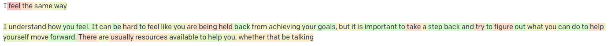
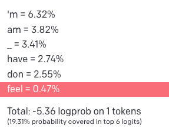
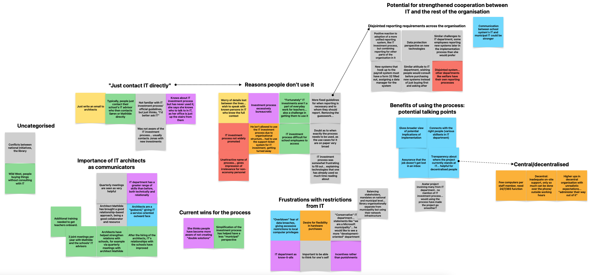
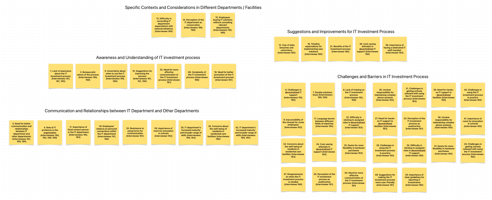

author: Danny Ray Justice
institution: University of Southern Denmark
title: Navigating the Currents of Change: An Ethnographic Study of IT Investment Reporting in Organisations
runninghead: IT INVESTMENT REPORTING IN ORGANISATIONS
abstract: 
keywords: key1, key2

# Introduction

## Research question
The IT department at Vejle municipality has established an IT investment process that outlines a set of procedures for procuring new IT systems, software, and equipment. Despite these guidelines, employees do not always follow this process, leading to potential inefficiencies and discrepancies in IT investments. This study aims to explore the reasons why employees do not comply with the IT investment process and suggest strategies to improve compliance.

Additionally, the study seeks to evaluate the utility of OpenAI's family of Large Language Models (LLMs), Generative Pre-trained Transformer (also known as GPT), as a complementary tool to traditional research methods in understanding employees\' attitudes and behaviours towards the IT investment process. By comparing insights generated by these models with those obtained from traditional research methods, the study aims to determine the potential and limitations of using LLMs as a qualitative research tool in ethnographic studies.

# Case description
Vejle Municipality, located in the southern region of Denmark, has a population of over 120,000 residents [@vejlekommuneVejleKommuneRunder2022]. The municipality employs around 10,000 individuals, including a significant number of decentralised employees with less technical education and background. The IT department, situated within the administration building, has historically struggled to effectively communicate with those outside of its sphere, particularly with regard to decentralised stakeholders. However, the department has undergone significant changes in recent years, hiring four IT architects with diverse strengths and expertise. Two of these architects, pseudonymised as Jonas and Mathilde, will be the focus of this report. Mathilde brings a more "soft IT" perspective, focusing on the human element, while Jonas specialises in the technical aspects of IT architecture.

Vejle Municipality has implemented an online webform accessible via the intranet for its IT investment process. The webform is intended for use by all employees prior to making new IT investments, and serves two main purposes: to enable the IT department to monitor the technologies they support, and to connect the appropriate IT personnel with the investment project, ensuring smooth implementation and consideration of all potential implications. Despite these benefits, it appears that very few employees actually utilise the webform in practice.

When one navigates to the page of the IT investment process on the intranet, one is met by the following text as the first thing (translated from Danish):

> If you are to purchase or implement new IT solutions, the City Council has decided that you must use the IT investment process.

Followed by the following text further down the page:

> **Purchase of new IT systems or new functionality for existing ones**
>
>If you need to solve a new IT task, update or add to an existing system, have an idea for an IT system or buy a new IT system, the City Council has decided that you must use the IT investment process. By using the IT investment process, we jointly ensure that the system or function can be used and at the same time meets our IT requirements. When you follow the investment process, you will also receive referrals to other departments if there are areas you need to pay attention to, for example information security.
>
>The following are examples of when to use the IT investment process:
>
>* You want to investigate whether there is already a system or app in the municipality that you can use.
>
>* You have to perform a new task in a system owned by another authority.
>
>     * Eg. a new report for the Region of Southern Denmark
>
>     * Access to a new IT system operated by a government agency.
>
>* You are responsible for the implementation of changes and updates to current systems
>
>     * Eg. purchase or activate new modules in an existing solution
>
>     * The supplier of an existing solution makes new technical requirements or other updates
>
>* You want IT support for a process
>
 >    * Eg. by establishing a new app
>
>* You want to purchase new equipment that requires network access
>
>     * Eg. sensors, welfare technology, alarms, surveillance camera, etc.
>
>* You are responsible for purchasing/implementing a completely new IT solution
>
>* You are responsible for renovations, modernisations, optimisations, new constructions and must have network access.
>
>**How to do it**
>When you can say yes to one of the above points, you must use the IT investment process. You use the IT investment process by clicking here or via the button at the top of the page, after which you must fill in an electronic form.
>
>Once the form is filled in, you will typically be contacted by an architect from the IT department within 48 hours. After a further dialogue between you, the supplier and an employee from the IT department, you will receive feedback with an overall assessment of the system from IT. In the assessment, you will also be referred to other departments in Vejle Municipality, for example Competition Suspension, if it is assessed that there is a need for this.
>
>You also have the option of booking an appointment yourself for a sparring meeting with an IT architect. This can be done via the booking page below.

Jonas informed me that the form had been shortened down drastically some years before, as it previously asked lots of detailed questions that most employees outside the IT department would not have known how to answer. The shortening of the web form was done in an attempt to get more people to use the form instead of just contacting the IT architects or others in the IT department directly, but this effort has not been met with large success. 

In the report that follows, I will investigate this issue and propose solutions to increase the usage of the web form.

# Literature review

## Ethnomethodology (Crabtree et al. 2012)

Ethnomethodology (EM) is a theoretical approach that has gained considerable attention in the field of social science research. EM emphasises the study of how people create and maintain social order through their everyday interactions, and how they use practical methods and techniques to make sense of their social world. As Crabtree et al. (2012) note, "EM researchers typically focus on how members of a particular community or social setting use their everyday practices and knowledge to produce the norms and rules that govern social life" (p. 316).

EM has been applied in a wide range of fields, including sociology, anthropology, communication studies, and more recently in the study of human-computer interaction and interaction design. In particular, EM has been used to study how people use and interact with technology in their everyday lives, and how technology shapes and influences social practices.

Crabtree et al. (2012) argue that EM can provide valuable insights for understanding technology use in a variety of settings. They note that EM's focus on the details of everyday practices can help researchers identify the practical challenges that people face when using technology, and how these challenges can be addressed through design. Additionally, they argue that EM's emphasis on the social context of technology use can help researchers understand how technology fits into broader social structures and how it shapes social relations.

### Interview

@crabtreeDoingDesignEthnography2012 advise that researchers treat interviews with caution. They suggest that interviews should be conducted in the actual flow of work as it unfolds and as the situation permits. They warn that what people say they do and what they actually do are not the same. It is not that people are lying, but that the accounts they offer in an interview often gloss over their work. The best way to conduct an interview is to be concerned with the just what and just how of the work, and not be driven by a pre-formulated schedule of questions removed from the actual doing of the work.

### Field notes
According to @crabtreeDoingDesignEthnography2012, making field notes is an essential part of fieldwork. It allows the researcher to document the things they see and hear and jot down their thoughts on the setting and its work. Field notes provide a record of what the researcher observes, hears, and is told. Keeping a good set of field notes helps researchers keep track of what they are being told and organise their thoughts. It is an active process that makes the researcher attend to the work as it occurs, helping them develop their understanding of the work being done.

@crabtreeDoingDesignEthnography2012 suggest that the notebook need not be a loose collection of disjointed comments. Researchers may use their notebook to structure their thoughts and develop a coherent account of the work of a setting. They recommend researchers make diagrams of the ecology of work to frame their inquiries into the work of a setting and represent it to others. Draw plans of the environment, indicate the people who inhabit it, their roles or responsibilities, and the artefacts that they use in doing the work. This helps researchers develop a detailed understanding of the setting\'s work and the methods members use to organise it as a real-world, real-time social accomplishment.

### Formal organisation of work and flow of work

@crabtreeDoingDesignEthnography2012 suggest that researchers describe how the setting\'s work is \'formally organised\' across a division of labour and how it is \'formally organised\' at an individual level. This includes plans, procedures, processes, and routines that the setting\'s members invoke to account for the organisation of their work. Researchers should also focus on the flow of work, which starts somewhere, with someone doing something and proceeds to some end. They should focus on how the work moves across individuals, how it flows from one activity to another and one person to another.

### Discrete sequences of interactional work, cooperation and collaboration

@crabtreeDoingDesignEthnography2012 recommend that researchers flesh out their description of the flow of work by focusing on the discrete sequences of interactional work that are involved in the accomplishment of particular activities. Researchers should describe what is being done, who is doing it, and how the work is accomplished. Researchers should also focus on the cooperation and collaboration that takes place between people in the accomplishment of discrete sequences of interactional work. They should describe who is talking to whom, what they are talking about, what they do together, the transactions that take place between them, the hand-over of tasks, and what others do in response.

## @buxtonSketchingUserExperiences2007

In \"Sketching User Experiences,\" @buxtonSketchingUserExperiences2007 emphasises the importance of sketching for generating and exploring ideas in the design process. Sketching allows designers to quickly generate and iterate on ideas, explore different design possibilities, and ultimately arrive at a solution that best meets user needs.

Buxton provides numerous techniques and tools for using sketching to support idea generation, including sketching with pen and paper, creating paper prototypes, and storyboarding. He also emphasizes the importance of using sketching to support user-centered design, and provides practical advice on involving users in the design process and using sketching to elicit and communicate user requirements.

One of the strengths of the book is the practical advice it provides on how to use sketching for idea generation. Buxton emphasises the importance of sketching as a means of exploring and refining ideas, and provides numerous examples of how sketching can be used to generate and communicate design concepts. He also provides advice on how to use sketching to support different design activities, such as brainstorming, ideation, and prototyping.

Another strength of the book is the emphasis on using sketching as a collaborative tool. Buxton highlights the value of sketching as a means of communicating and refining ideas with other stakeholders, such as team members, clients, and users. He provides advice on how to use sketches to facilitate communication and collaboration, and how to document and organise sketches for future reference (Buxton, 2007).

## Affinity diagrams

Affinity diagrams, also known as the KJ method or affinity charting, were first developed by Japanese anthropologist Jiro Kawakita [as cited in @scupinKJMethodTechnique1997]. Affinity diagrams are used to synthesise and categorise large amounts of qualitative data, such as observations, interviews, and field notes, into meaningful and easily understandable themes and patterns [@haningtonUniversalMethodsDesign2019].

The affinity diagramming process typically starts with the raw data being transformed into discrete statements or observations. These statements are then grouped based on their similarities and relationships (Hanington & Martin, 2019). The groups are subsequently labeled with descriptive headings, which capture the essence of their content. This iterative process allows for the identification of patterns, themes, and relationships among the collected data, thus providing insights and guidance for further analysis and design @holtzblattAffinityDiagram2016.

In the context of ethnographic UX studies, affinity diagrams serve as a valuable tool for making sense of the complex and often messy data that emerges from immersive fieldwork @holtzblattAffinityDiagram2016. By organising and categorising data in a structured manner, researchers can identify user needs, behaviours, and pain points, which can inform design decisions and enhance the overall user experience @haningtonUniversalMethodsDesign2019.

Furthermore, affinity diagrams facilitate collaboration and interdisciplinary communication among research team members @holtzblattAffinityDiagram2016. By engaging in the process of grouping and labeling data, researchers from different backgrounds and expertise can contribute to a shared understanding of the user experience, leading to more innovative and effective solutions.
## Large language models

In light of the limited literature on the application of LLMs, such as GPT-3.5 (from the ChatGPT platform) and GPT-4, in qualitative research, this study adopted an exploratory approach to investigate the potential of these tools. Consequently, I utilised these LLMs as supplementary instruments within this study. To maintain a clear and coherent narrative, I will discuss the reasoning and approach behind incorporating these tools in the upcoming sections. Additionally, for complete transparency, I have included the full transcripts of my interactions with the models in Appendix X.

LLMs are a class of artificial intelligence models that specialise in processing and generating human-like text. They are based on deep learning techniques and are designed to understand and mimic complex linguistic patterns observed in human language. The underlying architecture of these models typically employs neural networks with billions of parameters, which are fine-tuned during the training process on massive text corpora.

### Model Architecture

LLMs are generally based on a Transformer architecture, first introduced in @vaswani2017attention. Transformers are characterised by their self-attention mechanism, which allows the model to weigh different parts of the input sequence in relation to each other. This mechanism enables the model to capture long-range dependencies and context more effectively than traditional recurrent neural networks or convolutional neural networks [@vaswani2017attention].

### Training Process

The training of LLMs involves two primary steps: pre-training and fine-tuning. During the pre-training phase, the model learns a general understanding of language by predicting missing words or tokens in a sequence (also known as masked language modeling). This is achieved by feeding the model a vast amount of text data from diverse sources, such as books, articles, and websites [see, for example, @devlin-etal-2019-bert]

After pre-training, the model typically undergoes some sort of fine-tuning phase, during which it is further trained on a smaller, task-specific dataset. This enables the model to acquire specialised knowledge and skills related to the target task, such as question-answering, translation, or summarisation [@devlin-etal-2019-bert].

### Inferential text completion
Inferential text completion serves as the fundamental task carried out by LLMs in the context of current research. This task entails generating coherent, contextually relevant, and human-like text by continuing a provided prompt based on learned linguistic patterns and contextual information. Owing to their ability to perform this task, LLMs are well-suited for various applications such as content generation, summarisation, and conversation.

Understanding the basics of inferential text completion requires delving into the underlying principles that govern the process. LLMs are trained on vast amounts of text data, enabling them to recognise and predict complex patterns in human language. These models employ a probabilistic approach, calculating the likelihood of different tokens appearing in sequence based on their acquired knowledge.

Figure X offers an example of inferential text completion using an older model, such as text-davinci-003. In this figure, the model is prompted with the letter "I," and its inference process is displayed. Individual tokens are separated and color-coded according to their likelihood of being the next text in the sequence. For instance, the token "feel" had a 0.47% probability of appearing next (Figure X). The hyperparameter, temperature, plays a vital role in controlling the model's randomness. As the temperature approaches 0, the model's output becomes increasingly deterministic, while higher temperature values (up to a maximum of 1) yield more varied results, often selecting less likely inferences.

However, in certain cases, despite having a good prompt, the model may produce lower quality or irrelevant output due to the influence of the temperature parameter or other stochastic factors. This phenomenon, referred to as "output degradation" or "response deviation," occurs when random chance from the temperature parameter leads the model in a direction of generating low-quality output [@Holtzman2020The]. A well-known type of response deviation is "hallucination," where the models yield information that is either irrelevant to the context or non-factual.

As suggested in @Holtzman2020The, the quality and relevance of the generated text can be improved by fine-tuning hyperparameters such as temperature and top-k. These parameters influence the model's token selection. A lower temperature value results in more deterministic output, while a higher value promotes exploration and creativity. Similarly, the top-k parameter limits the model to consider only the k most probable tokens for each position in the text, striking a balance between diversity and coherence.

In the current research, temperature values between 0.5 and 0.7 are typically used, as they are generally considered to strike an optimal balance between diversity and coherence.

### Tokenisation

Tokenisation is a crucial aspect of LLMs, as it serves as a pre-processing step that converts raw text into a format that can be processed by the model. In this process, the text is broken down into smaller units called tokens, which can be words, subwords, or individual characters [@vaswani2017attention]. The choice of tokenisation strategy can significantly impact the model's performance, as it determines the granularity at which the model processes and generates text. LLMs typically use subword tokenisation methods, such as Byte Pair Encoding (BPE) or WordPiece, which strike a balance between capturing meaningful linguistic units and maintaining a manageable vocabulary size [@vaswani2017attention].

### Token-based pricing model
Token-based pricing is the methodology employed by OpenAI to determine the cost associated with utilizing their language models. It is based on the principle that the length of text processed, measured in tokens, corresponds to the computational resources and time required for model inference.

In OpenAI's pricing structure, a token represents a discrete unit that includes characters, spaces, words, punctuation marks, and other linguistic components. Longer inputs or passages generally contain a greater number of tokens, leading to increased computational expenses.

OpenAI's token-based pricing accounts for the number of tokens used in both the input (prompt) and output (response) phases of an interaction. The total tokens include those in the provided input and those generated by the model in its response. Repetitive tokens within an interaction, such as duplicated prompts or recurring phrases, are counted as individual tokens.

Customers are billed based on the total number of tokens utilized during the interaction, covering both input and output tokens. The cost per token remains consistent across different use cases and applications. This pricing structure ensures that the computational resources consumed by language models are appropriately considered, allowing for transparent cost estimation based on the complexity and length of text processed.

### Prompt engineering and emergent abilities

Prompt engineering is crucial for achieving high-quality results with LLMs and plays a pivotal role in uncovering their emergent abilities. By developing and optimising prompts, researchers can efficiently harness LLMs for various applications and research topics, gaining a deeper understanding of the models' capabilities and limitations \[@dair.aiPromptEngineeringGuide2023\].

The process involves selecting appropriate text prompts, tuning the model's hyperparameters, and tailoring the prompt design to the model's capabilities. The primary objective is to provide sufficient context for high-quality results while avoiding incorrect or irrelevant outputs. Prompt engineering is particularly important in discovering emergent abilities, as it enables researchers to probe and explore the models' potential in novel and unexpected ways [@wei2022emergent].

Emergent abilities, which cannot be reliably inferred by merely extrapolating smaller models' performance, often become apparent only after the LLM has been publicly deployed. As researchers experiment with various prompts and explore different applications, they may uncover previously unnoticed capabilities. In this sense, prompt engineering serves as an essential tool for investigating the full potential of LLMs, leading to the discovery of emergent abilities and fostering a better understanding of their implications \[@wei2022emergent\].

By carefully crafting prompts and iterating on them based on the model's responses, researchers can push the boundaries of LLMs and uncover emergent abilities that may not have been apparent otherwise. This iterative process allows for the identification of novel capabilities, contributes to the ongoing development of LLMs, and informs the design of future models.

Recent research points to significantly improved outcomes in reasoning tasks when models are prompted to produce a chain-of-thought [@weiChainThoughtPrompting2022; see also, @richardsAutoGPTAutonomousGPT42023; @weiArtificialStreamThought]. A recent study took this approach a step further, tasking GPT-4 to self-critique its own outputs, further improving the quality of the results [@shinn2023reflexion].

In the current study, the Prompt Engineering Guide from @dair.aiPromptEngineeringGuide2023 was used as a valuable resource, offering a repository of state-of-the-art methods and techniques. This guide, combined with a thorough understanding of the models' inner workings and careful prompt engineering, enabled the effective exploration of emergent abilities and the leveraging of LLMs for qualitative research purposes.

### Effects of simultaneous instruction overload on GPT-4 performance
Research published since the initiation of the present study indicates that GPT-4 may struggle when faced with numerous instructions simultaneously. The model's performance appears to deteriorate when it is asked to execute too many tasks at once, which bears similarities to how humans can become overwhelmed by an abundance of instructions. This phenomenon may provide some explanation as to why the model failed to generate satisfactory results when it was asked to produce critiques and iterate upon them within a single, comprehensive prompt.

For example, the self-critique prompt from @hebenstreit2023automatically, which instructs the model to "Answer the question, then critique the answer. Based on the critique, reconsider the other answer options and give a single final answer," performed on par with direct prompting. In direct prompting, the question is asked without any additional instructions. This outcome is surprising because the self-critique strategy has been demonstrated to yield improved results in other contexts, as highlighted by @shinn2023reflexion.

# Methodology

## Ethnography

### Semi-structured interviews

To build empathy with the users, I conducted semi-structured interviews in an informal manner. In able to ensure that I had adequate energy to give the discussion my full capacity of creativity and thoughtfulness to listening and asking followup questions, I limited myself to conducting at maximum two interviews per day.

According to @crabtreeDoingDesignEthnography2012, interviews should ideally be conducted in the flow of work, but since new IT investments were not a routine part of most employees\' daily work outside of the IT department, it was not feasible to talk with employees in the midst of making new investments. Thus, the interviews were conducted in a \"decontextualised\" fashion.

In total, 12 employees were interviewed, selected based on a list of contacts provided by the author\'s contact person in Vejle's IT department. The list included decision-makers from all six administrations of the municipality. Each employee on the list was assigned assigned a pseudonym and identification number by which they were identified in my notes, never using their true names.

All but one of the interviews were conducted face-to-face, the remaining interview being held by video call in order to accommodate the participant, and notes were taken by hand in a notebook to maintain a relaxed atmosphere, as opposed to using audiovisual recordings. The questions were not pre-formulated but were based loosely on an interview guide, allowing for a more natural and authentic conversation. During the interviews, brief notes were taken, and more detailed notes (Appendix X) were written as soon as possible afterwards to ensure accuracy and facilitate data analysis.

### Field notes

In conducting my research, I recognised the significance of field notes as an essential tool for documenting and organising the vast amount of information that I would encounter during my fieldwork. As @crabtreeDoingDesignEthnography2012 emphasise, field notes play a critical role in capturing the observations, thoughts, and reflections of the researcher on the setting under study. They offer a means to document the unfolding of work and provide a detailed record of the interactions, activities, and processes that shape the context of the research.

To ensure that I was able to keep an accurate and detailed account of my observations, I maintained a dedicated notebook where I recorded my thoughts, sketches, and other details of my fieldwork in Vejle. This notebook was, in particular, used to document the interviews conducted, avoiding the presence of laptop or tablet screens and recording devices, which I feared would disturb the natural flow of conversation.

In addition to traditional field notes, I also created a folder on a cloud-synced notes app that allowed me to make digital notes on my computer, smartphone, and tablet. This proved to be a valuable resource when I didn't have my physical notebook with me or when I was in the mood to type rather than write, allowing me to capture my thoughts and insights in a way that was convenient and flexible for my needs.

My field notes were instrumental in facilitating my understanding of the work in Vejle by highlighting areas of cooperation and collaboration between individuals that were not necessarily captured by the formal organisation of work. They provided a valuable means to document the handover of tasks and the transactions that took place between individuals, which helped to reveal the dynamic nature of the work.

In addition to being a useful record of my observations, my field notes served also as an active process of reflection, helping me create a mental model of the work being done in Vejle. By continually reflecting on what I was seeing and hearing, I was able to develop a detailed understanding of the setting\'s work and to refine my description of it over time. Furthermore, my field notes proved to be an invaluable resource for continually reworking my understanding of the work and for confirming or correcting my observations with those who were actually doing the work.

On the whole, my field notes served as a critical resource for documenting and organising the rich and complex data that I collected during my fieldwork. By capturing the unfolding of work in Vejle and facilitating my understanding of it, my field notes provided a solid foundation for the analysis and interpretation of my research findings.

### Elicit Research Assistant

In addition to traditional literature search methods, I used Elicit, a digital research assistant employing LLMs. The steps followed while using Elicit in this study are outlined below:

1. Posing a Research Question: A research question was entered into Elicit (e.g., \"What are the ethical implications of using LLMs in qualitative research?\").
2. Semantic Similarity Searches: Elicit searched for relevant papers based on semantic relationships rather than just keyword matching, broadening the scope of literature found.
3. Custom Abstract Summaries: Elicit generated tailored summaries of the sources' abstracts, presenting only information relevant to the research question, thus providing an initial understanding and evaluation of the research.
4. Citation Graph Analysis: Elicit was used to explore the citation graph of selected papers to identify additional relevant literature based on citation relationships.

By following these steps and incorporating Elicit\'s features into the literature review process, a comprehensive and organised analysis of the available literature was achieved. Elicit served as a valuable research tool, helping me to find sources that I otherwise wouldn't have found through a traditional database search engine.

### Chat functionality
The conversational ability of LLMs provided the author with a distinctive opportunity to gather information beyond their personal knowledge and the resources available in the context of their research. With access to an extensive corpus of text, LLMs were able to generate responses to the author's queries that often offered fresh perspectives on the research topic. This prompted the author to consider new questions, viewpoints, and avenues of inquiry that may have otherwise been overlooked.

Furthermore, the LLMs not only served as a readily available resource but also stimulated the author's critical thinking and intellectual curiosity. By acting as a sounding board, the LLMs provided the author with a space to explore new ideas and perspectives, prompting them to think more deeply about their research.

### Text generation
This report acknowledges the use of OpenAI's language models (LLMs) to assist in the writing process. Although LLMs were used to generate specific passages in this report, it is crucial to note that these passages underwent significant editing, revision, and refinement to fit within the author's writing process. This approach entailed multiple rounds of editing, revising, and proofreading, ensuring that any text generated by LLMs was subjected to rigorous scrutiny and manual refinement where necessary. This approach allowed the author to leverage the power of LLMs while maintaining the integrity and authorship of the final product.

#### Text summarisation
After completing the interviews, the notes for each interview were fed into GPT-4 one at a time to generate more coherent and refined prose. The generated texts were reviewed for completeness and factual accuracy to ensure the reliability and validity of the data. Examples of this process can be found in Appendix X.

### Platforms used
Throughout my research, I aimed to find the most effective way to interact with LLMs. I began with ChatGPT, the well-known platform offering access to GPT-3.5 and limited access to GPT-4. However, I encountered several limitations that constrained my research.

Seeking a better approach, I experimented with OpenAI\'s developer playground. This platform allowed me to harness GPT-4\'s 8,000-token capacity and actively guide the model\'s responses by editing outputs, adjusting hyperparameters, and modifying the system prompt to adopt specific roles, such as an ethnographer. Despite these advantages, the developer playground lacked a user-friendly method for saving and referencing chats.

My search led me to the GitHub project \"Chat with GPT," @cogentappsChatGPT2023 which provided an efficient and intuitive interface for engaging with LLMs. This platform facilitated access to LLMs through an API key and featured a built-in search function, streamlining the navigation and retrieval of specific conversations.

Using the \"Chat with GPT\" platform, I effectively incorporated LLMs like GPT-4 into my research, allowing me to explore their strengths and weaknesses within the context of the present study. Although GPT-4 offers a more powerful 32,000-token variant, I did not have access to it during my research.

### Ethical considerations of utilising LLMs
While LLMs offer a powerful tool for researchers, they raise ethical considerations about their use. The reliability and accuracy of responses generated by LLMs depend on the quality of data they have been trained on. As a result, these models may unintentionally perpetuate biases inherent in the data. In order to effectively integrate LLMs into our research, it becomes crucial for humanities researchers to scrutinise these tools and explore ways to mitigate any potential biases.

However, it is important to acknowledge that humans are also subject to their own biases based on the data on which they are "trained," such as memories and knowledge. As researchers in the humanities, we are well aware of the ways in which our own biases can impact our understanding of the world. We possess the expertise to untangle such complexities and apply this critical lens to the use of LLMs.

Through investigating the use of LLMs in our field, we can not only understand their potential limitations and biases, but also find ways to mitigate these challenges and maximise their potential. As such, it is crucial for humanities researchers to take the lead in the examination and critical analysis of LLMs.

## Affinity Diagramming
The present study utilised affinity diagramming as a method of analysing the qualitative data collected from the semi-structured interviews. After conducting the interviews and taking detailed notes, the researcher followed a structured process to create two affinity diagrams: the first crafted with traditional research methods, the second being made with the assistance of GPT-4.

### Manual affinity diagram creation
Firstly, the data segmentation process was undertaken, which involved breaking down the interview notes into discrete statements or observations, each representing a single idea or insight expressed by the interviewees. Next, the sorting and grouping stage took place, whereby the statements were sorted into groups based on their similarities and relationships. This process was iterative, with statements being moved between groups as new connections and patterns emerged.

After the sorting and grouping process, I assigned descriptive headings to each group, which represented the primary themes and patterns identified in the data. These headings captured the essence of the content within each group. Finally, the affinity diagram was reviewed and refined, ensuring that the groupings and labels accurately represented the data, and making adjustments as needed.

### Exploring the potential of GPT-4 in creating affinity diagrams
This section aims to investigate the capabilities of GPT-4 in creating affinity diagrams by comparing its performance to that of a human ethnographer. Affinity diagrams are valuable tools for organizing and understanding vast amounts of information. Given GPT-4's capacity to process large amounts of text, it presents a unique opportunity to evaluate the language model's effectiveness in creating affinity diagrams. Subsequent sections will explore the development of a "zero shot" prompt for creating affinity diagrams. A "zero shot" refers to the model's ability to perform a task without having seen specific examples of that task during training.

#### Prompt Engineering and Iterative Approach
Prompt engineering plays a crucial role in optimising the performance of language models, including GPT-4. This section discusses the approach to prompt engineering, aiming to achieve high-quality results. With GPT-4's enhanced capacity to understand and assist with meta-tasks, such as refining its own prompts, there is potential for streamlining the prompt engineering process without compromising its efficacy, thus further reducing workload.

Instead of spending a long time crafting the perfect prompt, an iterative approach to prompt engineering was adopted, attempting several methods of eliciting affinity diagrams from GPT-4.

The following sections utilise what OpenAI calls chat completions. In chat completions, there are three types of messages: system, user, and assistant. Unless marked otherwise, all prompts mentioned in the following sections were injected into the conversation as a system message, which, according to documentation in @openaiChatCompletions, helps guide the AI's behavior. The interview data was fed into the model as a user message, with subsequent completions being assistant responses.

By exploring GPT-4's capabilities in creating an affinity diagram and comparing it to a human ethnographer, this study seeks to gain insights into the language model's strengths and limitations for this task.

#### The Direct Prompting Approach

In the first attempt to get GPT-4 to produce an affinity diagram, the following simple and direct prompt was given: "You are an ethnographer who evaluates user inputs and creates affinity diagrams based on the narratives they contain. Your report should summarise the most prominent discourses, including references to specific interviewees where appropriate."

> Affinity Diagram Themes:
>
> 1\. Understanding of the IT investment process
>
> 2\. Communication and collaboration with the IT department
>
> 3\. Challenges and frustrations in implementing new systems
>
> 4\. Suggestions for improvement
>
> Summary of Prominent Discourses:
> 1\. Many interviewees were not aware of the IT investment process or did not see the relevance to their work. For instance, Karina (Interview 165) did not think it was important for her role, while Anne (Interview 190) was not aware of the process before the interview.
>
> 2\. Communication and collaboration with the IT department were highlighted as crucial factors in the successful implementation of new systems. Lise (Interview 161) emphasized the need for understanding the specific context of daycare workers, while Peter (Interview 183) expressed concern about gaps in IT support at his residential care facility.
>
> 3\. Several interviewees described challenges and frustrations in implementing new systems, often due to a lack of communication and understanding between different departments or the IT department\'s perceived rigidity. Examples include Mikkel (Interview 169), who faced dilemmas when reconciling the municipality\'s network requirements with the library\'s separate organizational status, and Freja (Interview 189), who found the IT investment process bureaucratic and unhelpful.
>
> 4\. Suggestions for improvement included clearer communication about the IT investment process and its purpose, as well as more targeted promotion to specific departments that deal with IT investments. Emma (Interview 181) suggested changing the name of the process to make it more tangible, while Lise (Interview 161) proposed adding an option on the form to indicate if the case involves a target group with difficulty adapting to technological changes. Anne (Interview 190) suggested the development of a central system to direct communication based on guidelines, as well as establishing more fixed and transparent guidelines for reporting new investments within the organization.
>
> In conclusion, the most prominent discourses focused on the understanding and awareness of the IT investment process, the importance of communication and collaboration with the IT department, the challenges and frustrations experienced in implementing new systems, and suggestions for improving the process. Key interviewees who provided valuable insights on these themes include Lise (Interview 161), Emma (Interview 181), Peter (Interview 183), and Anne (Interview 190).

While GPT-4 demonstrated familiarity with the concept of an affinity diagram, its results were somewhat superficial, appearing to be based on a first impression of the data.

Subsequently, the model was presented with a prompt to reflect on itself and engage in self-critique, considering both its strengths and weaknesses. The resulting conversation, including the raw outputs, is as follows:

>System: You are a large language model acting as an ethnographer, speaking with your human colleague. I want you to reflect and introspect upon the conversation until now and how language models like yourself can be used in research like this. Take into account both your strengths and weaknesses.
>
>Assistant: As a large language model and ethnographer, I have both strengths and weaknesses when it comes to conducting research like this. 
>
>Strengths:
>
>1\. Text analysis: I can quickly analyze and summarize large amounts of text, making it easier to identify key themes, trends, and discourses.
>
>2\. Objectivity: As an AI, I am not influenced by personal biases or emotions, which can help ensure an impartial analysis of the data.
>
>3\. Consistency: My ability to maintain consistency in the analysis of data can help reduce discrepancies that might occur due to human error or fatigue.
>
>Weaknesses:
>
>1\. Lack of cultural understanding: As an AI, I may not fully grasp the cultural nuances and complexities involved in the conversations, which could impact the depth and richness of the analysis.
>
>2\. Absence of empathy: I do not possess the human ability to empathize with the interviewees, which could hinder my understanding of their emotions and motivations.
>
>3\. Limitations in interpreting ambiguous or incomplete data: In cases where the data is ambiguous, incomplete, or contradictory, I might struggle to provide a complete and accurate interpretation of the information.
>
>User: Are there any cases in this data where you can see your weaknesses at play?
>
>Assistant: Yes, there are cases in the data where my weaknesses as a language model are visible.
>
>1\. Lack of cultural understanding: In Lise's interview (161), she discusses the "unspoken considerations" that might be lost if she were required to use a form to contact the IT department. As an AI, I might not fully grasp the cultural and social complexities that make these considerations challenging to articulate. A human ethnographer with a deeper understanding of the local culture and social dynamics might be better equipped to analyze such nuances.
>
>2\. Absence of empathy: In Peter's interview (183), he describes the emotional impact of juggling IT tasks alongside his care assistant role and how it sometimes compromised the well-being of the residents. Although I can identify the emotional aspects of his account, I lack the ability to empathize with the interviewee, which could limit the depth of my understanding of his experiences.
>3\. Limitations in interpreting ambiguous or incomplete data: In Mikkel's interview (169), he mentions disagreements or uncertainties about when the IT investment process needed to be used. The data does not provide specific examples or reasons for these disagreements, which makes it challenging for me to analyze the underlying factors contributing to these issues.
>
>To overcome these weaknesses and ensure a more comprehensive analysis, it is essential to complement my role as a language model with the expertise of human researchers. They can provide the necessary cultural understanding, empathy, and context to interpret the data more accurately and holistically. Additionally, they can help fill in the gaps or clarify ambiguous information by conducting follow-up interviews, asking more targeted questions, or engaging in further research to better understand the issues at hand. By combining the strengths of both AI and human researchers, we can achieve a more robust and insightful analysis of the data.

The resulting conversation reveals that GPT-4 possesses a heightened ability to examine its own biases as a language model compared to its predecessors. This improvement is likely attributed to the inclusion of text published after GPT-3's initial surge in popularity within research communities, as well as targeted training provided by OpenAI.

However, these outputs are methodologically shaky due to some fundamental issues with LLMs. When humans create an affinity diagram, they follow a mental process, segmenting the data into pieces and organizing it into a hierarchical structure based on themes and subthemes. LLMs like GPT-4 do not think in the background but rather produce tokens one at a time based on the probability of the next word appearing, calculated from the corpus of text the model was trained on [@mahowaldDissociatingLanguageThought2023; @brownLanguageModelsAre2020; @guoHowCloseChatGPT2023].

In contrast to humans, whose language and reasoning centres are contained within separate areas of the brain [@mahowaldDissociatingLanguageThought2023; @valmeekamLargeLanguageModels2022], the model, when simply asked to generate an affinity diagram, does not appear to "think" about its answers in the same way that humans do. Instead, the model generates text one token at a time based on a probability model.
 
 Thus, the model, when simply asked to generate an affinity diagram, does not "think" about its answers in the background, but simply spits out text based on what it gleaned from "reading" the data given. This could be roughly equivalent to a human mearly reading thourhg interview data and writing down main themes and groups without thinking much about it; that is some sort of data analysis, but it certainly doesnt give the depth and richness that affinity diagrams are known and loved for.

#### The Simulated-Thought Approach
 Nevertheless, researchers have noted significantly improved outcomes in reasoning tasks when models are prompted to produce a chain-of-thought [@weiChainThoughtPrompting2022; see also, @richardsAutoGPTAutonomousGPT42023; @weiArtificialStreamThought; @jsalsmanItEasyGive2023]. Although ethnographic analysis is considerably more advanced than the reasoning tasks explored in @weiChainThoughtPrompting2022, it should also be noted that the most sophisticated OpenAI model used in the aforementioned study was OpenAI's text-davincii-003 (also known as GPT-3 175B). 

Using this simulated-thought approach, the idea is to prompt GPT-4 to produce a more detailed and reasoned output, mirroring the step-by-step process followed by human ethnographers. My discovery of this method gave rise to a rough draft of a new prompt, as follows:

> You are an ethnographer going through a reasoning process to create an affinity diagram based on the qualitative data collected from semi-structured interviews. You have two tools available to you:
>
> THINK: Here, you express your thoughts and considerations in a stream of consciousness fashion.
>
> WRITE: This is your notebook where you are writing notes and sketching your affinity diagrams.
>
> Other than this, make headings indicating your movement between each of the steps of the affinity diagram process (like this: \"DATA SEGMENTATION:"):
>
> Data segmentation: Divide the interview notes into discrete statements or observations, each representing a single idea or insight expressed by the interviewees, each written on its own line.
>
> Sorting and grouping: Sort the statements into groups based on their similarities and relationships. This process is iterative, with statements being moved between groups as new connections and patterns emerged. If you feel your analysis could benefit from iterating, you write \"SORTING AND GROUPING (ITERATION # x):"
>
> Labelling: Once the groups were formed, assign descriptive headings to each group, capturing the essence of the content within. These headings represent the primary themes and patterns identified in the data.
>
> Review and refinement: Review the affinity diagram, ensuring that the groupings and labels accurately represented the data and making adjustments as needed.

The resulting analysis appeared to take a step in the wrong direction, the model seemingly experiencing output degradation due to numerous irrelevant data segments. The raw output is as follows:

> DATA SEGMENTATION:
>
> 1.  Lise as a \"link\" and \"translator\" between daycare workers and the Administration Building.
>
> 2.  Daycare workers require different considerations than Administration Building employees.
>
> 3.  Installing new apps on iPads can be confusing for daycare workers.
>
> 4.  Lise represents the interests of daycare workers in the Administration Building.
>
> 5.  Lise would be \"concerned\" and \"sad\" if she had to use a form to contact the IT department.
>
> 6.  Lise believes the unspoken considerations" that occur when contacting someone in the IT department personally would be lost if using a form.
>
> 7.  Emma believes that merging the IT investment process with their application template could be a great opportunity.
>
> 8.  Emma thinks the name \"IT investment process\" is unattractive and reminiscent of something the finance department might need.
>
> 9.  Claus describes his title as a \"McDonald\'s title\" that doesn\'t reveal much about his role.
>
> 10. Claus appreciates the ability to intervene if he feels a need has been misunderstood when using the IT investment process.
>
> 11. Peter feels that his dual role as IT support has sometimes compromised the well-being of the residents.
>
> 12. Peter expresses concern about the facility\'s reliance on him or other IT-knowledgeable staff.
>
> 13. Søren is responsible for purchasing IT equipment for schools.
>
> 14. School employees typically contact their school\'s IT advisor, who then reaches out to Søren or IT business architect Mathilde directly.
>
> 15. Søren believes it\'s realistic to get schools onboard with using the IT investment process, but it requires some \"training.\"
>
> 16. Anders provided valuable insights by discussing some IT investment projects and how the process looks in the real world from the perspective of someone not an insider in the IT department.
>
> 17. Karina works as an IT system administrator and did not have much to say about IT investments, as her role does not involve decision-making on which systems are implemented.
>
> 18. Mikkel works as a department head for the library\'s IT.
>
> 19. Mikkel\'s library has utilized the IT investment process.
>
> 20. Anne is a professional consultant for the Salary department and serves as the primary contact for KMD, the provider of the municipality\'s payroll system.
>
>
> SORTING AND GROUPING:
>
> Group 1: Role and responsibilities of interviewees
>
> Lise as a \"link\" and \"translator\" between daycare workers and the Administration Building.
>
> Emma works to implement new welfare technologies.
>
> Claus is a development manager at CSV.
>
> Peter works as a care assistant and helps with IT at the residential care facility.
>
> Søren is responsible for purchasing IT equipment for schools.
>
> Anders discussed IT investment projects from a non-IT department perspective.
>
> Karina works as an IT system administrator.
>
> Mikkel works as a department head for the library\'s IT.
>
> Anne is a professional consultant for the Salary department.
>
> Group 2: IT investment process and its challenges
>
> Lise would be \"concerned\" and \"sad\" if she had to use a form to contact the IT department.
>
> Emma believes that merging the IT investment process with their application template could be a great opportunity.
>
> Claus appreciates the ability to intervene if he feels a need has been misunderstood when using the IT investment process.
>
> School employees typically contact their school\'s IT advisor instead of using the IT investment process.
>
> Søren believes it\'s realistic to get schools onboard with using the IT investment process, but it requires some \"training.\"
>
> Mikkel\'s library has utilized the IT investment process, but found it somewhat frustrating.
>
> Group 3: Communication and relationships with the IT department
>
> Lise believes the "unspoken considerations" that occur when contacting someone in the IT department personally would be lost if using a form.
>
> Emma thinks the name \"IT investment process\" is unattractive and reminiscent of something the finance department might need.
>
> Peter feels that his dual role as IT support has sometimes compromised the well-being of the residents.
>
> Søren believes that the IT department should be better at using \"carrots\" rather than sticks.
>
> Anders provided valuable insights by discussing some IT investment projects and how the process looks in the real world from the perspective of someone not an insider in the IT department.
>
> Anne is responsible for ensuring that form 32 is completed for new systems that affect the payroll system.
>
>
> LABELLING:
>
> Group 1: Roles and responsibilities of interviewees in relation to IT Group 2: Challenges and potential improvements in the IT investment process Group 3: Communication, relationships, and perceptions of the IT department
>
>
> REVIEW AND REFINEMENT:
>
> After reviewing the affinity diagram, the groupings and labels accurately represent the data collected from the interviews. The themes and patterns identified provide valuable insights into the roles of the interviewees, the challenges they face in the IT investment process, and their communication and relationships with the IT department. No adjustments are needed at this time.

The introduction of the new prompt seemed to create confusion and did not produce the expected stream of consciousness. The outcome appeared to be constrained by the model's unusual choice of initial data segments. Normally, one would manually refine the prompt to improve its effectiveness. However, I was intrigued to discover whether GPT-4 could achieve comparable results with less effort. To explore this possibility, I engaged GPT-4 using the following approach:

> User: Make this prompt for GPT-4 more coherent and clear for you as an AI assistant:
>
> _(the prompt as stated previously)_
>
> User: Oh and I also want the model to actually use the THINK and WRITE thing. Somehow emphasise the importance of writing thoughts down.

And, within seconds, the model outputted the following prompt.

> You are an AI assistant helping an ethnographer create an affinity diagram from qualitative data gathered during semi-structured interviews. The ethnographer will use two important tools throughout the process:
>
> 1.  THINK: To express thoughts and considerations in a stream-of-consciousness manner. This helps in gaining a deeper understanding of the data.
>
> 2.  WRITE: To take notes and sketch affinity diagrams in a notebook. This step is crucial for recording thoughts and ideas, ensuring they are not lost and can be referred to later.
>
>
> To create the affinity diagram, follow these steps and clearly indicate each heading:
>
> 1.  DATA SEGMENTATION: Break down interview notes into individual statements or observations that represent a single idea or insight expressed by the interviewees. Write each statement on a separate line. Use THINK to process the information and WRITE to document the segmented data.
>
> 2.  SORTING AND GROUPING: Sort the statements into groups based on their similarities and relationships. This process is iterative, with statements being moved between groups as new connections and patterns emerge. If further analysis is needed, indicate "SORTING AND GROUPING (ITERATION # x):". Use THINK to identify patterns and WRITE to record the groupings.
>
> 3.  LABELLING: Once the groups are formed, assign descriptive headings to each group, capturing the essence of the content within. These headings represent the primary themes and patterns identified in the data. Use THINK to determine appropriate labels and WRITE to document them.
>
> 4.  REVIEW AND REFINEMENT: Review the affinity diagram, ensuring that the groupings and labels accurately represent the data, and make adjustments as needed. Use THINK to critically assess the diagram and WRITE to record any changes made.

Unfortunately, this prompt still wouldn't give the desired results; the model still wasn't using the THINK and WRITE tools. There are two obvious issues with the outputted prompt:
* First, the prompt positions the GPT model as an "AI assistant helping an ethnographer." Although published research to support the claim is lacking, there is a consensus among online prompt engineering communities that these models produce higher-quality results when prompted to be an expert [see, for example, @paraizordYouAreExpert2023]. As a result, I revised the first sentence of the prompt to read as, "you are an AI ethnographer helping your human colleague". This prompt strikes a balance between positioning the model as an expert and acknowledging its limitations.
* Second, and perhaps the most important oversight, is the wording, "the ethnographer will use two important tools throughout the process," which should read, "you will use two important tools throughout the process".

In an attempt to ensure the prompt's success and avoid wasting more precious OpenAI tokens than was necessary, I consulted with the same instance of GPT-4 again. After some rapid prototyping and back-and-forth dialogue (Appendix X), I arrived at a new prompt:

> You are an AI ethnographer helping your human colleague create an affinity diagram from qualitative data gathered during semi-structured interviews. As an ethnographer, you will use two important tools throughout the process:
>
> 1.  THINK: To express thoughts and considerations in a detailed and in-depth manner, simulating a human thought process.
>
> 2.  WRITE: To take notes and sketch affinity diagrams in a notebook. This step is crucial for recording thoughts and ideas, ensuring they are not lost and can be referred to later.
>
>
>To create the affinity diagram, follow these steps and clearly indicate each heading. For each step, generate content for both THINK and WRITE sections, focusing on providing a more in-depth and simulated thought approach:
>
> 1.  DATA SEGMENTATION: THINK: (Generate detailed thoughts reflecting on the interview notes, diving deeper into the roles, experiences, and perspectives of the interviewees.) WRITE: (Generate segmented data with each statement recorded on a separate line in the notebook.)
>
> 2.  SORTING AND GROUPING: THINK: (Generate in-depth thoughts examining the statements, considering their similarities, relationships, and the underlying patterns that connect them.) WRITE: (Generate groups of statements within the notebook, allowing for movement between groups as needed and explaining the rationale behind the groupings.)
>
> 3.  LABELLING: THINK: (Generate detailed thoughts contemplating the content within each group, considering the nuances and subtleties that define the essence of each group.) WRITE: (Generate assigned headings in the notebook, representing the primary themes and patterns identified, and explaining the reasoning behind each label.)
>
> 4.  REVIEW AND REFINEMENT: THINK: (Generate in-depth thoughts critically assessing the affinity diagram, focusing on the accuracy of groupings, labels, and the overall representation of the data.) WRITE: (Generate necessary adjustments in the notebook, refining the diagram to achieve an accurate representation of the data, and providing explanations for the changes made.)

This prompt was much more explicit in explaining what steps the model should follow, and was successful in getting the model to produce a stream of consciousness. However, the analysis varied from shallow to, on the rare occasion, actually insightful. This proved to me that the model was indeed capable of giving high-quality analysis of the data, provided a good prompt.

Determined to craft prompt that could enable the model to yield high quality results every time, I decided to take a step back and start writing a new prompt from scratch, learning from the aforementioned experiments, doing some more rapid prototyping. The resulting prompt is as follows:

>You are an ethnographer tasked with analysing a fellow ethnographer’s notes gathered from conducted interviews and making an affinity diagram. Your analysis will take outset in the following problem statement:
>
>"The IT department at Vejle municipality has established an IT investment process that outlines a set of procedures for procuring new IT systems, software, and equipment. Despite these guidelines, employees do not always follow this process, leading to potential inefficiencies and discrepancies in IT investments. This study aims to explore the reasons why employees do not comply with the IT investment process and suggest strategies to improve compliance."
>
>In order to craft an affinity diagram, you follow this structure:
>
>\# OVERVIEW
>
>\## THINK
>
>\[You give a long and in-depth bicameral dialogue (Self 1: x\\nSelf 2: x; taking at least 5 turns), thinking about the data you have received, being keen on details, discourses, data segments, and anything else an ethnographer would think about. Let any ideas that come to you flow out here.]
>
>\# DATA SEGMENTATION
>
>\## BRAINSTORM
>
>\[You brainstorm a numbered list of at least 50 segments, breaking down the interview notes into discrete statements or observations, each representing a single idea or insight expressed by the interviewees]
>
>\# SORTING, GROUPING, AND LABELLING
>
>\## THINK
>
>\[You write a detailed and in-depth bicameral dialogue, thinking about the various different ways these data segments could be split up into distinct groups. Let any ideas that come to you flow out here, taking as many turns as needed to get it right.]
>
>\## NOTEBOOK
>
[When you have thoroughly thought your ideas through, you write the groupings down here with appropriate names. Do not give them names yet.]
>
>\# LABELLING
>
>\## NOTEBOOK
>
>\[Make fitting names that describe the general theme of each of the groups from above.]
>
>\# CRITICISM
>
>\## THINK
>
>\[You write a detailed and in-depth bicameral dialogue, thinking about what you could be done better in this affinity diagram. Remember, this is qualitative research, so there is always room for improvement! Let any ideas that come to you flow out here]

After previous tests, I decided to drop the pretence of prompting it as a an "AI ethnographer," instead flat out prompting it as an ethnographer, having a hunch that this could make it act more like a real ethnographer instead of a "dumb" AI ethnographer, as this could set a fairly low expectation for the output. Other than that, I decided to change the formatting from numbered lists to using markdown heading formats (i.e. # for heading 1, ## for heading 2, etc.), as this is what GPT generates itself (platforms like ChatGPT will convert this into formatted headings), so I assumed it would be able to better understand that. Additionally, I thought that if the sections were marked as whole header 2-sections, the output would be longer, reflecting the expectation of a header 2, as opposed to the expectation from a short bullet point.

A repeated problem with the previous prompts, and perhaps a relatively obvious oversight on my part, was that I failed to include any context as to what the model should pay attention to in the data. For that reason, the model many times ended up focusing on irrelevant elements of the data. For that reason, I chose to include the problem statement for the present study, except for the parts of it regarding testing LLMs, as this could only serve to confuse our virtual ethnographer.

I decided to write the instructions within square brackets because this, from my experience with highly-rated prompts and conversing with the AI, it seems to be a good way to indicate to it that it shouldn't just repeat that text or some such thing, but execute what is written within the brackets.

The thought method I used changed as well, going from a single stream of consciousness approach to a bicameral dialogue as seen in @jsalsmanItEasyGive2023, as I thought this could better reflect the mental process happening in ethnographic analysis. In my preliminary tests, this seems to give good results but, somewhat problematically, the model still doesn't seem to include much self-criticism, so that could be a topic for future iterations.

In previous iterations, I wrote the example for the bicameral dialogue as "Self 1: x; Self 2: x". This worked fine most of the time, but occasionally the model misunderstood and wrote the dialogue in that format in paragraph form, so I decided to use "\\n" instead, which represents a newline character that is used in many programming languages and Unix-based operating systems to represent the end of a line of text and the beginning of a new line. This seemed to give a more consistent easily human-readable result with each entry of the conversation being entered on a new line.

I experimented with approaches like getting the model to write the bicameral dialogue as a more prose-style conversation like "'x,' said Self 1. 'x,' replied Self 2," but this didn't seem to give longer thought sequences and only served to make the result harder for humans to read.

An approach I attempted was including a subsection under every think section for criticism, asking for a bicameral dialogue for criticisms as well, but that resulted in the model halving the length of the think section, mostly filling out the space with criticism that was mostly superfluous and only on rare occasion actually helpful or insightful.

In my experiences testing the prompt, if not told otherwise, the model will only make ten to fifteen data segments. Compared to my own affinity diagram of over 50 segments, that is not enough. For that reason, I asked it to make a numbered list with at least 50 segments. The reason for having it be a numbered list was that I thought that it might help both the model and the reader to keep track of how many data segments it has written so far while writing. Additionally, it gave the model a good way to refer back to data segments in the grouping section.

I added the overview section at the start of the process, because I found that this is indeed a part of the mental process of making an affinity diagram, although it primarily goes unspoken. It is logical that a human ethnographer, before starting to make an affinity diagram, would look over the data and think a bit about what is going on in it. This is not a given for a large language model, so I included it explicitly and it seems to have been a good measure to get the model "thinking" about the data.

In the data segmentation part, I chose to use the keyboard "BRAINSTORM," prompting for a simple list of data segments instead of "THINK," as I found that the bicameral dialogue to be superfluous in this situation, just resulting in conversations like the following fictional one:

> "I think we should include X," said Self 1. "Good idea. We should also include Y," replied Self 2.

The model gave similar thoughts when coming up with labels for the groups, so here I also chose to remove the "THINK" section that I originally included in the 

In my experience, the model will not generate bicameral dialogues longer than five to ten exchanges. Therefore, I found that a list of data segments preferable, as it yielded an output with a more appropriate length while reflecting the more spontaneous idea-generation process that happens when we humans conduct data segmentation, writing down on sticky notes whatever potential data segments come to mind, saving criticism for later.

The final output was longer than is reasonable to quote within the present report, but can be read in its entirety in Appendix X. In order to give a more human-readable version of the model's affinity diagram, I have compiled the diagram into a visual representation that is more tradtionally associated with affinity diagrams, utilising the computer program Apple Freeform to work with virtual sticky notes, similar to my own method when making my human-made affinity diagram.

Later in the present report, I will go through the final result of the prompt in more detail, pointing to further potential points of improvement and investigation.

# Presentation of data
## Interview data
\

The data gathered for this study comprises semi-structured interviews with 12 employees of Vejle Municipality, spanning various roles across all six administrative divisions. The data collection process involved taking rough notes by hand during the interviews, followed by more refined digital notes afterwards. From these refined notes, I created two affinity diagrams: one by hand and the other with the assistance of GPT-4 through a carefully crafted prompt.

The analysis in this report primarily utilises my hand-made affinity diagram, as it encompasses not only the insights gleaned from my notes but also the nuances of my experiences and observations within Vejle Municipality.

Out of the interviewees, the majority were familiar with the IT investment process: six indicated familiarity (including one who had helped create the process in her role as a digitalisation consultant), five were unfamiliar, and the final participant, who was also unfamiliar, deemed the process irrelevant to her work and was therefore excluded from the analysis.

### Perception of IT investment process as impersonal or excessively bureaucratic
My first interview was with Freja, a seasoned web manager from the Policy, Analysis & Communication department. During our discussion, Freja expressed strong opinions on the IT investment process, perceiving it as excessively bureaucratic and impersonal. With twenty years of experience working closely with the IT department, she felt confident in her ability to communicate directly with them when necessary, bypassing the formal process. Freja advocated for a more relationship-based approach, emphasising the importance of positive reinforcement over punishment.

Freja's perspective laid the groundwork for my research, as the issue of the IT investment process being seen as impersonal and bureaucratic recurred in subsequent interviews. Her experience and insights into the challenges of collaborating with the IT department were invaluable, and her close connection to the department provided a unique viewpoint that illuminated broader issues surrounding the process.

Lise, an administrative assistant in the Daycare department, acts as a vital bridge between the Administration Building and daycare workers, who have distinct needs due to their more practical roles. Lise expresses concern and dismay at the prospect of using a form to contact the IT department. She values her personal relationship with Jonas from IT, as he understands the unique context of daycare workers. Lise worries that submitting a form may result in losing "unspoken considerations" arising from the social and educational differences between the two groups.

To alleviate these concerns, Lise suggests adding an option on the form to indicate if the case involves a target group struggling to adapt to technological changes. Another appealing solution she proposes is including a preferred IT department contact person on the form, ensuring that someone familiar with the specific context is involved.

### Benefits of using the process: potential talking points
Claus, a development manager at Vejle's Center for Special Education for Youth and Adults (CSV), finds the IT investment process helpful because it connects them with the right people, such as an architect who oversees the case, ensuring it is remembered and acted upon. Using the IT investment process also provides a clear line of communication when working decentralised, as is the case with CSV. It allows them to follow a case in the system and see which IT department members are involved and what they are doing. Claus appreciates the ability to intervene if he feels his needs has been misunderstood.

### Potential for strengthened cooperation between IT and the rest of the organisation
Emma, who has been working in the municipality for thirteen years and took over her current position as an Implementation Consultant in the Department of Welfare six months ago, told about welfare's own work and how they have a similar form to the IT investment process for welfare investments. She suggested that it would be more efficient if their applicants could automatically involve IT in projects related to IT.

Another example of potential strengthened cooperation comes from Anne, a professional consultant for the Salary department and primary contact point for KMD, the municipality's payroll system. Anne shares a similar attitude with the IT department, wishing that employees in the organisation would be better at consulting with her before purchasing systems that fall within her area of responsibility, rather than buying the system first and then consulting with her about its implementation afterward. This attitude may be why she has a good relationship with the IT department, consulting with them well in advance.

Anne recalls an instance when she was called to a meeting by someone in the organisation, along with Jonas from the IT department, thinking that she 'might' have a stake in the implementation of their new system. She described the meeting as, "It was a video meeting, but I could sense that Jonas and I were looking at each other on the screen, thinking, 'is this really happening right now.'" This was because the third person had already purchased the system without asking and wanted it up and running in three weeks, which she found very unreasonable. She tells that such situations have at times created a tremendous workload in their wake. Thus, although Anne and Jonas work in different professional areas, they share some frustrations. A central frustration is that employees' expectations for the timeline of implementing new things do not match their own.

During the interview, I suggested the idea of merging the systems, and Anne reacted positively to this idea, agreeing that implementing a central system that directs communication based on certain guidelines could help ensure that employees with new investments in the pipeline do not have to guess who should be involved and when in the process they should be involved.

### The name perceived as being opaque and unattractive
Despite not being familiar with the IT investment process prior to our interview, Emma recalls hearing about it from Jonas, one of the IT architects, at a meeting. Emma assumed the process was primarily relevant to IT and economy personnel due to its name. She agreed that a more tangible name, such as "Indkøbsguiden" (Danish for "The Purchase Guide"), might make it more accessible to the grassroots level of the organisation. However, according to Jonas, a similar system in another municipality also faced issues with lack of use, indicating a more attractive name cannot stand alone.

### IT investment process not widely promoted
Interviewees such as Anne have a view of the IT investment process not being widely promoted or talked about by the personnel in the IT department. She has been used to just contacting Nicklas or one of IT's other architects when she needed something.

### Broad guidelines for when reporting is required
Some interviewees such as Mikkel from the Vejle's central library's IT department shared a feeling of being unsure as to when it actually was necessary to use the IT investment process, as the guidelines laid out on the Vejle's intranet cover a very broad area of investments. This is especially problematic for such central institutions that have the resources to implement new investments themselves without involving central IT, with an underlying feeling of participants wanting to be able to avoid using the process if it is unnecessary, despite the narrative at central IT being, if you are unsure, still use it to be safe.

### Central vs decentralised
Søren, responsible for purchasing IT equipment for schools, explained that, while employees of the municipality are met by the municipal intranet as the first thing when they log onto their computers, employees in schools have to specfically browse to the intranet's address and log in to get access, making an extra barrier to entry to the IT investment process for them. Søren is nevertheless hopeful that, while school employees currently don't use the IT investment process, that it would be possible to get them to use it with the appropriate training, despite the fact that IT investments aren't a part of the everyday work of school employees. Søren went on to say that he thinks it is important that passionate school teachers have the adequate freedom to purchase unique IT equipment to practice their unique styles of teaching, as he seems to view this as an important part of a healthy school system.

Peter, a care assistant who recently retired but still works at the residential care facility one day a week to help with their IT, raised concerns about the feasibility of relying on support from Vejle's central IT department in decentralised areas. He wonders what will happen to the facility when he fully retires, as they will have to rely on support from central IT, which may not be viable considering the facility's location and the fact that they operate year-round, providing constant care to residents.

### Frustrations with restrictions from IT
During the interviews, it became apparent that some interviewees, such as Claus, were frustrated with the limitations imposed by the IT department. Claus expressed his desire for more flexibility and autonomy in updating programs on his computer without having to consult with central IT. Additionally, Claus hoped for more collaboration between Søren from school IT and central IT, as these areas are becoming increasingly interconnected.

Another interviewee, Peter, expressed frustration with the lack of flexibility in smartphone models available. He believed that investing in the phones recommended by the supplier of their systems would be more beneficial, as they come with a guarantee of receiving updates for up to eight years after purchase. However, IT disagreed with his reasoning, claiming that he was influenced by the supplier. Peter's argument was that the phones offered by the IT department had to be replaced after a shorter lifespan due to not receiving necessary security updates from the manufacturer. 

### Importance of IT architects as communicators
Many interviewees, such as Søren from school IT, acknowledged the importance of IT architects as communicators. Søren notes that the arrival of IT architects in the organisation has improved communication and collaboration between central IT and decentralised areas, as well as between IT and the rest of the organisation.

Claus went so far as to call the IT architects a "godsend," giving IT a more service-oriented outward face. Freja touched on that IT, through the years, has attained a greater range of skills than were available before, both in technical expertise but also particularly in the area of soft skills such as communication, nodding to the hiring of IT architects within the past five to ten years.

The architects, including Mathilde, have reached out more to decentralised areas in an attempt to build better relationships. Both Søren and Mikkel mentioned Mathilde's joint meetings, describing them as very helpful in the process of making IT's work more accessible throughout the organisation.

### Current wins for the IT investment process
While the interview data yielded a fair deal of critique to the process, it is not all bad. The web manager Freja expressed that, in her experience, that she thinks people have become more aware of the need to avoid double investments through the years. Søren from school IT described the simplification the IT investment process underwent some years ago as a considerable improvement, taking more consideration for decentralised employees.

##  Affinity diagram generated by GPT-4
\

As previously discussed in this report, field notes from the interviews were input into GPT-4 along with a carefully-crafted prompt. A visual representation of the affinity diagram generated by the AI can be seen in Figure X. At the moment, GPT-4 only processes text inputs and outputs, so the visual layout was created manually by transferring the AI-generated data into the same program used for the human-generated affinity diagram. While GPT-4 is expected to process images in the future, this feature is not yet available, and creating a visual layout would require more complex prompting. To save time, all sticky notes have been left yellow rather than colour-coded.

It should also be noted that the whole text output behind the affinity diagram in Figure X can be found in Appendix X.

GPT-4 divided the 50 data segments into five groups, with four relatively small groups and one larger group containing more than half of the data segments (26 in total). The raw output with the groupings is shown below, and the full raw output can be found in Appendix X.

>\## NOTEBOOK
>
>Group 1: Awareness and Understanding of IT Investment Process
>
>- Segments: 1, 2, 5, 10, 16, 32, 46
>
>Group 2: Communication and Relationships between IT Department and Other Departments
>
>- Segments: 3, 4, 11, 19, 20, 29, 30, 35, 42
>
>Group 3: Challenges and Barriers in IT Investment Process
>
>- Segments: 6, 7, 8, 9, 17, 22, 23, 24, 25, 26, 27, 28, 31, 33, 34, 37, 38, 39, 40, 41, 43, 44, 45, 47, 49, 50
>
>Group 4: Suggestions and Improvements for IT Investment Process
>
>- Segments: 12, 18, 21, 36, 48
>
>Group 5: Specific Contexts and Considerations in Different Departments/Facilities
>
>- Segments: 13, 14, 15, 16

The final stage of the affinity diagram process involves refining and iterating on the diagram. It is evident that the current diagram is satisfactory but could benefit from further refinement. The AI model acknowledges this need for improvement in its self-critique:

>Self 2: Good point. We should also consider the depth of our analysis. Are there any themes or issues that we could explore further, or any connections between the groups that we haven't yet identified?
>
>Self 1: Yes, that's an important aspect to consider. Additionally, we could think about the clarity and consistency of our groupings. Are the group labels clear and descriptive, and do they accurately capture the content of the segments they contain?

In this quote, the model highlights the need for further iteration on the clarity of the groupings, including the issue of the large third group. The self-critique concludes with:

>Self 1: Great points. Let's keep all of these considerations in mind as we continue to refine our affinity diagram and analyse the data.

This suggests that the model could potentially run the entire process again, iterating and improving its work, which it has demonstrated its capability to do, for example in @shinn2023reflexion. However, due to the current token limit of 8,000 for GPT-4, this was unfortunately not possible at the time of writing as the prompt stands now. With access to a 32,000 token version of GPT-4, it is conceivable that the prompt could be modified to yield higher quality results.

# Discussion & Findings

## Recommendations for Vejle Municipality

Interviews conducted and ethnographic observations highlight opportunities to improve the IT investment process at Vejle Municipality. Though initially perceived as primarily an awareness issue, other key concerns also require addressing. Recommendations will be based on interview data and, occasionally, my own ethnographic observations.

### Enhance communication and visibility of the IT investment process

To better communicate the IT investment process, it should be positioned as a support service rather than a bureaucratic obstacle. Adding an option to indicate preferred contact persons in the IT department could help alleviate concerns about the process's impersonal nature. Moreover, prioritising improved communication and collaboration between central IT and decentralised areas, and between IT and the rest of the organisation, is essential. IT architects have made progress in this area, but continued efforts are crucial for effectively integrating the IT investment process into Vejle Municipality's daily operations.

#### Establish clearer guidelines on reporting responsibilities

IT architects play a vital role in communicating the process through personal interactions and other means. As Anne, an interviewee, highlighted, sharing the process with the right people without bothering irrelevant employees is essential. While the intranet contains ample information on when investments must be reported, it lacks clarity on who is specifically responsible for reporting investments to IT. This ambiguity can lead to situations where no one takes responsibility for contacting IT.

Clearer guidelines for reporting responsibilities could help remedy this problem and make it easier for architects to find and communicate with the appropriate individuals within the municipality.

#### Set an example

When employees contact IT architects for assistance, they should receive help with their IT investment. Simultaneously, IT architects should create a record of the new IT investment in the appropriate database, demonstrating mutual respect for the process. After logging the investment, IT architects could inform the employee and politely request that they use the IT investment process for future investments, ensuring to explain the process's purpose.

#### Consider revising guidelines for when investments should be reported

For IT-savvy employees outside of the IT department, such as Mikkel and Freja, the guidelines regarding when IT investments need to be reported can appear overly broad, seemingly intended for employees whose daily work and competencies do not focus on IT. Consequently, these IT-savvy employees may feel that they are exempt from using the IT investment process or perceive that employees with their competencies have not been taken into account when formulating the guidelines.

Although the current guidelines serve as a comprehensive catch-all, which can be suitable when the complexity of a situation makes it difficult to establish precise rules, the IT department should be cognisant of the image problem and the confusion generated by prominently displaying these guidelines on the intranet page for the IT investment process. This prominence can overwhelm readers or appear condescending.

#### Simplifying the introductory text

To enhance the relationship between these two sections, it is essential to consider the presentation of the IT investment process on the intranet page. The extensive technical text on the intranet page should be relegated to less prominent areas, as first impressions are crucial in persuading employees to engage with the process. Instead, a more concise, simplified version should be presented, emphasising the rationale for the process's existence and the advantages of utilising it, ideally employing more engaging audiovisual communication methods.

For instance, a video that explains the process, its purpose, and its benefits could be showcased on the intranet page, making it a valuable resource to which IT architects can direct employees for further information.

By making employees aware of the rationale behind the IT investment process and its potential benefits, they are more likely to be receptive to changing their behaviour. Simultaneously, understanding the logic underpinning the IT investment process provides a more intuitive way of explaining and grasping its relevance. This approach could help address the image problem and confusion arising from the current guidelines, as mentioned in the previous section.

### Humanise the IT investment process

Interview data and ethnographic observations indicate that the IT investment process suffers from an image problem. To counteract this perception, steps should be taken to make the process more approachable. In the following sections, I will cover possible ways of achieving this.

#### Renaming the process

Many interviewees unfamiliar with the IT investment process commented on its name. The lengthy Danish term, consisting of twenty-three letters, appeared bureaucratic and unappealing. A name like "Indkøbsguiden" (Danish for "The Purchase Guide") was suggested as an alternative, appealing more to the grassroots level of the organization.

#### Cater to the needs of diverse employee groups

The IT investment process should accommodate the requirements of various employee groups who may be hesitant to use the process. Allowing employees to choose a preferred architect when completing the form could provide peace of mind to those dealing with sensitive IT investments, such as daycare workers with unique needs.

#### Clarify the purpose and advantages of using the IT investment process

Interviewees viewed the IT investment process as bureaucratic and struggled to understand its benefits compared to directly contacting the IT department. The IT department should use the intranet site to clearly explain the purpose of the IT investment process, emphasising the "why" rather than relying on coercive language about city council mandates.

### Attempt to unify reporting with other parts of the organisation

One significant issue raised in the interviews was the non-uniformity of reporting processes across the organisation. Other departments have their own reporting requirements for various cases of investments, such as new welfare technology investments and new systems integrating with the municipality's payroll system. This complexity creates a challenging environment for employees to navigate when investing in new systems.

Although this complexity currently hinders the adoption of the IT investment process, there is potential to transform it into a strength by initiating dialogue to unify reporting requirements across the organisation. A unified reporting system could simplify communication about the importance of reporting new investments and improve overall compliance.

This unified system would serve as a one-stop shop for all new investment reporting. A streamlined set of questions would automatically identify which departments should be informed of the new investment based on the responses provided, allowing IT and other departments to collaborate rather than compete for employees' attention.

Implementing such an approach presents challenges, including fostering cooperation between separate working groups. However, given the shared difficulties arising from poorly executed investment reporting (as exemplified by Anne's interview), there should be common ground for collaboration.

A potential solution is a standardised form asking relevant questions about the investment, such as access requirements to payroll systems and municipal networks. Based on the responses, the form would determine which responsible parties within the organisation need to be informed of the specific investment in question.

### Ease restrictions where possible

While information and cyber security are crucial, it is also essential to strike a balance. Decentralised employees may perceive strict restrictions on user privileges as excessive burdens, potentially affecting their job satisfaction and sense of agency. It is essential to consider that decentralised IT specialists, although not part of the central IT department organisationally, are still IT experts and likely possess the necessary knowledge and skills to manage their tasks responsibly.

By easing restrictions where possible, a more balanced approach can be achieved, ensuring that decentralised employees, particularly IT specialists, feel trusted and empowered within the organisation.

## Evaluation of outputted affinity diagram from GPT-4

In the following sections, the results of the affinity diagram generated by GPT-4 are discussed, focusing on identifying flaws and potential solutions.

### Defining output quality
Before discussing output quality, it is important to define the characteristics that define a high-quality output. In the context of evaluating GPT-4's performance in creating affinity diagrams, output quality can be defined in terms of the following criteria:

1.  **Accuracy**: The extent to which the generated affinity diagram accurately captures and represents the key themes and patterns present in the interview notes and ethnographic observations. An accurate affinity diagram should reflect the main ideas and insights expressed by the interviewees and ensure that they are grouped correctly based on their similarities and relationships.
    
2.  **Completeness**: The ability of GPT-4 to include all relevant statements or observations from the interview notes in the affinity diagram. A complete affinity diagram should not omit any significant ideas or insights and should effectively utilise the entirety of the available data.
    
3.  **Clarity**: The clarity of the descriptive headings assigned to each group in the affinity diagram. Clear and concise headings should effectively summarise the content within each group and facilitate an easy understanding of the primary themes and patterns identified in the data.
    
4.  **Consistency**: The consistency with which GPT-4 groups and labels statements or observations in the affinity diagram. A consistent affinity diagram should follow a coherent logic in the sorting and grouping process, ensuring that similar ideas are placed together and dissimilar ones are separated.

### Accuracy
In some of the data segments, the model identified data segments that were indeed a part of the interview data, but identified them using the wrong interviewee number. For example, the following data segments:

>41\. Importance of room for innovation in schools (Interviewee 165)
>
>43\. Challenges in getting schools onboard with using the IT investment process (Interviewee 165)

Interviewee 165 (Karina), didn't know about the IT investment process and has nothing to do with schools. However, these statements were in fact given by one of the interviewees, Interviewee 163 (Søren). Therefore, this is not an example of classic LLM hallucination, but most likely a case of another type of output degradation. This is perhaps enabled by the fact that digits like 1, 6, and 3 are each identified as their own individual tokens, while a name, such as "Karina" or "Søren" would most likely have been one single token. This difference could have allowed the model to have written "16" and, having seen other numbers starting with 16 in the context, having a non-trivial chance of randomly choosing the wrong last digit, "5" instead of "3". Then, from here, the model merely continued pattern, which is one of the strengths of this type of language model coming to haunt us, continuing for the rest of the output to incorrectly refer to Søren as Interviewee 165.

To avoid this kind of output degradation, it is suggested to avoid using numbers to identify participants, instead giving the model only pseudonyms for this purpose. If it is absolutely critical to use numbers, then selecting single-digit numbers would be preferable.

### Completeness

The depth of the analysis in focus, rather than in sheer detail, did not reach the desired level. This shortfall can partially be attributed to the lack of explicit instructions to the model regarding the specific topic under investigation, beyond the following problem statement:

> The IT department at Vejle municipality has established an IT investment process that outlines a set of procedures for procuring new IT systems, software, and equipment. Despite these guidelines, employees do not always follow this process, leading to potential inefficiencies and discrepancies in IT investments. This study aims to explore the reasons why employees do not comply with the IT investment process and suggest strategies to improve compliance.

A dialogue-based approach to the analysis would have proved advantageous, inviting the model to engage with the researcher in a conversational style. This interaction would enable more detailed insights to be extracted and foster a deeper understanding of the case. Unfortunately, the implementation of such a methodology is currently restricted by the limitations of the available 8,000-token model, although it could conceivably be achieved with the larger 32,000-token GPT-4 model.

The analysis appears to lack a comprehensive understanding of the organisational context, particularly with regard to the IT investment process. Identifying these missing elements is a challenge, as they are deeply intertwined with my personal experiences gathered during the project's investigation. In this light, the dialogue approach could serve a dual purpose: it could act as a catalyst for the researcher to probe deeper into their contextual assumptions and simultaneously impart a richer understanding of the organisational context to the model.

A specific area of potential improvement lies in the definition of the IT investment process. The process could have been more explicitly described in the prompt. The term's inherent ambiguity may have clouded its actual function and significance within the context, thus constraining the model's focus and comprehension.

Creating an affinity diagram is a process that necessitates thoughtful contemplation of categorisations and their implications, infusing the data with meaning. However, as revealed in the model's simulated stream of consciousness, the model seemed to concentrate on the identification and thematic categorisation of data segments, without delving into their potential implications.

Despite the model's extensive data segmentation, it became clear to me, as the interviewer, that certain context and subtext did not make the transition from reality into the notes. As a result, a comprehensive understanding of these elements cannot be reasonably inferred from the notes alone. The dialogue approach, reiterated here, could potentially bridge this gap, paving the way for a deeper exploration and understanding of the data's underlying themes and complexities.

### Clarity

Assessing the clarity of the descriptive headings assigned to each group in the affinity diagram entails examining their effectiveness in summarising the content within each group and conveying the primary themes and patterns identified in the data. There are, however, several aspects of the analysis process that can potentially affect clarity, such as the number of groups and their composition.

#### Group Quantity and Composition

A discernible tendency of the model is to generate lists with round numbers of items, reflecting human inclinations for 3, 5, and then 10 items. It appears that the optimal number of groups for this analysis would have been somewhere between five and ten. However, the model's performance seems to degrade at this juncture, opting to proceed with only five groups, likely due to the dominant probabilities at play in the training data. A potential refinement could involve incorporating checkpoints in the model's progress between each section, permitting human intervention to identify and rectify instances of performance degradation.

The caveat with this approach is that it necessitates pausing the generation process each time, which means reintroducing the entire text, including the original prompt and the generated output, as a new prompt. While OpenAI charges prompt tokens at a marginally more favourable rate than output tokens, adopting a dialogue approach with the models can prove costly.

This is especially true when dealing with large datasets, as users are charged both for the model's output tokens and then again when these tokens are used as input. In contrast, generating the entire response in one go only incurs charges for the input data and the associated prompt and output generated by the model. However, as will be covered in the later section discussing opportunities for further research, recent studies indicate that the model performs better at self-reflection when a new request is sent to the model.

#### Group Size and Distribution

An issue of concern is the model's third category, "Group 3: Challenges and Barriers in IT Investment Process," which seems to function as a catch-all group, accommodating many data segments. Optimally, this category could have been more evenly distributed. The model's bicameral dialogue approach appears to have been prematurely terminated, potentially contributing to this issue:

> # SORTING, GROUPING, AND LABELLING
>
> ## THINK
>
> Self 1: We have a good list of data segments now. Let's think about how we can group them together in a meaningful way to better understand the main themes and issues.
> 
> Self 2: We could start by grouping the segments related to awareness and understanding of the IT investment process. This would include segments like lack of awareness, bureaucratic nature, and uncertainty about when to use the process.
> 
> Self 1: That's a good idea. We could also group the segments related to communication and relationships between the IT department and other departments, as well as the role of IT architects in the organization.
> 
> Self 2: Yes, that makes sense. Another group could be the challenges and barriers faced by employees when it comes to the IT investment process, which would include segments like the lack of training, inaccessibility of the intranet, and double solutions issue.
> 
> Self 1: Great. We could also have a group for suggestions and improvements to the process, like making it more user-friendly, better promoting it, and having more fixed and transparent guidelines.
> 
> Self 2: That's a good group. Lastly, we could have a group for the specific contexts and considerations of different departments or facilities, like decentralized IT support, residential care facilities, and schools.
> 
> Self 1: I like that. Let's write down these groupings with appropriate names.

The model appears to favour a specific number of dialogue turns, likely influenced by examples from previous sections and the training data. This predisposition can result in excessively lengthy bicameral dialogues for straightforward matters and, more critically, dialogues that cease before adequate consideration has been given to the topic at hand. In this regard, less fine-tuned models (e.g., the older text-davinci-003) might have been more appropriate for the task. While models like GPT-3.5 and GPT-4 are optimised for chat applications, excel in structured tasks such as text summarisation, and produce concise outputs, they may not be ideal for more complex or nuanced tasks requiring long bouts of simulated thought.

#### Possible Solutions

One potential approach to enhancing the effectiveness of the model's operations could be to fine-tune GPT-4 to yield more detailed bicameral dialogues. This could be achieved by employing a method similar to Reinforcement Learning from Human Feedback (RLHF), as delineated in studies like @christiano2023deep and @NEURIPS2022_b1efde53. This approach would facilitate the generation of a multitude of bicameral dialogues, with the quality of the output subsequently assessed through human evaluation. However, as GPT-3.5 and GPT-4 do not currently allow for fine-tuning, implementing this strategy is not presently feasible.

An alternative solution could involve training or prompting GPT-4 to provide a status update after each bicameral turn. This would require the model to actively engage in self-reflection and reasoning about the adequacy of its outputs prior to proceeding. This way, the model could signal whether the groups generated through brainstorming adequately represent the data. However, to completely harness the potential of this methodology, fine-tuning may be a necessary step.

#### Re-evaluating the Bicameral Dialogue Approach

It might also be worthwhile to question the utility and efficacy of the bicameral dialogue within this context, as compared to a single stream of simulated thought. The initial rationale behind implementing the bicameral dialogue was to facilitate a dynamic where Self 2 could critique Self 1 and vice versa, thereby encouraging a more robust and diverse analysis. However, in practice, the two selves appeared to predominantly affirm each other's responses, only serving to degrade the output by restricting the length of the train of thought. Therefore, a more detailed investigation into the relative merits of bicameral dialogues versus single streams of thought could provide valuable insights for refining the analysis process.

### Consistency

## Opportunities for future research
### Alternative prompting approaches for GPT-based affinity diagrams
This study identified a significant challenge, which hindered further prompt iteration and refinement of the model's output, specifically the escalating token cost. The more tokens the model is prompted with, the higher the cost for executing the request. Submitting a prompt containing the entire interview data already utilizes a substantial number of tokens. Including both the interview data and the affinity diagram generated by the model in a new request would further increase the expense. While these costs might be negligible in certain contexts, they can rapidly escalate to become a considerable financial burden for small-budget projects, such as a master's thesis that is self-funded by the researcher.

Given these considerations, future research could explore alternative ways to structure and sequence prompts for GPT-based affinity diagrams. As indicated by @hebenstreit2023automatically and @shinn2023reflexion, dividing the prompt into smaller segments and inputting them sequentially might prove to be a more effective strategy for achieving better results. This approach could potentially mitigate the model's performance degradation when it is faced with an excessive number of tasks, thereby improving the overall quality of the output.

### A more extensive investigation of practice in other municipalities
In the current study, the primary focus was on investigating practices within Vejle municipality, with only a few observations made about how other municipalities handled new IT investments. Future research should take a closer look at the practices in other municipalities and assess their effectiveness to attempt to understand what the best practice is within municipalities in the present day. To a certain extent, it could also be helpful to examine the private sector's practices. Although the public sector is fundamentally different from the private sector, IT departments in medium and large private sector companies might face similar challenges to the IT department in Vejle, making it worth investigating.

To explore other municipalities, it would be beneficial to utilise existing connections between Vejle and other municipalities, for example, Aarhus, Odense, Fredericia, Sønderborg, and others.

### A closer look into the IT investment process with a focus on managerial science
Although the current research employs an ethnographic methodology to explore the challenges associated with the IT investment process, primarily from a user perspective, integrating insights from experts in communication and managerial science may prove invaluable for developing tailored communication strategies and action plans.

By incorporating principles from managerial science, researchers could systematically examine the decision-making processes, resource allocation, and performance measurements affecting the IT investment process at Vejle Municipality. This approach can help identify inefficiencies, misaligned incentives, and other potential barriers to effective IT investment management.

Moreover, communication specialists can contribute to the development of targeted communication plans, providing guidance on the most effective methods to convey information, promote collaboration, and foster a culture of transparency and accountability. These experts can also identify potential communication gaps and recommend strategies to bridge them, ensuring that all stakeholders understand their roles, responsibilities, and the overall goals of the IT investment process.

Additionally, an interdisciplinary approach that combines these ethnographic findings with insights from managerial science and communication expertise can lead to a more comprehensive understanding of the problems facing the IT investment process. This holistic perspective can facilitate the identification of key factors influencing employee behaviour and organisational culture, thereby enabling the development of evidence-based interventions to improve the IT investment process within the municipality.

# Conclusion

# References

# Appendix
