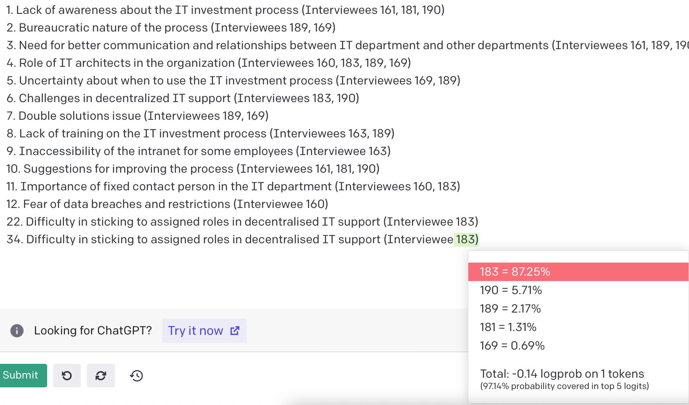

author: Danny Ray Justice
institution: University of Southern Denmark
title: Navigating the Currents of Change: An Ethnographic Study of IT Investment Reporting in Organisations
runninghead: IT INVESTMENT REPORTING IN ORGANISATIONS
abstract: 
keywords: key1, key2

# Introduction
Artificial Intelligence (AI) and Machine Learning (ML) technologies have permeated various domains of human activity, one of the most notable being academic research. The application of these technologies introduces novel possibilities for significant breakthroughs. One such innovation is the Generative Pretrained Transformer 4 (GPT-4), an advanced Large Language Model (LLM) developed by OpenAI, which offers a powerful tool for processing and analysing large volumes of text data. This study centres around the exploration and application of GPT-4 in the realm of qualitative research, particularly in the context of organisational behaviour within IT departments.

Situated within the setting of Vejle Municipality's IT department in Denmark, this study investigates GPT-4's potential in augmenting traditional qualitative research methodologies. Despite having a structured IT investment process, Vejle's IT department grapples with issues related to employee compliance, which have led to inefficiencies and discrepancies. This research aims to uncover the root causes behind such non-compliance and proposes strategies for improvement, using GPT-4 as a tool for deep analysis and insightful understanding of the complexities involved. A key innovative element of our research lies in leveraging GPT-4 to create affinity diagrams, capitalising on its superior capability to process and synthesise vast amounts of text data, and identify interconnected themes within.

Digital technology's rapid evolution continues to intersect with various spheres of human life, transforming traditional practices and forging new paradigms. This transformative trend is vividly visible within academia, where AI and ML advancements present unparalleled possibilities. This study, therefore, probes one such possibility—the integration of GPT, represented by GPT-4, into qualitative studies.

We investigate this potential within the unique setting of Vejle municipality, Denmark, a local government that serves a vibrant community of 120,000 residents [@vejlekommuneVejleKommuneRunder2022]. Despite the establishment of a robust IT investment process, the department faces inconsistencies in employee adherence, leading to inefficiencies. Our study aims to understand why this is the case, and how to formulate strategies that enhance compliance.

The use of language models like GPT-4 in this research is twofold. Firstly, they are used as a peripheral method within the context of the traditional qualitative research in order to assist the investigation in an unobtrusive way, much the same as a supervisor available 24/7. Secondly, we take a more exploratory approach to how this cutting-edge technology can be harnessed in order to accelerate or augment the process of qualitative analysis, taking the route of attempting to automate the process generating an affinity diagram from interview data, with the aim of extracting new perspectives from the extensive dataset. Despite the application of bicameral dialogue, a technique that simulates the model's thoughts through self-dialogue, the resulting diagrams did not meet the anticipated expectations. Consequently, we recommend additional research to explore the limitations and potential applications of GPT-4 in this context.

Through examining this intersection of technology and human behaviour, we aim to provide solutions to Vejle Municipality's challenges while simultaneously shining a light on new paths for the academic world. Our study contributes to understanding a specific socio-technical system within Vejle municipality, exploring LLMs' potential as a groundbreaking tool in academic research. It is a journey at the exciting intersection of technological innovation and human complexity, seeking to enrich both fields with new insights and strategies.

GPT-4's unique ability to process large volumes of detailed text input and generate insightful analyses has been fully leveraged in this study. GPT-4 can handle up to 8,000 tokens with the 8K model, and a massive 32,000 tokens with the 32K model, where each token represents approximately 0.75 words in English text [@openaiPricing].

This exploration, therefore, fulfils a dual purpose. Firstly, it sheds light on the socio-technical system within Vejle municipality and the specific dynamics that impact the IT investment process. Secondly, it uncovers the potential of AI and GPT-4 as pioneering tools in academic research, providing an original perspective on qualitative studies. Thus, the present research is guided by two intertwined questions:

1.  How does GPT-4's capacity to generate affinity diagrams from interview data compare to that of a human researcher, and what insights can this provide for qualitative research methodologies?
2.  What are the key factors contributing to the non-compliance of employees with the IT investment process in Vejle municipality, and how can these factors be addressed to improve adherence?

These research questions aim to deliver a comprehensive assessment of GPT-4 as an innovative tool for qualitative research and simultaneously offer deeper insights into the dynamics of the IT investment process in Vejle municipality.

## Relevance of Research

This research holds significant value from both pragmatic and scholarly perspectives. From a practical viewpoint, the results of this study aim to ameliorate the efficiency and adherence to guidelines within the IT investment process in Vejle Municipality. The aim here is to provide tangible recommendations and insights to better navigate the complexities inherent in municipal IT investment decisions, and by doing so, help to facilitate a more sustainable, robust, and accountable IT ecosystem within the context of Danish municipalities.

From an academic standpoint, the study ventures into relatively uncharted territories by examining the potential of GPT-4 as a novel tool in qualitative research. Despite the increasing recognition of AI's transformative potential across various fields, there is a conspicuous lack of scholarly research specifically focused on GPT-4's application in qualitative analysis as of now. This research will thus contribute significantly to the ongoing discourse about the integration of AI, specifically Large Language Models (LLMs), into academic research practices.

Furthermore, to the best of our knowledge, there exists no comprehensive study that explicitly investigates IT investment processes within the specific context of Danish municipalities, making this research both timely and necessary.

The fusion of these perspectives underscores the profound relevance of the research, bearing immediate practical implications while potentially shaping the future course of academic research methodologies. It paves the way for a broadened scope of investigation into the role LLMs like GPT-4 could play in qualitative research, raising intriguing questions and setting the stage for future explorations in this emergent and promising field of study.

## Overview of Structure

This thesis is composed of two parts, each addressing a specific research question. We work out way backwards, the first part focusing on a traditional qualitative investigation of the IT Investment Process in Vejle Municipality, while the second part evaluates the utility of GPT-4 in the context of the aforementioned qualitative research, focusing on prompting the model to output affinity diagrams from interview data.

The first section starts with an introduction to the case background, followed by a literature review providing the theoretical context. The research methodology includes semi-structured interviews and field notes for data collection, with affinity diagrams used for data analysis. The results, discussion, and recommendations form the subsequent segments of this part of the study.

The second section focuses on GPT-4, beginning with a technical background for those unfamiliar with the model. This is followed by a literature review positioning the present research in the intersection of qualitative research and machine learning and natural language processing. The methodology involves data collection through user-model interfaces, details about the iterative prompting approach used, ending by establishing a set criteria for assessing output quality forming the basis of data analysis.

# Case Study: Vejle Municipality's IT Investment Process
The forthcoming chapter will present a comprehensive qualitative analysis of the IT investment process in Vejle Municipality. This investigation will begin with a thorough case background, providing insights into the organisational structure of Vejle Municipality, the composition and function of its IT department, and the mechanics of its IT investment process, among other details.

Subsequently, we will delve into a literature review. This section will encapsulate the existing body of knowledge that forms the basis for the study at hand. By exploring previous scholarship, we can position our current research within a broader academic context, illuminating the novel aspects of our investigation.

Following the literature review, we will present the collected data, detailing its relevance and potential implications for Vejle Municipality's IT investment process. This evidence will be meticulously examined to ensure it supports the study's objectives and assumptions.

The chapter will culminate in a comprehensive discussion, synthesizing our findings and positing their significance within the framework of our broader research goals. This concluding section will effectively tie together the various elements of the chapter, offering a cohesive analysis of the IT investment process within Vejle Municipality.
## Case Background
Residing within the administrative building of Vejle Municipality, the IT department has historically grappled with effective communication, particularly with external stakeholders and individuals in decentralised roles. Recognising the need to bridge this gap, the department strategically incorporated four IT architects into its ranks over recent years, each bringing a distinct blend of skills and expertise.

These IT architects, integral to the municipality's IT ecosystem, strive to reconcile municipal employees' expectations with the capabilities and resources of the IT department. They deftly navigate technical and non-technical perspectives within the municipality, balancing the need for clear communication with the complex understanding required of their role. A blend of "hard" and "soft" skills allows them to empathise with the diverse needs of users throughout the municipality while staying conversant with current and emergent technologies.

Among these architects are Jonas and Mathilde, who together form a harmonious blend of technical and human-focused insights. Jonas excels in the intricate nuances of IT architecture, while Mathilde advocates for a more empathetic, human-centred approach to IT. Their collaborative efforts ensure the fluid integration of new technologies and foster a sense of shared understanding and ownership in IT investment decisions across the organisation.

Jonas and Mathilde's invaluable guidance and profound knowledge have significantly shaped the course of the present study, their generosity in sharing their insights reflects in the multiple references within the forthcoming text.

In response to the challenges in procuring new technologies, Vejle Municipality has implemented an IT investment process, facilitated through an online webform accessible via the intranet. The webform serves a dual purpose: keeping the IT department aware of which technologies the organisation works with, and connecting appropriate IT personnel with the investment project for smooth implementation and potential impact evaluation.

The webform's user interface presents a clear directive to all employees of the municipality:

> "If you need to address a new IT task, update or enhance an existing system, have an idea for an IT system, or purchase a new IT system, the City Council requires you to utilise the IT investment process. By following this process, we collectively ensure that the system or function can be utilised while meeting our IT requirements. Additionally, when you follow the investment process, you will receive guidance to other departments if there are specific areas that require attention, such as information security."

A list of examples provided to clarify the instances in which the IT investment process should be invoked includes scenarios like exploring existing solutions, making changes to current systems, seeking IT support for a process, purchasing new equipment requiring network access, or implementing a new IT solution.

To engage this process, employees are required to complete an electronic form on the designated intranet page. Following form submission, an IT department architect typically contacts the submitter within 48 hours, initiating a dialogue involving the employee, the supplier, and an IT department representative, ultimately leading to feedback that includes an overall IT assessment of the system. If required, additional references to other departments within Vejle Municipality, such as Competition Suspension, are provided.

However, despite these comprehensive instructions and the broad applicability of the webform, its use among employees remains limited. A significant effort has been made to simplify the webform, making it more accessible by removing intricate questions that non-IT personnel found challenging. The primary goal was to increase the form's usage and prevent staff from directly contacting IT architects or other members of the IT department, thereby streamlining the IT investment process. However, these efforts have not translated into the expected increase in webform usage.

In light of these observations, this study aims to delve into the reasons behind employees' inconsistent adherence to the IT investment process and propose strategies to improve compliance. The ensuing report will thoroughly investigate the complexities of this case before using the rich qualitative data generated for experiments in the field of NLP in the penultimate chapter.

## Literature Review
This literature review will delve into three key areas pertinent to this study: IT Investment Governance, Ethnomethodology, and Affinity Diagrams. The analysis of these topics aims to build a theoretical underpinning for understanding the complexities of IT investment in the public sector and how ethnomethodological research and affinity diagrams can help derive valuable insights into this intricate process. Let's begin by unpacking the first concept, Information Technology Investment Governance

### IT Investment Governance

IT governance is a vital component for both private and public sector organisations, playing a central role in aligning IT investments with institutional goals and maximising associated benefits \[@Weill2004\]. Encompassing decision-making, planning, and controlling IT investments, it sits at the heart of effective governance.

One influential concept for understanding IT governance is the resource-based theory, proposed by @Wernerfelt1984. The resource-based view (RBV) suggests that organisations can secure a sustainable advantage by optimally employing their resources and capabilities, those possessing valuable, rare, imperfectly imitable, and non-substitutable (VRIN) attributes \[@Wernerfelt1984; @Barney1991\]. RBV underlines the strategic necessity of resource allocation for maximum value.

When we consider RBV in public sector contexts, such as Vejle municipality, the idea of a "competitive advantage" is recontextualised. Unlike private firms, public institutions aim to deliver the best possible public value rather than outperform market competitors. Here, the efficient allocation and utilisation of resources equate to high-quality service delivery. In the realm of IT investment, strategic decisions should maximise public benefit through increased efficiency and effectiveness.

Building upon the RBV, @Bharadwaj2000 positions IT resources as a distinct strategic category. Organisations, he argues, possessing superior IT capabilities, can enhance their operational efficiency and service quality \[@Bharadwaj2000\]. This perspective fits seamlessly within the RBV, reinforcing the critical need for effective governance of IT resources and investments.

@ALI20151 developed a novel construct, known as IT investment governance (ITIG), also premised on the RBV. ITIG gauges an organisation's competence in effectively governing its IT investments, thereby enabling the efficient allocation and utilisation of IT resources. The construct comprises four elements: IT investment value governance, IT investment value monitoring, IT investment appraisals, and IT investment project management.

The relevance and efficacy of the ITIG construct were demonstrated by Ali et al. (2015), highlighting a significant positive correlation with organisational performance. This critical finding implies organisations with robust IT investment governance are poised to extract greater value from their IT investments and align these more closely with their strategic goals. Consequently, effective IT investment governance enables organisations to amplify operational efficiency and public value, thus reinforcing the core principles of the RBV.

While Ali et al. (2015) made notable strides, certain gaps still persist, particularly in understanding the behavioural elements influencing effective IT investment governance, such as employee compliance with IT governance processes. Nonetheless, the RBV and ITIG construct offer a robust theoretical foundation to scrutinise and enhance IT investment governance within the public sector, paving the way for future research and improvements.

### Ethnomethodology

The field of social science research has seen a significant surge in the application of Ethnomethodology (EM) as a theoretical approach. EM explores how individuals establish and uphold social order through their everyday interactions, focusing on practical methods and techniques they utilise to comprehend their social realm. As observed by @crabtreeDoingDesignEthnography2012, EM research primarily centres on how communities or social settings employ quotidian practices and knowledge to formulate the regulations governing their social existence (p. 316).

EM's wide-ranging application spans diverse fields such as sociology, anthropology, communication studies, with more recent integration into human-computer interaction and interaction design studies. It is instrumental in examining how individuals engage with technology in daily life and how technological advancements impact and shape social practices.

@crabtreeDoingDesignEthnography2012 assert the value of EM in deciphering technology utilisation across various settings. They suggest that the methodology's focus on minutiae of day-to-day practices can aid researchers in recognising practical challenges encountered by individuals while using technology, and how design can alleviate these issues. Moreover, they posit that EM's emphasis on the social context of technological use can provide insights into how technology integrates into broader social structures and influences social relations.

#### Interviewing: A Word of Caution

Interviews, according to @crabtreeDoingDesignEthnography2012, should be approached with prudence. They propose conducting interviews within the authentic flow of work as circumstances allow. Highlighting the discrepancy between what people claim to do and their actual actions, they note that while not being intentionally misleading, interviewees tend to gloss over their work. To overcome this, researchers are advised to focus on the precise actions and methods of work, avoiding an interview format driven by a set of pre-formulated questions detached from the actual work process.

#### The Importance of Field Notes

The creation of field notes is a crucial component of fieldwork, state @crabtreeDoingDesignEthnography2012. Field notes allow researchers to document their observations, capturing what they witness, hear, and are informed of. This not only provides a record of the research but also assists researchers in tracking and organising their thoughts. The active process of note-taking encourages the researcher's attention to the work as it occurs, thereby fostering a better understanding of the task at hand.

The researchers' notebook, @crabtreeDoingDesignEthnography2012 suggest, should not be a mere collection of disjointed remarks. Instead, it should serve as a structure for the researcher's thoughts, crafting a coherent narrative of the setting's work. Diagrams of the work ecology are recommended to frame inquiries and represent the work environment to others. Detailing the environment, the inhabitants, their roles or responsibilities, and the artefacts employed for work can lead to a more comprehensive understanding of the setting's work and the methods employed by members to organise it.

#### Formal Organisation of Work and Its Flow

Understanding how the work is 'formally organised' across a division of labour and individually, is crucial, according to @crabtreeDoingDesignEthnography2012. This comprises the plans, procedures, processes, and routines invoked by the members to account for their work organisation. Researchers should also concentrate on the work's flow, noting how it moves across individuals, activities, and culminates in an endpoint.

#### Discrete Sequences of Interactional Work, Cooperation, and Collaboration

@crabtreeDoingDesignEthnography2012 encourage researchers to enrich their depiction of work's flow by concentrating on discrete sequences of interactional work entailed in completing specific activities. The focus should be on what is done, who does it, and the process of work completion. Attention should also be given to the cooperation and collaboration between individuals during discrete sequences of interactional work. This would involve observing and documenting who interacts with whom, their discussion points, joint activities, task transactions and handovers, and subsequent responses.

### Affinity diagrams
Affinity diagrams, also known as the KJ method or affinity charting, were first developed by Japanese anthropologist Jiro Kawakita [as cited in @scupinKJMethodTechnique1997]. Affinity diagrams are used to synthesise and categorise large amounts of qualitative data, such as observations, interviews, and field notes, into meaningful and easily understandable themes and patterns [@haningtonUniversalMethodsDesign2019].

The affinity diagramming process typically starts with the raw data being transformed into discrete statements or observations. These statements are then grouped based on their similarities and relationships [@haningtonUniversalMethodsDesign2019]. The groups are subsequently labelled with descriptive headings, which capture the essence of their content. This iterative process allows for the identification of patterns, themes, and relationships among the collected data, thus providing insights and guidance for further analysis and design @holtzblattAffinityDiagram2016.

In the context of ethnographic UX studies, affinity diagrams serve as a valuable tool for making sense of the complex and often messy data that emerges from immersive fieldwork @holtzblattAffinityDiagram2016. By organising and categorising data in a structured manner, researchers can identify user needs, behaviours, and pain points, which can inform design decisions and enhance the overall user experience @haningtonUniversalMethodsDesign2019.

Furthermore, affinity diagrams facilitate collaboration and interdisciplinary communication among research team members @holtzblattAffinityDiagram2016. By engaging in the process of grouping and labeling data, researchers from different backgrounds and expertise can contribute to a shared understanding of the user experience, leading to more innovative and effective solutions.

## Methodology
This section delineates the research methodology undertaken in this study, with a detailed examination of both data collection and analysis processes. The data collection encompasses two salient approaches: semi-structured interviews and field note documentation. Following this, the data analysis strategy is explicated, focusing on affinity diagrams and the employment of Generative Pre-trained Transformer (GPT) models. These methodologies provide a synergistic approach, marrying qualitative and quantitative aspects to ensure an all-encompassing understanding of the research context. This thorough exposition of the processes involved serves to elucidate the rigor and thoughtfulness in the methodological design of the study. Furthermore, it underscores the comprehensive trajectory from data procurement to analysis, illuminating the rigorous approach taken to ensure the validity and reliability of the research findings.

### Data Collection: Interviews & Field Notes

In this study, the process of data collection was established upon two critical components: semi-structured interviews and field notes documentation.

**Semi-Structured Interviews:** This data collection methodology was a primary channel to gain insight into the users' experiences and perspectives. As suggested by @crabtreeDoingDesignEthnography2012, the interview setting was informal to encourage genuine and in-depth discussion. The interviews were designed to be "decontextualised" due to the nature of the study, where the subject matter (new IT investments) was not part of the daily routine for most employees.

A selection of twelve employees across all six administrative divisions of Vejle's municipality was interviewed based on a list provided by an internal contact at the municipality. To maintain confidentiality, each interviewee was assigned a pseudonym and an identification number.

The interviews were conducted face-to-face, barring one instance where a video call was arranged to accommodate the participant's circumstances. Handwritten notes were taken during the conversations to ensure a relaxed atmosphere, and the questions were based loosely on an interview guide (Appendix X), allowing flexibility for natural discourse.

Following each interview, the brief notes were used to create detailed transcriptions, which were then developed into coherent prose summaries. It is important to note that the interviews were conducted in Danish, and the translation into English occurred at the summary phase. The complete interview summaries and notes are available for reference in Appendix X.

**Field Notes:** As a complementary method, field notes played an essential role in the data collection process. Drawing from the significance emphasised by @crabtreeDoingDesignEthnography2012, field notes were used to document observations, thoughts, and insights about the research setting.

A physical notebook was consistently maintained for documenting fieldwork observations, particularly during interviews, to avoid the intrusion of digital devices. Additionally, a cloud-synced notes application served as a supplemental tool for situations where typing was preferable to handwriting.

The process of taking field notes enabled a comprehensive understanding of Vejle's work environment, shedding light on specific dynamics such as task handovers and transactions between individuals. Additionally, the field notes acted as a reflective tool, aiding in evolving an understanding of the work setting over time.

In sum, the combination of semi-structured interviews and field notes documentation provided a comprehensive and valuable resource. The detailed accounts served as a solid foundation for the analysis and interpretation of the data, effectively informing the subsequent phases of this research study.

### Data Analysis: Affinity Diagrams
Following the process of collecting interview summaries and field notes, an affinity diagramming technique was employed to synthesise and analyse the data. This method provided an effective way to organise the large volume of collected data, identify patterns, and uncover underlying themes.

The affinity diagramming was conducted virtually using a computer program. Each interview summary was reviewed one at a time, and data segments were captured on virtual sticky notes. Each interviewee was assigned a unique colour for their sticky notes, thereby enabling easy identification of their respective insights. However, due to the limited palette, the color differentiation ended once the range was exhausted, and the remaining sticky notes were kept in grey. 

As the process unfolded, these sticky notes started forming natural clusters of related information based on the similarities and patterns that emerged from the data. This process allowed for the visual grouping of insights according to their inherent relationships, providing a high-level view of the data landscape.

Additionally, lines were drawn between these clusters to illustrate the connections and dependencies between different groups of data, making the relationships explicit. This process enabled a more profound understanding of the data and facilitated the identification of overarching themes and patterns.

Throughout this process, the affinity diagram was consistently reviewed and iteratively adjusted to ensure that the emerging patterns and relationships accurately reflected the data. The diagram served as an evolving visual representation of the collected data, allowing the research findings to be presented in a comprehensive, organised, and accessible manner. 

In conclusion, the affinity diagramming method was instrumental in providing a structured approach to data analysis. It facilitated a holistic view of the data collected through semi-structured interviews and field notes, allowing for a nuanced understanding of the research context, which in turn informed the interpretation of the research findings.

### Data Analysis: GPT Models

While the data analysis of the present chapter primarily relied on creating a traditional affinity diagram, the LLMs GPT-4 and its predecessor GPT-3.5 served as valuable supplementary tools, aiding the author in the research process. Their inclusion offered a unique opportunity to enhance the breadth of information accessed beyond what was personally known or available in the immediate context of the study. The LLMs were primarily utilised for their conversational abilities, providing an interactive platform to generate diverse perspectives on the research topic. Drawing from an extensive text corpus, LLMs offered insightful responses to the author's queries, often sparking new lines of thought, novel questions, and unexplored research avenues.

Notably, the LLMs did not merely function as an easily accessible knowledge resource, but they also catalysed critical thinking and intellectual curiosity. They served as a sounding board for the author's ideas, providing a space for in-depth exploration of varying perspectives, encouraging a deeper contemplation of the research. Furthermore, their extensive knowledge base, available on-demand, supported the author in making real-time decisions on research matters.

While LLMs can serve as a source of knowledge, it is always worth noting that these models can also output false information, so all information attained from the models was double-checked using traditional information searching methods.

## Presentation of Interview Data
\

The data gathered for this study comprises semi-structured interviews with twelve employees of Vejle Municipality, spanning various roles across all six administrative divisions. The data collection process involved taking rough notes by hand during the interviews, followed by more refined digital notes afterwards. From these refined notes, I created two affinity diagrams: one by hand and the other with the assistance of GPT-4 through a carefully crafted prompt.

The analysis in this report primarily utilises my hand-made affinity diagram, as it encompasses not only the insights gleaned from my notes but also the nuances of my experiences and observations within Vejle Municipality.

Out of the interviewees, the majority were familiar with the IT investment process: six indicated familiarity (including one who had helped create the process in her role as a digitalisation consultant), five were unfamiliar, and the final participant, who was also unfamiliar, deemed the process irrelevant to her work and was therefore excluded from the analysis.

### Perception of IT investment process as impersonal or excessively bureaucratic
My first interview was with Freja, a seasoned web manager from the Policy, Analysis & Communication department. During our discussion, Freja expressed strong opinions on the IT investment process, perceiving it as excessively bureaucratic and impersonal. With twenty years of experience working closely with the IT department, she felt confident in her ability to communicate directly with them when necessary, bypassing the formal process. Freja advocated for a more relationship-based approach, emphasising the importance of positive reinforcement over punishment.

Freja's perspective laid the groundwork for my research, as the issue of the IT investment process being seen as impersonal and bureaucratic recurred in subsequent interviews. Her experience and insights into the challenges of collaborating with the IT department were invaluable, and her close connection to the department provided a unique viewpoint that illuminated broader issues surrounding the process.

Lise, an administrative assistant in the Daycare department, acts as a vital bridge between the Administration Building and daycare workers, who have distinct needs due to their more practical roles. Lise expresses concern and dismay at the prospect of using a form to contact the IT department. She values her personal relationship with Jonas from IT, as he understands the unique context of daycare workers. Lise worries that submitting a form may result in losing "unspoken considerations" arising from the social and educational differences between the two groups.

To alleviate these concerns, Lise suggests adding an option on the form to indicate if the case involves a target group struggling to adapt to technological changes. Another appealing solution she proposes is including a preferred IT department contact person on the form, ensuring that someone familiar with the specific context is involved.

### Benefits of using the process: potential talking points
Claus, a development manager at Vejle's Center for Special Education for Youth and Adults (CSV), finds the IT investment process helpful because it connects them with the right people, such as an architect who oversees the case, ensuring it is remembered and acted upon. Using the IT investment process also provides a clear line of communication when working decentralised, as is the case with CSV. It allows them to follow a case in the system and see which IT department members are involved and what they are doing. Claus appreciates the ability to intervene if he feels his needs has been misunderstood.

### Potential for strengthened cooperation between IT and the rest of the organisation
Emma, who has been working in the municipality for thirteen years and took over her current position as an Implementation Consultant in the Department of Welfare six months ago, told about welfare's own work and how they have a similar form to the IT investment process for welfare investments. She suggested that it would be more efficient if their applicants could automatically involve IT in projects related to IT.

Another example of potential strengthened cooperation comes from Anne, a professional consultant for the Salary department and primary contact point for KMD, the municipality's payroll system. Anne shares a similar attitude with the IT department, wishing that employees in the organisation would be better at consulting with her before purchasing systems that fall within her area of responsibility, rather than buying the system first and then consulting with her about its implementation afterward. This attitude may be why she has a good relationship with the IT department, consulting with them well in advance.

Anne recalls an instance when she was called to a meeting by someone in the organisation, along with Jonas from the IT department, thinking that she 'might' have a stake in the implementation of their new system. She described the meeting as, "It was a video meeting, but I could sense that Jonas and I were looking at each other on the screen, thinking, 'is this really happening right now.'" This was because the third person had already purchased the system without asking and wanted it up and running in three weeks, which she found very unreasonable. She tells that such situations have at times created a tremendous workload in their wake. Thus, although Anne and Jonas work in different professional areas, they share some frustrations. A central frustration is that employees' expectations for the timeline of implementing new things do not match their own.

During the interview, I suggested the idea of merging the systems, and Anne reacted positively to this idea, agreeing that implementing a central system that directs communication based on certain guidelines could help ensure that employees with new investments in the pipeline do not have to guess who should be involved and when in the process they should be involved.

###  Time requirements for new solution implementation
As touched on earlier, Anne from the Salary department has grappled with some employees in the organisation who were eager to introduce new solutions, with expectations regarding the timeframe for these implementations that, in her view, were unrealistic and lacked sensitivity to the accompanying workload. At present, there are no formal guidelines laying out the expected duration for the implementation of new solutions. This void likely stems from the inherently diverse nature of IT investments, making the creation of universal guidelines a challenging task.

### The name perceived as opaque and unattractive
Despite not being familiar with the IT investment process prior to our interview, Emma recalls hearing about it from Jonas, one of the IT architects, at a meeting. Emma assumed the process was primarily relevant to IT and economy personnel due to its name. She agreed that a more tangible name, such as "Indkøbsguiden" (Danish for "The Purchase Guide"), might make it more accessible to the grassroots level of the organisation. However, according to Jonas, a similar system in another municipality also faced issues with lack of use, indicating a more attractive name cannot stand alone.

### IT investment process not widely promoted
Interviewees such as Anne have a view of the IT investment process not being widely promoted or talked about by the personnel in the IT department. She has been used to just contacting Nicklas or one of IT's other architects when she needed something.

### Broad guidelines for when reporting is required
Some interviewees such as Mikkel from the Vejle's central library's IT department shared a feeling of being unsure as to when it actually was necessary to use the IT investment process, as the guidelines laid out on the Vejle's intranet cover a very broad area of investments. This is especially problematic for such central institutions that have the resources to implement new investments themselves without involving central IT, with an underlying feeling of participants wanting to be able to avoid using the process if it is unnecessary, despite the narrative at central IT being, if you are unsure, still use it to be safe.

### Central vs decentralised
Søren, responsible for purchasing IT equipment for schools, explained that, while employees of the municipality are met by the municipal intranet as the first thing when they log onto their computers, employees in schools have to specfically browse to the intranet's address and log in to get access, making an extra barrier to entry to the IT investment process for them. Søren is nevertheless hopeful that, while school employees currently don't use the IT investment process, that it would be possible to get them to use it with the appropriate training, despite the fact that IT investments aren't a part of the everyday work of school employees. Søren went on to say that he thinks it is important that passionate school teachers have the adequate freedom to purchase unique IT equipment to practice their unique styles of teaching, as he seems to view this as an important part of a healthy school system.

Peter, a care assistant who recently retired but still works at the residential care facility one day a week to help with their IT, raised concerns about the feasibility of relying on support from Vejle's central IT department in decentralised areas. He wonders what will happen to the facility when he fully retires, as they will have to rely on support from central IT, which may not be viable considering the facility's location and the fact that they operate year-round, providing constant care to residents.

### Frustrations with restrictions from IT
During the interviews, it became apparent that some interviewees, such as Claus, were frustrated with the limitations imposed by the IT department. Claus expressed his desire for more flexibility and autonomy in updating programs on his computer without having to consult with central IT. Additionally, Claus hoped for more collaboration between Søren from school IT and central IT, as these areas are becoming increasingly interconnected.

Another interviewee, Peter, expressed frustration with the lack of flexibility in smartphone models available. He believed that investing in the phones recommended by the supplier of their systems would be more beneficial, as they come with a guarantee of receiving updates for up to eight years after purchase. However, IT disagreed with his reasoning, claiming that he was influenced by the supplier. Peter's argument was that the phones offered by the IT department had to be replaced after a shorter lifespan due to not receiving necessary security updates from the manufacturer. 

### Importance of IT architects as communicators
Many interviewees, such as Søren from school IT, acknowledged the importance of IT architects as communicators. Søren notes that the arrival of IT architects in the organisation has improved communication and collaboration between central IT and decentralised areas, as well as between IT and the rest of the organisation.

Claus went so far as to call the IT architects a "godsend," giving IT a more service-oriented outward face. Freja touched on that IT, through the years, has attained a greater range of skills than were available before, both in technical expertise but also particularly in the area of soft skills such as communication, nodding to the hiring of IT architects within the past five to ten years.

The architects, including Mathilde, have reached out more to decentralised areas in an attempt to build better relationships. Both Søren and Mikkel mentioned Mathilde's joint meetings, describing them as very helpful in the process of making IT's work more accessible throughout the organisation.

### Current wins for the IT investment process
While the interview data yielded a fair deal of critique to the process, it is not all bad. The web manager Freja expressed that, in her experience, that she thinks people have become more aware of the need to avoid double investments through the years. Søren from school IT described the simplification the IT investment process underwent some years ago as a considerable improvement, taking more consideration for decentralised employees.

## Discussion

Upon analysing the data from the interviews conducted within Vejle Municipality, it becomes clear that navigating the IT investment process is a complex and challenging task. These interviews spanned a diverse range of roles within the Municipality, painting a comprehensive picture of how the organisation perceives and interacts with the IT investment process.

A key revelation from these findings is the perception of the IT investment process as bureaucratic and inaccessible. This perception affects the process's acceptance and effectiveness. Many employees, especially those whose roles are not directly linked to IT, express a hesitancy towards engaging with it. This sentiment highlights a noticeable divide between the central IT department and the remaining sectors of the Municipality, which has exhibited signs of improvement in recent years but remains in need of further attention.

Moving forward, we will draw from these insights to suggest practical and focused recommendations for improving the IT investment process within Vejle Municipality. These suggestions concentrate on refining communication methods, making the process more relatable, and fostering enhanced collaboration within the organization.

Following the recommendations, we aim to outline potential avenues for further research. We will suggest expanding the scope of this study to include insights from management science, learnings from other municipalities, and the use of ethnomethodology to deepen our understanding of the IT investment process.

Through this in-depth study of Vejle Municipality's IT investment process, our objective is to catalyze improvements that not only benefit the Municipality but also enrich the broader understanding of IT investment processes in similar contexts.

### Recommendations for Vejle Municipality

Based on the data analysis and understanding of the current IT investment process at Vejle Municipality, it's clear there are areas of opportunity for improvement. The recommendations for the Municipality centre around five major themes: (1) enhancing communication and visibility of the IT investment process, (2) setting an example in reporting responsibilities and implementation timelines, (3) simplifying the introductory text and revising guidelines, (4) humanising the IT investment process, and (5) unifying reporting across the organisation and easing restrictions where applicable.

The suggestions emphasise a more user-friendly approach that bridges the gap between the central IT department and the decentralised units, making the process more accessible and efficient. These steps are intended to foster an environment of collaboration, understanding, and efficient execution of the IT investment process across the Municipality. Let's delve into the specifics of each recommendation.

#### Enhance communication and visibility of the IT investment process

To better communicate the IT investment process, it should be positioned as a support service rather than a bureaucratic obstacle. Adding an option to indicate preferred contact persons in the IT department could help alleviate concerns about the process's impersonal nature. Moreover, prioritising improved communication and collaboration between central IT and decentralised areas, and between IT and the rest of the organisation, is essential. IT architects have made progress in this area, but continued efforts are crucial for effectively integrating the IT investment process into Vejle Municipality's daily operations.

##### Establish clearer guidelines on reporting responsibilities

IT architects play a vital role in communicating the process through personal interactions and other means. As Anne, an interviewee, highlighted, sharing the process with the right people without bothering irrelevant employees is essential. While the intranet contains ample information on when investments must be reported, it lacks clarity on who is specifically responsible for reporting investments to IT. This ambiguity can lead to situations where no one takes responsibility for contacting IT.

Clearer guidelines for reporting responsibilities could help remedy this problem and make it easier for architects to find and communicate with the appropriate individuals within the municipality.

##### Address implementation time and workload concerns
As reported in the interview with Anne from the Salary department, instances have occurred where employees approach IT and other stakeholders with unrealistic expectations regarding the timeframe for solution implementation. Such situations can lead to disappointment and/or impose an excessively heavy workload to meet the desired schedule. It is therefore crucial to focus on the time requirements of projects. If feasible, guidelines should be established to provide employees with a realistic estimate of the time it will take to implement their IT investments.

Alternatively, or in addition, the IT investment process form could incorporate an option for indicating a preferred implementation date for the new IT investment. This provision would allow the IT architect to manage expectations right from the first meeting, helping to realign any unrealistic timelines. Consequently, the IT architect would be less likely to be taken aback by an impractical timeframe presented during the meeting. This strategy could also mitigate the element of surprise and reduce the likelihood of a burdensome workload being imposed at short notice.

##### Set an example

When employees contact IT architects for assistance, they should receive help with their IT investment. Simultaneously, IT architects should create a record of the new IT investment in the appropriate database, demonstrating mutual respect for the process. After logging the investment, IT architects could inform the employee and politely request that they use the IT investment process for future investments, ensuring to explain the process's purpose.

##### Simplifying the introductory text

IT should consider the presentation of the IT investment process on the intranet page further. The extensive technical text on the page should be relegated to less prominent areas, as first impressions are crucial in persuading employees to engage with the process. Instead, a more concise, simplified version should be presented, emphasising the rationale for the process's existence and the advantages of utilising it, ideally employing more engaging communication methods.

For instance, a video that explains the process, its purpose, and its benefits could be showcased on the intranet page, making it a valuable resource to which IT architects can direct employees for further information.

By making employees aware of the rationale behind the IT investment process and its potential benefits, they are more likely to be receptive to changing their behaviour. Simultaneously, understanding the logic underpinning the IT investment process provides a more intuitive way of explaining and grasping its relevance. This approach could help address the image problem and confusion arising from the current guidelines, as mentioned in the previous section.

##### Consider revising guidelines for when investments should be reported

For IT-savvy employees outside of the IT department, such as Mikkel and Freja, the guidelines regarding when IT investments need to be reported can appear overly broad, seemingly intended for employees whose daily work and competencies do not focus on IT. Consequently, these IT-savvy employees may feel that they are exempt from using the IT investment process or perceive that employees with their competencies have not been taken into account when formulating the guidelines.

Although the current guidelines serve as a comprehensive catch-all, which can be suitable when the complexity of a situation makes it difficult to establish precise rules, the IT department should be cognisant of the image problem and the confusion generated by prominently displaying these guidelines on the intranet page for the IT investment process. This prominence can overwhelm readers or appear condescending.

#### Humanise the IT investment process

Interview data and ethnographic observations indicate that the IT investment process suffers from an image problem. To counteract this perception, steps should be taken to make the process more approachable. In the following sections, I will cover possible ways of achieving this.

##### Renaming the process

Many interviewees unfamiliar with the IT investment process commented on its name. The lengthy Danish term, consisting of twenty-three letters, appeared bureaucratic and unappealing. A name like "Indkøbsguiden" (Danish for "The Purchase Guide") was suggested as an alternative, appealing more to the grassroots level of the organisation.

##### Cater to the needs of diverse employee groups

The IT investment process should accommodate the requirements of various employee groups who may be hesitant to use the process. Allowing employees to choose a preferred architect when completing the form could provide peace of mind to those dealing with sensitive IT investments, such as daycare workers with unique needs.

##### Clarify the purpose and advantages of using the IT investment process

Interviewees viewed the IT investment process as bureaucratic and struggled to understand its benefits compared to directly contacting the IT department. The IT department should use the intranet site to clearly explain the purpose of the IT investment process, emphasising the "why" rather than relying on coercive language about city council mandates.

#### Attempt to unify reporting with other parts of the organisation

One significant issue raised in the interviews was the non-uniformity of reporting processes across the organisation. Other departments have their own reporting requirements for various cases of investments, such as new welfare technology investments and new systems integrating with the municipality's payroll system. This complexity creates a challenging environment for employees to navigate when investing in new systems.

Although this complexity currently hinders the adoption of the IT investment process, there is potential to transform it into a strength by initiating dialogue to unify reporting requirements across the organisation. A unified reporting system could simplify communication about the importance of reporting new investments and improve overall compliance.

This unified system would serve as a one-stop shop for all new investment reporting. A streamlined set of questions would automatically identify which departments should be informed of the new investment based on the responses provided, allowing IT and other departments to collaborate rather than compete for employees' attention.

Implementing such an approach presents challenges, including fostering cooperation between separate working groups. However, given the shared difficulties arising from poorly executed investment reporting (as exemplified by Anne's interview), there should be common ground for collaboration.

A potential solution is a standardised form asking relevant questions about the investment, such as access requirements to payroll systems and municipal networks. Based on the responses, the form would determine which responsible parties within the organisation need to be informed of the specific investment in question.

#### Ease restrictions where possible

While information and cyber security are crucial, it is also essential to strike a balance. Decentralised employees may perceive strict restrictions on user privileges as excessive burdens, potentially affecting their job satisfaction and sense of agency. It is essential to consider that decentralised IT specialists, although not part of the central IT department organisationally, are still IT experts and likely possess the necessary knowledge and skills to manage their tasks responsibly.

By easing restrictions where possible, a more balanced approach can be achieved, ensuring that decentralised employees, particularly IT specialists, feel trusted and empowered within the organisation.

### Opportunities for Future Research
Further research is necessary to delve deeper into the facets of the IT investment process that weren't covered in depth during this study. Potential areas of exploration could include:

#### Comprehensive Review of Practices in Other Municipalities
In this study, we primarily focused on examining the IT practices within the Vejle municipality. However, our observations were limited to this area, leaving a gap in our understanding of how other municipalities manage new IT investments. Future research should cast a wider net, scrutinizing practices in various municipalities to identify the most effective strategies for managing IT investments. This approach can pave the way to establishing a standard for best practices among municipalities.

There's merit in drawing comparisons and lessons from the private sector, despite fundamental differences between it and the public sector. Mid to large-sized private companies may face similar challenges to Vejle's IT department, thus it's worthwhile to include such entities in future investigations.

To extend our exploration to other municipalities, leveraging established relationships between Vejle and its counterparts, such as Aarhus, Odense, Fredericia, Sønderborg, among others, would be advantageous.

#### Enhancing IT Investment Process Understanding Through Managerial Science
While the present research employs ethnographic methods to delve into IT investment process challenges primarily from a user standpoint, integrating insights from communication and managerial science could be highly valuable. These insights could guide the creation of custom communication strategies and action plans.

By incorporating managerial science principles, we could systematically investigate the decision-making processes, resource distribution, and performance metrics that shape the IT investment process in Vejle Municipality. This strategy would aid in pinpointing inefficiencies, discrepancies in incentives, and other potential hindrances to efficient IT investment management.

Communication specialists can play a crucial role in crafting targeted communication plans. Their expertise can guide the choice of effective ways to share information, encourage cooperation, and foster a culture of transparency and accountability. These experts can detect potential communication voids and propose strategies to fill them, ensuring all stakeholders are aware of their roles, responsibilities, and the overarching goals of the IT investment process.

An interdisciplinary approach that merges these ethnographic findings with insights from managerial science and communication expertise can yield a broader understanding of the IT investment process's issues. This comprehensive view can help identify key influences on employee behaviour and organisational culture, thereby informing the design of evidence-based interventions to enhance the IT investment process within the municipality.

#### In-Depth Exploration of IT Investment Process through Ethnomethodology
Drawing from the ethnographic approach that was undertaken in the current research, there are clear opportunities for further exploration, especially employing an EM approach. 

Future research can aim to delve deeper into the nuanced practices and interactions that constitute the IT investment processes. The daily workings of IT architects, as well as their decision-making processes, can be the focus of such studies. EM techniques, such as video analysis or conversational analysis, would be extremely useful for this purpose. This approach will help uncover not only the explicit knowledge that IT architects use when making IT investment decisions but also tacit knowledge and practices, which are often overlooked but are critical to the process and which potentially could benefit from being explicated.

Moreover, breaching experiments, another EM method, could provide valuable insights into the inherent assumptions and norms within the IT department and the larger organisation. These experiments involve intentionally breaking the "rules" of social behaviour to reveal underlying norms and expectations. In an IT investment context, this might involve changing certain standard procedures or channels of communication and observing how IT architects and other stakeholders react and adapt to these changes.

In addition, a more detailed study of the social interactions and meaning-making processes associated with IT investments could be beneficial. For instance, how do different stakeholders negotiate and collaborate during the IT investment process? What kinds of informal communication and collaboration channels exist? And how do these processes influence IT investment decisions?

Finally, more research could be done on how sociocultural factors impact the IT investment process. The EM approach could be particularly effective in uncovering these influences, as it emphasises the importance of social context in shaping behaviors and actions.

In summary, the current research has laid the groundwork for a more detailed exploration of the IT investment process. Future studies that incorporate EM methods could build on this foundation, providing a more holistic and in-depth understanding of the complex social dynamics that underlie IT investments. These studies could in turn inform more effective strategies and interventions for improving IT investment processes within municipalities and other organisational contexts.

### Interim Conclusions
These interim conclusions drawn from the current research provide valuable insights into the challenges and opportunities associated with Vejle Municipality's IT investment process. Based on the findings and recommendations, it is apparent that a multifaceted approach is required to enhance the IT investment process. Through improved communication, streamlined guidelines, and a more human-centred approach, Vejle Municipality has the potential to make substantial improvements to its IT investment process, ultimately leading to more effective IT investments in the future.

The insights garnered so far have laid the groundwork for a deeper exploration into not just the mechanisms of the IT investment process, but also the potential applicability of advanced technological tools like artificial intelligence in understanding and enhancing this process.

As we transition into the next chapter of this report, we turn our focus to the evaluation of the utility of GPT-4 in the domain of qualitative research. Specifically, we will be examining GPT-4's capability in creating affinity diagrams and comparing its performance to that of a human ethnographer. This exploration offers an exciting perspective on the intersection of qualitative research and artificial intelligence.

Before we dive into this analysis, it is important to provide a solid understanding of the principles underlying the functioning of GPT-4. The upcoming sections will provide a technical background on the architecture, training process, and operational mechanisms of large language models, and delve into specific aspects such as inferential text completion, tokenisation, token-based pricing, and the critical role of prompt engineering.

While these interim conclusions close this chapter of our report, they also pave the way for the exciting discussions to come. The subsequent examination of AI's role in qualitative research, specifically the application of GPT-4 in creating affinity diagrams, promises to open up new avenues of thought and possibilities.

# GPT-4's Utility in Qualitative Research
This chapter provides an in-depth look at the potential of GPT-4, a large language model developed by OpenAI, to contribute to qualitative research. Specifically, we will assess GPT-4's proficiency in creating affinity diagrams, and compare its performance with that of the human ethnographer who authored this report. This evaluation will give us insights into the model's practical utility and effectiveness. While our focus here is on affinity diagrams, we hope this exploration will spark interest in investigating a wider range of applications for AI models like GPT-4 in the field of qualitative research.

This chapter is structured into five sections. We begin with a technical background to give those unfamiliar with the workings of GPT-4 a foundational understanding of the technology behind it, simultaneously referring to state of the art literature in the area for further reading.

The following section is dedicated to methodology. Here, I will detail the user-model interfaces used in this research, and the iterative prompting approaches that were employed. I will also describe the qualitative criteria used for assessing the quality of the model's outputs.

The fourth section presents the results: the outputs generated by GPT-4 in response to the prompts provided. These results will then be evaluated and discussed in the subsequent section.

In the final section, we delve into a discussion of the output quality. We reflect on the strengths and weaknesses of GPT-4's performance, and explore potential areas for future research. We will also consider the broader implications of our findings for the application of AI in qualitative research.

## Technical Background
The following sections provide a technical background designed to enhance the understanding of LLMs, specifically focusing on their architecture, training process, and operational mechanisms, delving into the principles of inferential text completion, tokenisation, token-based pricing, and the importance of prompt engineering in eliciting emergent abilities from LLMs. 

While this background aims to build a strong foundation for understanding the chapter that follows, it is worth nothing that the complexity and depth of the subject at hand does not allow for an exhaustive coverage in this brief overview. Further reading and resources are cited throughout to provide a more detailed exploration of these topics. It is encouraged to delve into these sources for a deeper and more nuanced understanding of the intricacies of LLMs.

### GPT-4's Unique Architecture

With OpenAI's debut of the GPT-4 model, a pioneering advancement was realised in the form of its multi-modal capabilities. The model is distinguished by its ability to process not only text data but also images [@openai2023gpt4]. The current study, however, is restricted in its scope as the image module of GPT-4 has yet to be fully released to the public. Therefore, I will solely focus on examining the text-processing proficiency of this LLM.

### Transformer Architecture

LLMs are generally based on a Transformer architecture, first introduced in @vaswani2017attention. Transformers are characterised by their self-attention mechanism, which allows the model to weigh different parts of the input sequence in relation to each other. This mechanism enables the model to capture long-range dependencies and context more effectively than traditional recurrent neural networks or convolutional neural networks [@vaswani2017attention].

### Training Process

The training of LLMs involves two primary steps: pre-training and fine-tuning. During the pre-training phase, the model learns a general understanding of language by predicting missing words or tokens in a sequence (also known as masked language modelling). This is achieved by feeding the model a vast amount of text data from diverse sources, such as books, articles, and websites [see, for example, @devlin-etal-2019-bert]

After pre-training, the model typically undergoes some sort of fine-tuning phase, during which it is further trained on a smaller, task-specific dataset. This enables the model to acquire specialised knowledge and skills related to the target task, such as question-answering, translation, or summarisation [@devlin-etal-2019-bert].

### Inferential text completion
Inferential text completion serves as the fundamental task carried out by LLMs in the context of current research. This task entails generating coherent, contextually relevant, and human-like text by continuing a provided prompt based on learned linguistic patterns and contextual information. Owing to their ability to perform this task, LLMs are well-suited for various applications such as content generation, summarisation, and conversation.

Understanding the basics of inferential text completion requires delving into the underlying principles that govern the process. LLMs are trained on vast amounts of text data, enabling them to recognise and predict complex patterns in human language. These models employ a probabilistic approach, calculating the likelihood of different tokens appearing in sequence based on their acquired knowledge.

Figure X offers an example of inferential text completion using an older model, such as text-davinci-003. In this figure, the model is prompted with the letter "I," and its inference process is displayed. Individual tokens are separated and color-coded according to their likelihood of being the next text in the sequence. For instance, the token "feel" had a 0.47% probability of appearing next (Figure X). The hyperparameter, temperature, plays a vital role in controlling the model's randomness. As the temperature approaches 0, the model's output becomes increasingly deterministic, while higher temperature values (up to a maximum of 1) yield more varied results, often selecting less likely inferences.

However, in certain cases, despite having a good prompt, the model may produce lower quality or irrelevant output due to the influence of the temperature parameter or other stochastic factors. This phenomenon, referred to as "output degradation" or "response deviation," occurs when random chance from the temperature parameter leads the model in a direction of generating low-quality output [@Holtzman2020The]. A well-known type of response deviation is "hallucination," where the models yield information that is either irrelevant to the context or non-factual.

As suggested in @Holtzman2020The, the quality and relevance of the generated text can be improved by fine-tuning hyperparameters such as temperature and top-k. These parameters influence the model's token selection. A lower temperature value results in more deterministic output, while a higher value promotes exploration and creativity. Similarly, the top-k parameter limits the model to consider only the k most probable tokens for each position in the text, striking a balance between diversity and coherence.

In the current research, temperature values between 0.5 and 0.7 are typically used, as they are generally considered to strike an optimal balance between diversity and coherence.

#### Chat Completions
The present study utilises what OpenAI calls chat completions. In chat completions, there are three types of messages: system, user, and assistant; under the hood, this works the same as a normal inferential text completion, where the messages are passed to the model in plaintext [@openaiChatCompletions].

Unless marked otherwise, all prompts mentioned in the following sections were injected into the conversation as a system message, which, according to documentation in @openaiChatCompletions, helps guide the AI's behaviour. The interview data was fed into the model as a user message, with subsequent completions being assistant responses.

### Tokenisation

Tokenisation is a crucial aspect of LLMs, as it serves as a pre-processing step that converts raw text into a format that can be processed by the model. In this process, the text is broken down into smaller units called tokens, which can be words, subwords, or individual characters [@vaswani2017attention]. The choice of tokenisation strategy can significantly impact the model's performance, as it determines the granularity at which the model processes and generates text. LLMs typically use subword tokenisation methods, such as Byte Pair Encoding (BPE) or WordPiece, which strike a balance between capturing meaningful linguistic units and maintaining a manageable vocabulary size [@vaswani2017attention].

### Token-based pricing model
Token-based pricing is the methodology employed by OpenAI to determine the cost associated with utilising their language models. It is based on the principle that the length of text processed, measured in tokens, corresponds to the computational resources and time required for model inference.

In OpenAI's pricing structure, a token represents a discrete unit that includes characters, spaces, words, punctuation marks, and other linguistic components. Longer inputs or passages generally contain a greater number of tokens, leading to increased computational expenses.

OpenAI's token-based pricing accounts for the number of tokens used in both the input (prompt) and output (response) phases of an interaction. The total tokens include those in the provided input and those generated by the model in its response. Repetitive tokens within an interaction, such as duplicated prompts or recurring phrases, are counted as individual tokens.

Customers are billed based on the total number of tokens utilised during the interaction, covering both input and output tokens. The cost per token remains consistent across different use cases and applications. This pricing structure ensures that the computational resources consumed by language models are appropriately considered, allowing for transparent cost estimation based on the complexity and length of text processed.

### Prompt Engineering and its Importance

Prompt engineering plays a pivotal role in achieving high-quality results with LLMs such as GPT-4. This process involves the careful crafting and optimisation of text prompts that are used to instruct the model, as well as tuning the model's hyperparameters, for specific tasks or applications. The overarching aim is to provide a clear and context-rich instruction that elicits accurate, relevant, and comprehensive outputs from the model, while minimising the chance of incorrect or irrelevant responses \[@dair.aiPromptEngineeringGuide2023\].

The quality of a prompt is paramount for two main reasons: First, it sets the stage for the model's response, influencing its understanding and interpretation of the task. Second, it can significantly impact the model's output, dictating its structure, content, and level of detail. In essence, prompt engineering is a vital skill for harnessing the capabilities of LLMs effectively and for a wide array of applications.

### Emergent Abilities and the Role of Prompt Engineering

Prompt engineering also plays a key role in uncovering emergent abilities of LLMs. Emergent abilities are unique capabilities of these models that are not merely a direct function of their size or complexity, but rather manifest unexpectedly as the model scales. These abilities, which can't be reliably inferred by simply extrapolating the performance of smaller models, often become apparent only after the LLM has been publicly deployed and extensively probed with diverse prompts [@wei2022emergent].

As researchers experiment with various prompts and explore different applications, they may uncover previously unnoticed capabilities. In this sense, prompt engineering serves as an essential tool for investigating the full potential of LLMs, leading to the discovery of emergent abilities and fostering a better understanding of their implications \[@wei2022emergent\].

The discovery of emergent abilities through prompt engineering is an iterative process. By thoughtfully designing prompts, observing the model's outputs, and refining prompts based on the observed responses, researchers can push the boundaries of LLMs' capabilities. This process not only uncovers new applications but also contributes to the ongoing development of LLMs and informs the design of future models.

### Zero-shot Prompting

Zero-shot prompting is a technique used to elicit intelligent behaviour from LLMs like GPT-4 without any additional fine-tuning or training on task-specific data. The term 'zero-shot' implies that the model is being tested on a type of task it has not explicitly trained on before. Instead, it relies on the comprehensive and diverse training data it has been trained on to understand the task and generate a reasonable response.

The main advantage of zero-shot prompting is that it allows the model to perform tasks it has not explicitly trained for, leveraging its vast knowledge base to understand and respond to diverse and novel situations. This feature makes zero-shot prompting a powerful tool for extracting knowledge and insights from LLMs.

However, while zero-shot prompting can produce impressive results, it is not without limitations. It relies heavily on the quality and diversity of the model's training data, and there can be gaps in its knowledge or understanding, especially for very specific, niche, or recently-developed topics. Additionally, the quality of the output often hinges on the clarity and precision of the prompt, requiring careful crafting of prompts for best results.

### The Chain-of-Thought Prompting and Self-Critique Approach

Recent research highlights the effectiveness of a chain-of-thought prompting approach in improving the model's performance in reasoning tasks [@weiChainThoughtPrompting2022]. This approach encourages the model to elaborate on its thought process, thereby providing more transparency and potentially leading to more accurate and reasoned outputs. 

Taking this a step further, a recent study tasked GPT-4 to self-critique its own outputs, which led to further improvements in the quality of the results [@shinn2023reflexion]. By prompting the model to review and critique its initial output, researchers can guide it towards refining its responses and potentially correcting any mistakes or oversights.

In the present study, these strategies and insights from the Prompt Engineering Guide by @dair.aiPromptEngineeringGuide2023 were used. This guide offers a repository of state-of-the-art methods and techniques for prompt engineering and has been instrumental in exploring emergent abilities and leveraging LLMs for qualitative research purposes.

### Ethical Considerations in the Application of Large Language Models
As we contemplate the adoption of Large Language Models (LLMs) like GPT-4 in research practices, it is critical that we carefully consider the ethical dimensions of this enterprise. The use of such models introduces a set of unique ethical quandaries that must be thoroughly addressed to ensure the responsible and conscientious application of these technologies.

A core issue lies in the accuracy and trustworthiness of an LLM's responses, which are intrinsically linked to the quality and diversity of the data used in its training. Given that these models learn from vast volumes of data, they risk absorbing and replicating any biases present in their training material. Biased responses could have serious implications in a research context, potentially skewing analyses and leading to distorted or unfair conclusions. Consequently, researchers need to scrutinise the origins and characteristics of these models thoroughly and develop strategies to mitigate these embedded biases. 

It is also necessary to consider transparency when employing LLMs. Despite the astounding capability of these models to generate human-like text, the processes driving their decisions remain opaque. The 'black box' nature of these models could prove challenging in situations where we need to understand the reasoning behind a particular output. Developing methods for 'opening' this black box, or at least developing a more intuitive sense of how these models operate, is a pressing requirement.

However, it is also crucial to recognise the parallels between LLMs and human cognition. Humans are not devoid of biases; our perceptions and interpretations are significantly influenced by our 'training data', composed of our personal experiences, cultural backgrounds, education, and a plethora of other factors. In the humanities, we have cultivated a sophisticated understanding of how these biases shape our interpretation of the world. We employ a range of methodological and epistemological strategies to critically engage with these biases, understand their influence, and, where possible, mitigate their impact.

The same level of rigorous introspection and self-awareness should be applied when we employ LLMs. By acknowledging their limitations and potential for bias, and by understanding the opaque processes underpinning their operations, we can more responsibly utilise these powerful tools. This thoughtful approach to LLMs mirrors the humanistic tradition of ethical research and critical self-reflection, reinforcing the importance of these values even as we venture into new technological frontiers.

### Effects of simultaneous instruction overload on GPT-4 performance
An emergent complexity both from the findings of this study and recent research conducted after the data collection phase of the present research centres on GPT-4's difficulty in simultaneously managing multiple instructions. Mirroring a human tendency to become overwhelmed when faced with numerous tasks at once, GPT-4's performance appears to decline under similar circumstances. This understanding might illuminate why the model struggled to deliver satisfactory results when tasked with both generating critiques and iterating upon them within a single, comprehensive prompt [@hebenstreit2023automatically; @shinn2023reflexion].

A notable exemplification of this challenge can be seen in the self-critique prompt from @hebenstreit2023automatically. The model was instructed to "Answer the question, then critique the answer. Based on the critique, reconsider the other answer options and give a single final answer." Intriguingly, in this situation, GPT-4's performance was on par with direct prompting, where the question was asked with no additional directives. This result contrasts sharply with expectations given that the self-critique strategy has previously demonstrated efficacy in enhancing results in various contexts, as observed by @shinn2023reflexion.

Such findings suggest that while GPT-4 is indeed capable of tackling complex tasks, the amalgamation of several instructions into a single prompt seems to compromise its performance. Therefore, these insights underscore the urgency for further research to elucidate GPT-4's optimal conditions and develop more effective strategies for prompt design. The subsequent sections of this chapter will draw upon these insights to suggest potential remedies for the issues identified in this research and will also explore other future research opportunities.

## Methodology
[INSERT TEXT]
### Data Collection: User-Model Interfaces
My research endeavour focused on identifying the optimal method to interact with GPT-4. I was particularly interested in the user-model interface, which serves as the frontend mechanism to facilitate interaction between humans and the model's functionalities. To suit my research needs, I required an interface that could support chat functionality, allowing me to manually control the model's inputs and outputs as much as possible.

Initially, I engaged with ChatGPT, the official platform from OpenAI that provides access to GPT-3.5, and limited access to GPT-4 for subscribed users. However, I soon discovered limitations with this platform that posed constraints on my research. The most critical limitation was that the interface of ChatGPT did not support large input sizes, which was an essential requirement for the goals of the present study.

In search of a more suitable solution, I turned to the OpenAI's developer playground. This platform catered to my needs in a much more satisfactory manner. It allowed me to exploit the 8,000-token capacity of GPT-4 and provided me with the flexibility to actively steer the model's responses. I could edit outputs, tweak hyperparameters, and alter the system prompt to assume specific roles, such as that of an ethnographer. Despite its many advantages, the developer playground fell short on user-friendliness, particularly when it came to saving and referencing chats.

The final stage of my quest led me to the GitHub project "Chat with GPT" from @cogentappsChatGPT2023. This platform offered an ideal amalgamation of the user-friendly aspects of ChatGPT and the granular control offered by the developer playground. It facilitated communication with OpenAI's servers via an API key, providing an efficient and intuitive interface for interacting with GPT-4.

Despite the existence of a more robust 32,000-token variant of GPT-4, I did not have access to this version during the course of this research.

### Data Collection: Iterative Prompting
In the subsequent subsections, we will delve into two distinct prompt approaches that were explored during the iterative process: the direct prompting approach and the simulated thought approach. These approaches were designed to enhance the generation of affinity diagrams from interview data by employing different strategies.

The direct prompting approach involved utilising a simple and straightforward prompt to elicit affinity diagrams from GPT-4. This approach focused on providing clear instructions and cues to the model, aiming for efficient and concise outputs. By employing a direct prompt, researchers aimed to streamline the process and obtain immediate results.

On the other hand, the simulated thought approach aimed to increase the interpretability of the generated results and enhance the overall depth of analysis. This approach involved constructing prompts that simulated the thought process behind generating affinity diagrams. By providing more context and guidance to the model, researchers sought to encourage GPT-4 to generate more nuanced and insightful affinity diagrams, thus facilitating a richer qualitative data analysis experience.

By exploring these two prompt approaches, researchers aimed to compare and evaluate their respective merits and limitations. The direct prompting approach prioritised simplicity and efficiency, while the simulated thought approach emphasised interpretability and the generation of more sophisticated affinity diagrams. Through this exploration, the iterative process sought to uncover the most effective approach that could strike a balance between simplicity and depth, ultimately optimising the performance of GPT-4 in generating valuable affinity diagrams from interview data.

#### The Direct Prompting Approach

In the first attempt to get GPT-4 to produce an affinity diagram, the following simple and direct prompt was given: "You are an ethnographer who evaluates user inputs and creates affinity diagrams based on the narratives they contain. Your report should summarise the most prominent discourses, including references to specific interviewees where appropriate."

Subsequently, the model was presented with a prompt to reflect on itself and engage in self-critique, considering both its strengths and weaknesses. The resulting conversation, including the raw outputs, is as follows:

>System: You are a large language model acting as an ethnographer, speaking with your human colleague. I want you to reflect and introspect upon the conversation until now and how language models like yourself can be used in research like this. Take into account both your strengths and weaknesses.

The dialogue that ensues suggests that GPT-4 possesses the capacity to scrutinise its inherent biases as a language model (available in full in Appendix X). This capability is likely due to the inclusion of research texts published following GPT-3's initial wave of popularity within academic communities, in addition to targeted training provided by OpenAI. However, in some areas, this could potentially represent an emergent ability. The precise origins remain elusive due to the "black-box" nature of Large Language Models (LLMs) and the absence of comprehensive knowledge regarding GPT-4's training data and fine-tuning process.

Contrasting with human cognition, where language and reasoning centres reside within distinct regions of the brain \[@mahowaldDissociatingLanguageThought2023; @valmeekamLargeLanguageModels2022\], GPT-4, when tasked with generating an affinity diagram, doesn't formulate a plan prior to initiating its writing process. Instead, it creates text one token at a time, guided by a probability model. In the subsequent section, we will explore the simulated-thought approach, aiming to enhance both interpretability and the overall depth of analysis through a chain of thought methodology.

#### The Chain of Thought Approach

In this section, we introduce the simulated-thought approach adapted for creating affinity diagrams using GPT-4. The primary purpose of this approach is to elicit more detailed and reasoned outputs from the model, thus achieving in-depth ethnographic analysis. We will discuss its application, design, challenges, and evaluation in the subsequent sections.

##### Background and Motivation

The simulated-thought approach is often employed for reasoning tasks in LLMs, having shown to yield higher quality results measured on criteria of accuracy and interpretability [@weiChainThoughtPrompting2022; see also, @richardsAutoGPTAutonomousGPT42023; @weiArtificialStreamThought; @jsalsmanItEasyGive2023]. Although ethnographic analysis is more complex than the reasoning tasks explored in the aforementioned studies, the simulated-thought approach has demonstrated promising outcomes in enhancing the analysis and interpretation of data generated by LLMs.

##### Prompt Design and Strategy

The key to optimising GPT-4's performance lies in iterative prompt engineering. To apply the simulated-thought approach to creating an affinity diagram, I designed a prompt that aimed to emulate human thought processes, such as detailed reflection and analysis. The prompt included sections for THINK and WRITE processes, simulating the way human ethnographers contemplate and record their observations, respectively. The final adapted simulated-thought prompt is as follows:

>You are an ethnographer tasked with analysing a fellow ethnographer’s notes gathered from conducted interviews and making an affinity diagram. Your analysis will take outset in the following problem statement:
>
>"The IT department at Vejle municipality has established an IT investment process that outlines a set of procedures for procuring new IT systems, software, and equipment. Despite these guidelines, employees do not always follow this process, leading to potential inefficiencies and discrepancies in IT investments. This study aims to explore the reasons why employees do not comply with the IT investment process and suggest strategies to improve compliance."
>
>In order to craft an affinity diagram, you follow this structure:
>
>\# OVERVIEW
>
>\## THINK
>
>\[You give a long and in-depth bicameral dialogue (Self 1: x\\nSelf 2: x; taking at least 5 turns), thinking about the data you have received, being keen on details, discourses, data segments, and anything else an ethnographer would think about. Let any ideas that come to you flow out here.]
>
>\# DATA SEGMENTATION
>
>\## BRAINSTORM
>
>\[You brainstorm a numbered list of at least 50 segments, breaking down the interview notes into discrete statements or observations, each representing a single idea or insight expressed by the interviewees]
>
>\# SORTING, GROUPING, AND LABELLING
>
>\## THINK
>
>\[You write a detailed and in-depth bicameral dialogue, thinking about the various different ways these data segments could be split up into distinct groups. Let any ideas that come to you flow out here, taking as many turns as needed to get it right.]
>
>\## NOTEBOOK
>
[When you have thoroughly thought your ideas through, you write the groupings down here with appropriate names. Do not give them names yet.]
>
>\# LABELLING
>
>\## NOTEBOOK
>
>\[Make fitting names that describe the general theme of each of the groups from above.]
>
>\# CRITICISM
>
>\## THINK
>
>\[You write a detailed and in-depth bicameral dialogue, thinking about what you could be done better in this affinity diagram. Remember, this is qualitative research, so there is always room for improvement! Let any ideas that come to you flow out here]

For a more in-depth look into the iterative prompting process behind the aforementioned prompt, I have included a rough journal entry detailing parts of this process in Appendix X.

### Data Analysis: Criteria for Assessment of Output Quality
In the context of evaluating the output quality of affinity diagrams created by GPT-4, a holistic approach is taken, encompassing several definitive criteria. These ensure that the resulting outputs are not only accurate and relevant but also comprehensive, consistent, clear, unbiased, interpretable, and of significant utility.

The primary criterion is Accuracy, which emphasises the importance of the generated affinity diagram's fidelity relative to the raw interview data. This denotes that the output should appropriately and accurately organise and represent the data within its categories. 

Following Accuracy, we focus on the Relevance of the categories formed by the model in relation to the subject matter at hand. This involves ascertaining whether the categories formed carry meaningfulness and significance within the context of the original interview data. A critical assessment of relevance thus involves an in-depth analysis of the conceptual links between the raw data and the categories found in the generated affinity diagram.

Next, we consider the Completeness of the data incorporation into the affinity diagram. This criterion requires careful scrutiny to ensure no data from the interviews has been overlooked or excluded from the output. Completeness serves as an indicator of the thoroughness of the model's categorisation process. 

Consistency is the fourth criterion, evaluating the uniform application of criteria in grouping data by the model. It necessitates a close inspection of whether data points with similarities have been grouped in a comparable manner, thus indicating the model's interpretive and categorising consistency.

Clarity, the fifth criterion, assesses the readability and comprehensibility of the generated affinity diagram. The ease of understanding both the individual groupings and the overall diagram is a key aspect of this evaluation, often serving as a precursor to the usability of the output in subsequent research or decision-making processes.

The sixth criterion, Bias, explores the impartiality of the model during the data categorisation process. A careful examination of the model's potential inclination towards certain responses or categories without data-based justification is essential. This scrutiny aims to identify any unintentional distortions in data representation.

Interpretability is the penultimate criterion, and it encompasses the evaluation of the transparency and comprehensibility of the model's decision-making process. This pertains to understanding how the language model processes input data to produce an affinity diagram and determining whether this process is logically explainable. However, due to the complex nature of LLMs and their numerous parameters, interpretability is inherently limited [@openai2023gpt4]. These models, often considered "black-box" systems, pose a significant challenge in terms of interpretability.

Finally, we consider Utility, which assesses the practical usefulness of the generated affinity diagram. The potential of the output to yield insights that can be applied in further research or decision-making processes is central to this criterion. Utility, thus, serves as a measure of the actionable value of the model's output.

## Presentation of GPT-4 Output Data
In the following sections, we will be presenting and examining the output data generated by the GPT-4 model, using two distinct approaches: the direct prompting approach and the simulated-thought approach. These methodologies illustrate the capability of GPT-4 to segment, group, and reflect upon qualitative data, specifically in the creation of affinity diagrams. Our exploration provides insights into the potential strengths and limitations of AI application in qualitative research. While promising in many aspects, the GPT-4 model's interpretation of data sometimes lacked the depth and contextual sensitivity inherent in such research, indicating room for further enhancement and refinement.

### The direct prompting approach
The direct prompting approach yielded the following results, the prominent discourses serving as explanations of each of the diagram themes laid out:

> Affinity Diagram Themes:
>
> 1\. Understanding of the IT investment process
>
> 2\. Communication and collaboration with the IT department
>
> 3\. Challenges and frustrations in implementing new systems
>
> 4\. Suggestions for improvement

Then, the model gave a summary of prominent discourses in the data, as requested. Each of the numbers seem to correspond with the affinity diagram themes defined previously.

> Summary of Prominent Discourses:
> 1\. Many interviewees were not aware of the IT investment process or did not see the relevance to their work. For instance, Karina (Interview 165) did not think it was important for her role, while Anne (Interview 190) was not aware of the process before the interview.
>
> 2\. Communication and collaboration with the IT department were highlighted as crucial factors in the successful implementation of new systems. Lise (Interview 161) emphasized the need for understanding the specific context of daycare workers, while Peter (Interview 183) expressed concern about gaps in IT support at his residential care facility.
>
> 3\. Several interviewees described challenges and frustrations in implementing new systems, often due to a lack of communication and understanding between different departments or the IT department\'s perceived rigidity. Examples include Mikkel (Interview 169), who faced dilemmas when reconciling the municipality\'s network requirements with the library\'s separate organizational status, and Freja (Interview 189), who found the IT investment process bureaucratic and unhelpful.
>
> 4\. Suggestions for improvement included clearer communication about the IT investment process and its purpose, as well as more targeted promotion to specific departments that deal with IT investments. Emma (Interview 181) suggested changing the name of the process to make it more tangible, while Lise (Interview 161) proposed adding an option on the form to indicate if the case involves a target group with difficulty adapting to technological changes. Anne (Interview 190) suggested the development of a central system to direct communication based on guidelines, as well as establishing more fixed and transparent guidelines for reporting new investments within the organization.
>
> In conclusion, the most prominent discourses focused on the understanding and awareness of the IT investment process, the importance of communication and collaboration with the IT department, the challenges and frustrations experienced in implementing new systems, and suggestions for improving the process. Key interviewees who provided valuable insights on these themes include Lise (Interview 161), Emma (Interview 181), Peter (Interview 183), and Anne (Interview 190).

When asked to reflect upon its potential strengths and weaknesses, the model outputted the following:

>Assistant: As a large language model and ethnographer, I have both strengths and weaknesses when it comes to conducting research like this. 
>
>Strengths:
>
>1\. Text analysis: I can quickly analyze and summarize large amounts of text, making it easier to identify key themes, trends, and discourses.
>
>2\. Objectivity: As an AI, I am not influenced by personal biases or emotions, which can help ensure an impartial analysis of the data.
>
>3\. Consistency: My ability to maintain consistency in the analysis of data can help reduce discrepancies that might occur due to human error or fatigue.
>
>Weaknesses:
>
>1\. Lack of cultural understanding: As an AI, I may not fully grasp the cultural nuances and complexities involved in the conversations, which could impact the depth and richness of the analysis.
>
>2\. Absence of empathy: I do not possess the human ability to empathize with the interviewees, which could hinder my understanding of their emotions and motivations.
>
>3\. Limitations in interpreting ambiguous or incomplete data: In cases where the data is ambiguous, incomplete, or contradictory, I might struggle to provide a complete and accurate interpretation of the information.
>
>User: Are there any cases in this data where you can see your weaknesses at play?
>
>Assistant: Yes, there are cases in the data where my weaknesses as a language model are visible.
>
>1\. Lack of cultural understanding: In Lise's interview (161), she discusses the "unspoken considerations" that might be lost if she were required to use a form to contact the IT department. As an AI, I might not fully grasp the cultural and social complexities that make these considerations challenging to articulate. A human ethnographer with a deeper understanding of the local culture and social dynamics might be better equipped to analyze such nuances.
>
>2\. Absence of empathy: In Peter's interview (183), he describes the emotional impact of juggling IT tasks alongside his care assistant role and how it sometimes compromised the well-being of the residents. Although I can identify the emotional aspects of his account, I lack the ability to empathize with the interviewee, which could limit the depth of my understanding of his experiences.
>3\. Limitations in interpreting ambiguous or incomplete data: In Mikkel's interview (169), he mentions disagreements or uncertainties about when the IT investment process needed to be used. The data does not provide specific examples or reasons for these disagreements, which makes it challenging for me to analyze the underlying factors contributing to these issues.
>
>To overcome these weaknesses and ensure a more comprehensive analysis, it is essential to complement my role as a language model with the expertise of human researchers. They can provide the necessary cultural understanding, empathy, and context to interpret the data more accurately and holistically. Additionally, they can help fill in the gaps or clarify ambiguous information by conducting follow-up interviews, asking more targeted questions, or engaging in further research to better understand the issues at hand. By combining the strengths of both AI and human researchers, we can achieve a more robust and insightful analysis of the data.

Despite GPT-4 demonstrating an understanding of the concept of an affinity diagram, its output remained somewhat superficial, lacking the depth inherent in the context of the data. While its performance was commendable, the interpretability of its results could be enhanced.

In the human process of creating an affinity diagram, data is segmented and organised into a hierarchical structure based on themes and subthemes, following a mental process. Conversely, LLMs such as GPT-4 do not formulate a plan before producing tokens. Rather, the generation of tokens is sequential, based on the probability of the appearance of the subsequent word, as computed from the corpus of text on which the model was trained \[@mahowaldDissociatingLanguageThought2023; @brownLanguageModelsAre2020; @guoHowCloseChatGPT2023\].

### The simulated-thought approach
\

As previously discussed in this report, the interview field notes were input into GPT-4, accompanied by a specifically curated prompt, with the final affinity diagram generated by the model displayed in Figure X. Given that GPT-4 currently only processes text inputs and outputs, the graphical layout was manually created by migrating the AI-generated data into the program utilized for the human-generated affinity diagram. 

The complete text output underpinning the affinity diagram illustrated in Figure X can be found in Appendix X due to its extensive length which could potentially overshadow the report's main focus. Although future versions of GPT-4 are expected to handle image processing, the current version does not possess this feature, hence the manual visual layout creation. All sticky notes have been left yellow for expedience, foregoing colour-coding.

GPT-4 segmented the 50 data elements into five groups, including one considerably large group accommodating over half of the data segments. The raw output showcasing the groupings is presented below, with the full raw output also available in Appendix X.

>\## NOTEBOOK
>
>Group 1: Awareness and Understanding of IT Investment Process
>
>- Segments: 1, 2, 5, 10, 16, 32, 46
>
>Group 2: Communication and Relationships between IT Department and Other Departments
>
>- Segments: 3, 4, 11, 19, 20, 29, 30, 35, 42
>
>Group 3: Challenges and Barriers in IT Investment Process
>
>- Segments: 6, 7, 8, 9, 17, 22, 23, 24, 25, 26, 27, 28, 31, 33, 34, 37, 38, 39, 40, 41, 43, 44, 45, 47, 49, 50
>
>Group 4: Suggestions and Improvements for IT Investment Process
>
>- Segments: 12, 18, 21, 36, 48
>
>Group 5: Specific Contexts and Considerations in Different Departments/Facilities
>
>- Segments: 13, 14, 15, 16

The refinement and iteration of the affinity diagram form the concluding phase of the process. GPT-4, in its self-critique, recognizes the need for enhancement:

>Self 2: Good point. We should also consider the depth of our analysis. Are there any themes or issues that we could explore further, or any connections between the groups that we haven't yet identified?
>
>Self 1: Yes, that's an important aspect to consider. Additionally, we could think about the clarity and consistency of our groupings. Are the group labels clear and descriptive, and do they accurately capture the content of the segments they contain?

Here, the model underscores the necessity of further iterations for enhancing the clarity of the groupings, including the matter of the sizeable third group. This self-critique concludes by stating:

>Self 1: Great points. Let's keep all of these considerations in mind as we continue to refine our affinity diagram and analyze the data.

This indicates that the model could potentially undertake the entire process again, iterating and improving its work, as demonstrated in @shinn2023reflexion. However, due to the current token limit of 8,000 for GPT-4, re-running the process with the existing prompt was impracticable. In the future, if access to a 32,000 token version of GPT-4 is available, it's conceivable that the prompt could be altered to allow the model to iterate and produce superior results.

## Discussion

This section aims to delve deeper into the evaluation of the results obtained from the affinity diagrams generated by GPT-4, emphasising the identification of flaws and potential improvements. To ensure a comprehensive analysis, the structure of this discussion is arranged as follows:

First, we will revisit the quality criteria previously outlined for assessing the generated outputs. This reiteration is vital for laying a solid foundation for the subsequent analyses and for aligning the assessment with the predetermined standards.

Second, we will conduct separate analyses for each affinity diagram: one for the diagram generated using the direct prompting approach and another for the one using the simulated thought approach. These analyses are structured to uncover the strengths and weaknesses inherent in each approach, providing a platform for a deeper understanding of the processes and their results.

Given the intricate nature of the simulated thought approach, the analysis for its affinity diagram will be more extensive compared to the direct prompting approach. This is due to the more complex process involved in the simulated thought approach, leading to a more nuanced output that requires a more detailed examination.

Lastly, in the spirit of continuous development and exploration of AI capabilities, the discussion will culminate with a section on opportunities for future research. Here, the focus will be on the challenges encountered in both approaches and potential strategies to overcome them. We will also explore novel avenues that can be pursued, leveraging the unique capabilities of AI, specifically GPT-4, in enhancing the quality of affinity diagram generation in qualitative data analysis. 

This systematic and in-depth examination of the results will enable us to draw meaningful insights and formulate strategies for better utilisation of AI in qualitative research, fostering a more synergistic relationship between human researchers and AI.

### Defining output quality
Before evaluating the output quality of the simulated-thought approach applied in this research, we need to revisit the parameters of high-quality output, as already defined in the methodology section of this report. These criteria, which are used to appraise the quality of the affinity diagram generated by GPT-4, are as follows:

1.  **Accuracy**: The output should accurately represent the data from the interviews. The model should be able to correctly interpret the responses and group them appropriately.
    
2.  **Relevance**: The groups or categories formed by the model should be relevant to the topic at hand. If the categories don't make sense in the context of the interview data, this could indicate a problem with the model's interpretation.
    
3.  **Completeness**: All data from the interviews should be represented in the affinity diagram. If any data is missing or has been overlooked, this could affect the overall findings.
    
4.  **Consistency**: The model should consistently apply the same criteria when grouping data. If some data is grouped differently than similar data, this could indicate an issue with the model's algorithm.
    
5.  **Clarity**: The affinity diagram should be easy to understand. If it's too complex or the groupings are not clear, this could make it difficult for users to interpret the results.
    
6.  **Bias**: The model should not exhibit any bias in its grouping of the data. This means it should not favor certain responses or categories over others unless there's a valid reason to do so based on the data.
    
7.  **Interpretability**: The model's decision-making process should be transparent and understandable. This allows users to trust the results and understand how the model arrived at them.
    
8.  **Utility**: The generated affinity diagram should provide useful insights that can guide decision-making. If the output is not actionable, its utility is limited.

### The Direct Prompting Approach

The direct prompting approach resulted in an affinity diagram that diverged from the standard structure, typically comprising small, data-rich segments presented on sticky notes. Despite inherent limitations, the model utilised the interview data with a fair degree of accuracy. However, shortcomings were evident in the model's understanding of the organisational context, particularly within the context of Vejle Municipality and its IT investment process, a limitation also observed in the simulated-though approach. The output, for ease of interpretation, has been reformatted and summarised as follows:

> 1.  **Understanding of the IT investment process**: Several interviewees, including Karina (Interview 165) and Anne (Interview 190), either lacked awareness of the IT investment process or didn't view it as pertinent to their work.
> 2.  **Communication and collaboration with the IT department**: The crucial role of communication and collaboration with the IT department in successfully implementing new systems was underscored. Lise (Interview 161) stressed the importance of understanding the specific context of daycare workers, while Peter (Interview 183) flagged concerns about gaps in IT support at his residential care facility.
> 3.  **Challenges and frustrations in implementing new systems**: A number of interviewees articulated their challenges and frustrations in implementing new systems. These were often attributed to communication gaps and misunderstandings between different departments or a perceived rigidity of the IT department. Mikkel (Interview 169) and Freja (Interview 189) were among those voicing such concerns.
> 4.  **Suggestions for improvement**: Proposals for improvement included enhanced communication regarding the IT investment process, targeted promotion to specific departments dealing with IT investments, and changes to the process name for increased tangibility. Suggestions for a more streamlined form, a central system to guide communication, and transparent guidelines for reporting new investments were also made.

In particular, the model's interpretation of Karina's interview revealed a crucial misunderstanding. Karina, whose role did not involve the IT investment process, expressed unawareness of it, a legitimate response given her job scope. Yet, the model misinterpreted this as a lack of understanding, underscoring the model's deficiency in recognizing contextual nuances, a thread common in its analysis.

Another example of this is reflected in its interpretation of Peter's concerns about IT support at his residential care facility. These concerns were not within the remit of the central IT department, highlighting the model's insufficient grasp of the organisational structure. Thus, the accuracy of the output was moderate, limited by these contextual misunderstandings.

Despite the occasional misinterpretation, the model effectively grouped the data, leading to high scores in relevance and consistency. It also presented the output in clear, accessible language, securing a high rating for clarity. However, it fell short in fully utilising the depth of available data, resulting in a low completeness score.

The model's 'black-box' nature posed a challenge for interpretability, providing little insight into the decision-making process behind the output. In terms of bias, no obvious leanings were detected. Given the interview context and data, it is highly probable that the output was free from significant bias.

In terms of utility, while the model's output could offer a quick overview for those unfamiliar with the data, it didn't provide any new insights for researchers or those familiar with the context. It failed to offer knowledge that couldn't be quickly noted manually, leading to a utility rating of low to moderate. This critique, combined with the model's contextual misunderstandings, underlines the necessity for a deeper contextual understanding for more salient analysis.

This direct prompting approach's overarching analysis was adequately conducted. It presented the responses in an organised, coherent manner, providing a broad overview of the issues and suggestions related to the IT investment process at Vejle Municipality. Although, there was a marked inability to distinguish the intricacies contained within the subtext of the interview data.

While the model was capable of highlighting the issues raised, such as the lack of understanding of the IT investment process and the challenges in implementing new systems, it failed to provide a nuanced interpretation of the underlying issues. Instead, it often simplified the responses, occasionally leading to misinterpretations and neglecting the complexities inherent in a real-world organisational setting, not successfully recognising the limitations of its data set. It treated all responses with equal weight, failing to read between the lines in the way a researcher with an in-depth understanding of the context and subtext would.

Despite these limitations, the direct prompting approach has potential as an initial data analysis tool, especially in processing large amounts of qualitative data quickly. However, its output needs to be carefully scrutinised for contextual accuracy and validated against the human analyst's understanding of the organisation.

### The simulated-though approach
The simulated-thought approach used in the present study could be argued to have attained a deeper level analysis, but other key problems arising from the selected prompting approach limited the output's efficacy, particularly in the area of depth of analysis and grouping strategy. In the following sections, I offer my in-depth analysis of the output, drawing hypotheses regarding the causes of the problems that arose, as well as suggesting possible solutions to the problems at hand.

#### Accuracy
\

In our discourse, accuracy pertains to the model's output faithfully mirroring the interview data. The model should aptly interpret responses and categorise them suitably.

On the whole, GPT-4's output demonstrated moderate accuracy, despite facing some challenges. For instance, around the 25th data segment of the output in question, the model began to replicate previously outputted data segments, wrongly ascribing them to a different interviewee. Specifically, data segments originally associated with Interviewee 163 were erroneously repeated for Interviewee 165.

Initially, this was presumed to be an issue related to the model's interpretation of digits as distinct tokens. However, further clarification revealed that GPT-models, like text-davincii-003, usually perceive all numbers, even three-digit ones, as single tokens. To comprehend the root of the issue, consider this illustrative example:

> 34. Difficulty in sticking to assigned roles in decentralised IT support (Interviewee

When analysed with a model akin to text-davincii-003 (employed as a stand-in for GPT-4), it chose the correct interviewee with an 87.25% probability. The remaining probability introduces unpredictability, resulting in the observed output degradation, as the model likely slips into a pattern of benign hallucination, repetitively outputting data segments until the requested fifty are fulfilled.

GPT-4 typically exhibits a diminished inclination towards such output loops compared to its predecessors, such as text-davincii-003. This discrepancy prompts consideration of the root causes leading to the repetitive output of identical data segments. A likely hypothesis is that the complexity and nature of the tasks encapsulated in a single, lengthy prompt, as outlined in the literature review, triggers this phenomenon. This problem could be exacerbated when the model is tasked to generate an extensive number of fifty data segments. Consequently, the model seems to have adopted a shortcut strategy of repetitive identical data segments output, a technique not explicitly prohibited in the original prompt.

A proposed solution for the misattribution issue involves adjusting the top-p value to around 0.8. This would restrict the model to choose outputs within the top 80% of possibilities, fostering more predictable outcomes and minimising unexpected errors. While this could uphold factual accuracy, it could potentially curb the model's creativity. The 'magic' of the model's creative output might dwell in the lower 20% probability range; further investigation is required to comprehend the effects of top-p adjustments on model output.

Modifying the model's temperature parameter offers another potential solution. Yet, caution is advised. Lowering the temperature could theoretically mitigate misattribution errors but is likely to proportionately constrain the model's ability to generate creative or novel analyses. Similar to top-p adjustments, the ramifications of temperature modifications on model functionality largely remain an unexplored field.

Despite the identified accuracy issues, it's noteworthy that GPT-4 typically generated data segments that authentically mirrored the original data. However, significant deviations were observed in data groupings, with the model incorrectly classifying certain data segments under unrelated groups. This issue suggests a shortfall in the model's contextual understanding, as opposed to a genuine misinterpretation of the inputted data. Here, the ethnographer's role extends beyond interpreting written data, drawing conclusions with the aid of extra-textual understanding.

Another dimension of accuracy pertains to the correct classification of data segments into groups. Akin to the direct prompting approach, some segments were accurately identified but misplaced into unrelated groups. For instance, segments such as "Fear of data breaches and restrictions", "Cost-saving attempts in decentralised IT support", and "Importance of having a dedicated IT staff member" were incorrectly categorised under "Suggestions and Improvements for the IT Investment Process", despite being unrelated in context to the IT investment process.

Moreover, the model allocated a repeated data segment, "Need for more effective communication of the IT investment process", to two disparate groups: "Awareness and Understanding of the IT Investment Process" and "Challenges and Barriers in IT Investment Process". This redundancy suggests the groups might lack distinctness or meaning.

An interactive dialogue-based approach could potentially enhance the model's accuracy. It would allow the researcher to interactively steer the model through the data analysis process, rectifying misconceptions, elucidating ambiguities, and imparting additional context to the model. This proposed approach will be discussed more extensively in the future research opportunities section.

These problems with groupings segue into the subsequent section, where we will examine the relevance of the outputted groupings.

#### Relevance
The relevance of the model's output lies in the alignment between the generated categories or groups and the actual interview data. It is essential to assess whether the model's categorisation accurately reflects the content and context of the interviews.

The models outputted categories are the following:

1.  Awareness and Understanding of IT Investment Process
2.  Communication and Relationships between IT Department and Other Departments
3.  Challenges and Barriers in IT Investment Process
4.  Suggestions and Improvements for IT Investment Process
5.  Specific Contexts and Considerations in Different Departments/Facilities

These categories closely resemble the groupings in my own affinity diagram, demonstrating a notable similarity in the identification of relevant themes. However, one notable difference is the comprehensiveness of certain categories, which will be examined in greater detail in the next section on completeness.

#### Completeness
The data analysis, while meticulously segmented, demonstrates discernible gaps in both context and subtext comprehension. These omissions have, regrettably, resulted in an incomplete representation of the organisational context, as they failed to be translated from the interview phase to the final analysis notes.

In crafting a truly comprehensive affinity diagram, accurate representation of all interview data is absolutely paramount. Neglecting to do so could potentially lead to distorted interpretations of the overall findings. Given the depth and richness of the interview data, it becomes a challenging task to ascertain with complete certainty whether any data points have been overlooked. Despite this, the existing analysis appears to be somewhat superficial compared to an analysis conducted with subtextual and contextual understanding. No significant data has been left out, yet the depth of the analysis remains visibly less intensive than a personally conducted one, incorporating my own understanding of context and subtext.

This issue could potentially be rectified by the model with further iteration opportunities or deeper contextual understanding, thereby producing groupings of greater precision.

Looking forward, the interactive dialogue-based approach proposed for future research holds promise as a solution to this issue of completeness. This approach could ensure the data's comprehensive representation in the model's output, an aspect that is undeniably critical. Thus, it offers an intriguing prospect for ensuring the comprehensive portrayal of the data.
 
#### Consistency
(weave in) **Consistency**: The model should consistently apply the same criteria when grouping data. If some data is grouped differently than similar data, this could indicate an issue with the model's algorithm.

Consider, for example, the "Challenges and Barriers in IT Investment Process" grouping in the model's output. This category hosts over half of all the data segments, indicating a potential confluence of related content. While this is not necessarily a mistake, it suggests that further refinement could enhance the precision of the model's data classification. 

#### Clarity

Clarity of the model's output denotes how effortlessly users can comprehend and interpret the results. In this case, clarity pertains to the affinity diagram's ease of understanding. If the diagram is overly complex, or if the groupings are not clear, this could pose difficulties for users in interpreting the results.

Despite GPT-4's laudable efforts to segregate the data into distinct groups, it could be argued that the generated output lacks the expected clarity. An evident instance of this is the model's handling of data segments belonging to different interviewees, which led to confusion when repeated data segments were wrongly attributed to different interviewees.

Furthermore, while the categorisation of the affinity diagram largely aligns with the themes of the interview data, there are instances of misplaced segments, which creates confusion. For example, segments such as "Fear of data breaches and restrictions", "Cost-saving attempts in decentralised IT support", and "Importance of having a dedicated IT staff member" were incorrectly categorised under "Suggestions and Improvements for the IT Investment Process", despite being unrelated in context to the IT investment process. This misclassification leads to ambiguity and undermines the clarity of the model's output.

Moreover, the high repetition of data segments obscures easy navigation of the affinity diagram, contributing to the lack of clarity. The significant overlap in the data segments across categories also muddles the understanding of the individual categories' scope and focus.

Another area where clarity is somewhat compromised is in the large category "Challenges and Barriers in IT Investment Process", which hosts over half of all the data segments. This bloated category may give an impression of being a catch-all category, thus diluting its specificity and making it more challenging to discern the distinct threads of information within it.

Though GPT-4's affinity diagram displays reasonable coherence, the presence of unclear and potentially misleading groupings makes it difficult for both novices and those well-versed in the data to navigate the diagram easily and confidently. While the model has demonstrated considerable progress in its categorisation efforts, further improvements in clarity are needed for effective user comprehension and utilisation of the generated output. 

Possible strategies to improve clarity include clearer instructions in the prompt, fine-tuning the model parameters, or implementing an interactive dialogue-based approach to provide the model with real-time feedback, allowing it to adjust and refine its output iteratively. These could potentially enhance the model's understanding of the task and consequently result in clearer, more easily interpretable output.

#### Bias
Similarly to the direct prompting approach, the model's output did not appear to contain any bias. However, the premature termination of the bicameral dialogues in the thinking sections could potentially introduce bias in the output, leading the model to leave out important details, although this would more likely affect the completeness criterion.

#### Interpretability
(weave in) **Interpretability**: The model's decision-making process should be transparent and understandable. This allows users to trust the results and understand how the model arrived at them.

LLMs are often likened to "black boxes" due to the difficulty in understanding how they reach their conclusions. The reasoning typically occurs within the parameters behind the output, which aren't readily interpretable. However, chain of thought approaches, like the one employed in this study, can enhance the model's performance on reasoning-based tasks and, as a side effect, improve the interpretability of the output. It allows the researcher to follow the model's logic, checking it at every stage.

While the bicameral dialogue approach to simulating thoughts used in this study improved the interpretability of the output, it's unclear whether this method offers any advantages over a standard chain of logic approach, as featured in contemporary studies \[e.g., @hebenstreit2023automatically; @shinn2023reflexion\].

#### Utility

Utility is gauged by how actionable and applicable the model's output is for the users. In essence, the ultimate goal of producing an affinity diagram is to generate meaningful insights that can guide further action or decision-making.

When examining GPT-4's output from the utility perspective, several factors come into play. One major issue hampering utility is the model's tendency to repeat data segments. This high repetition not only obscures the true diversity of interviewees' thoughts but also makes it difficult for users to navigate the diagram and extract meaningful insights. The redundancy of data is less likely to yield fresh perspectives, thus limiting its practical usefulness.

Another aspect to consider is the model's incomplete contextual understanding. Although it provides a broad overview of the data and identifies key themes, the model's lack of deep context and subtext comprehension limits the depth of analysis it can provide. This limitation could, in turn, affect the model's ability to yield rich, nuanced insights that could be leveraged in decision-making.

The model's difficulty in precisely categorising data segments also hinders the utility of its output. For example, misplacing segments that do not pertain to the IT investment process under the "Suggestions and Improvements for the IT Investment Process" category could misguide users about the focus and the nature of issues within this area. 

Moreover, despite GPT-4's commendable attempt to generate categories that closely resemble the actual interview data, the categories themselves do not always hold significant new insights for someone well-versed in the data. A novice, on the other hand, may find the model's output confusing, due to the aforementioned clarity issues, and hence, may struggle to derive useful insights from it.

Despite these challenges, it is worth mentioning that the generated data segments could potentially be repurposed effectively given their quality, if one overlooks their repetitive nature. This suggests that while the model's current output may not offer high utility in its present form, there remains potential for it to be used in a more effective way with some modifications.

Considering the current state of the output, it would be fair to conclude that the utility of the outputted affinity diagram leans more towards being low. However, this presents opportunities for further research and improvements. Possible strategies to enhance the utility could include providing the model with more context about the IT investment process or using an interactive dialogue-based approach, which would allow the model to learn and adapt its output in real-time based on researcher's feedback. This approach could potentially enhance the model's understanding of the data and thereby increase the utility of its output.

### Opportunities for Future Research
#### Instruction Overload and the Role of Interaction
Addressing the challenge identified in this study, future research could experiment with streamlining each request made to the model. The complexities of juggling multiple tasks simultaneously – as observed in this study – might have imposed cognitive strain on GPT-4, impacting its performance. This theory aligns with the emergent findings from recent research into GPT-4's capabilities, such as those discussed in the "Effects of Simultaneous Instruction Overload on GPT-4 Performance" section of this study [@hebenstreit2023automatically; @shinn2023reflexion].

In future work, we might explore the efficacy of dividing tasks among several requests to GPT-4 rather than bundling them into one. By separating tasks like data segmentation and grouping, and possibly also lowering the demand for data segments from fifty to a more manageable number, we may help the model avoid performance degradation. This separation of tasks could also offer a significant additional benefit: it would enable the researcher to interactively shape the analysis, refining the model's outputs and guiding its future directions based on each output it generates. 

This interactive approach acknowledges the model's ability to learn from conversational context, harnessing it for a more precise analysis. It allows for a form of dialogue between the researcher and the model, with the researcher being able to modify the model's outputs in the ongoing conversation to better align with the research objectives.

These research avenues underscore the significance of understanding the limitations of GPT-4, and the importance of devising strategies that work within these constraints to extract optimal performance. This includes harnessing the potential of a more interactive relationship with the model, guiding it towards more accurate and relevant outputs. Through these strategies, we may enhance the utility of AI in qualitative data analysis.

#### LLM-Assisted Socratic Elucidation
Future research could further explore the interactive dialogue-based approach, which could be termed as "LLM-Assisted Socratic Elucidation" or "SocElu". The SocElu approach involves the researcher engaging in a step-by-step dialogue with GPT-4, guiding the model's analysis through a Socratic method of questioning. Notably, this approach could address one of the key limitations of current large language models, namely their lack of inherent knowledge about specific organizational contexts.

In the SocElu approach, the roles are somewhat reversed: the model is prompted to ask thought-provoking questions to the researcher. The researcher answers these queries, providing the model with additional context, clarifying ambiguities, and rectifying misconceptions. Based on these responses, the model formulates more questions, creating an iterative dialogue process. This cycle continues until the researcher determines that they have provided sufficient information for the model to understand the data in its specific organisational context.

The researcher's feedback and the iterative dialogue process could help the model develop a more nuanced understanding of the organisational dynamics at play. Consequently, the model could generate a more accurate and contextually aware analysis, enhancing the relevance, completeness, and utility of its output.

The LLM-Assisted Socratic Elucidation approach opens up exciting opportunities for future research in AI-assisted data analysis. By improving the model's contextual understanding and providing real-time feedback, this method holds promise for mitigating some of the challenges identified in this study. It presents an intriguing pathway towards enhancing the quality of large language model outputs in the realm of qualitative data analysis.
# Conclusion
[INSERT TEXT]
## Summary of Findings
[INSERT TEXT]
## Implications of Research
[INSERT TEXT]
# References

